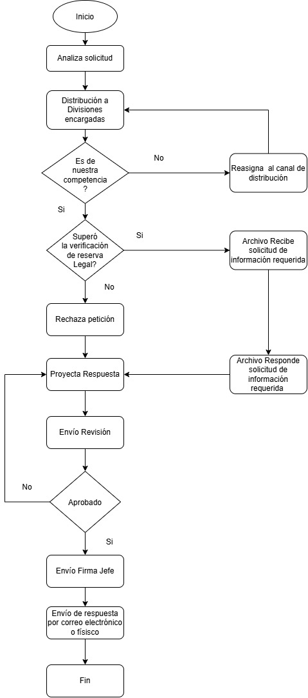
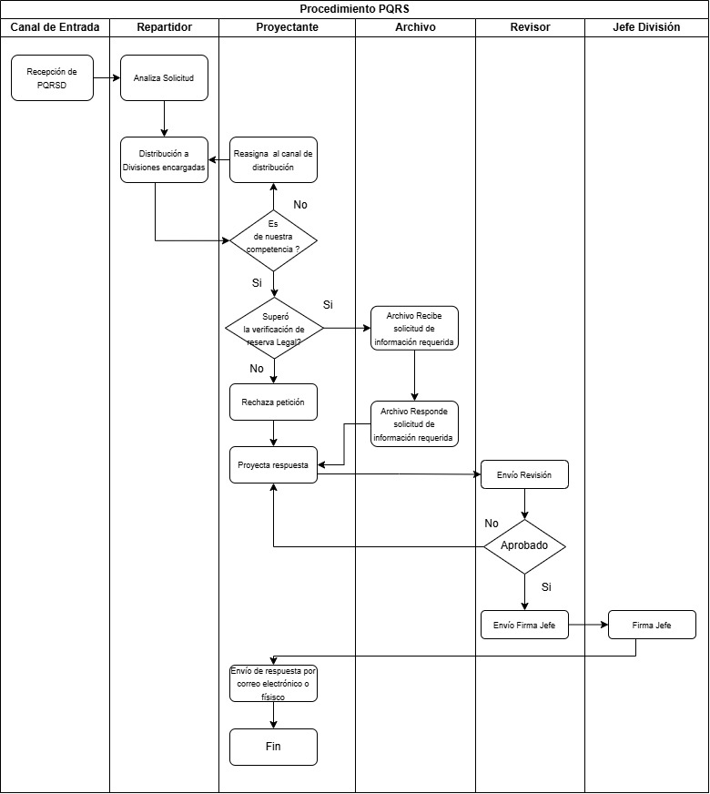
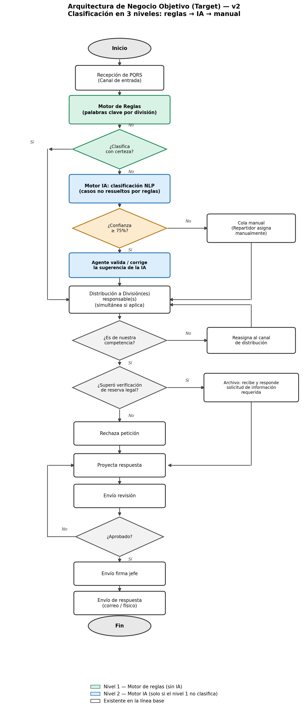

# Fase B: Arquitectura de Negocio
## Marco de trabajo TOGAF — ADM (Architecture Development Method)
### Proyecto: IA-PQRS Smart Routing
**Enrutamiento inteligente de Peticiones, Quejas, Reclamos y Sugerencias (PQRS)**
**Empresa de referencia:** TelcoLatam

*Documento elaborado como continuación de la Fase A: Visión de la Arquitectura.*

---

## 1. Introducción y alcance de la Fase B

El objetivo de la Fase B del ADM de TOGAF es desarrollar la Arquitectura de Negocio objetivo que describe cómo TelcoLatam necesita operar para alcanzar las metas establecidas en la Fase A (Visión de la Arquitectura), documentando tanto la arquitectura de línea base (situación actual) como la arquitectura objetivo, e identificando las brechas, los requisitos de negocio y los componentes de la hoja de ruta necesarios para cerrarlas.

Este documento toma como entrada directa la Visión de la Arquitectura aprobada en la Fase A (proyecto "IA-PQRS Smart Routing") y el procedimiento operativo vigente "Procedimiento PQRSD", que documenta el proceso manual actual de gestión y respuesta a PQRS. A partir de ambos insumos se construye la arquitectura de negocio línea base y objetivo, los catálogos y matrices formales, el análisis de brechas, la especificación de requisitos y los componentes de la hoja de ruta que exige esta fase.

### 1.1 Trazabilidad con la Fase A

| Elemento de la Fase A | Contenido aprobado | Reflejo en esta Fase B |
|---|---|---|
| Objetivo de negocio | Reducir el tiempo promedio de primera respuesta a las PQRS en 40% en el primer trimestre | Motiva el rediseño del proceso de triage/enrutamiento (secciones 3 y 6) |
| Impulsores (drivers) | Alto volumen (>10.000 PQRS/día) y penalizaciones regulatorias por incumplimiento | Justifica la automatización de la clasificación (sección 3.1) |
| Limitaciones | Presupuesto de USD 50.000, MVP en 3 meses, cumplimiento de la Ley de Protección de Datos Personales | Delimita el alcance de la hoja de ruta (sección 8) y los requisitos RN-05 (sección 7) |
| Capacidad base / objetivo | De un proceso 100% manual (3–5 min/ticket) a un motor NLP que clasifica en milisegundos | Estructura la comparación línea base vs. objetivo (secciones 2 y 3) |
| Brechas identificadas | Falta de talento en IA e infraestructura cloud nativa | Insumo directo del análisis de brechas (sección 6) |
| Alcance (in/out) | Dentro: modelo de clasificación y enrutamiento. Fuera: respuesta automatizada al cliente | Delimita qué procesos de la línea base cambian y cuáles permanecen (sección 3.1) |
| Principios de negocio y arquitectura | El cliente es el centro de la operación; los datos son un activo; independencia tecnológica | Guían las decisiones de diseño del proceso objetivo (sección 3) |
| KPI | Accuracy > 88%, reducción de 90% en tiempo de triage, ROI en 8 meses | Métricas de éxito de la arquitectura objetivo (sección 3.1) |
| Riesgos y mitigación | Clasificación errónea (umbral de confianza 75%) y sesgo en los datos (auditoría/balanceo) | Incorporados como controles del proceso objetivo (secciones 3.4 y 7) |

## 2. Arquitectura de Negocio – Línea Base (Baseline)

### 2.1 Descripción general

Actualmente la gestión de PQRS en TelcoLatam es 100% manual: un agente lee cada ticket y lo asigna dentro del CRM, tomando en promedio de 3 a 5 minutos por caso (capacidad base declarada en la Fase A). Este proceso está formalizado en el "Procedimiento PQRSD" vigente, descrito a continuación.

### 2.2 Catálogo de Actor / Rol – Línea Base

| Rol | Responsabilidad principal | Aplicaciones requeridas |
|---|---|---|
| Repartidor | Distribuye las solicitudes internamente, hace seguimiento al vencimiento de términos, elabora el informe mensual y mantiene las plantillas de respuesta. | Suite ofimática, lector de PDF |
| Proyecta la respuesta | Analiza la solicitud, consolida la información, elabora el documento de respuesta con la plantilla oficial y lo remite a revisión. | Suite ofimática, lector de PDF |
| Revisor | Verifica que el documento cumpla los lineamientos institucionales, normativos y de forma; informa inconsistencias sin modificar el documento. | Editor de texto, lector de PDF, certificado de firma PDF |
| Jefe de División | Firma el documento final, validando que el contenido sea adecuado antes del envío al interesado. | Editor de texto, lector de PDF, certificado de firma PDF |

### 2.3 Catálogo de Proceso / Evento / Control / Producto – Línea Base

| Tipo | Elemento | Descripción |
|---|---|---|
| Evento | Recepción de PQRS | Ingreso de la solicitud por el canal de entrada |
| Proceso | Análisis y distribución | El repartidor analiza y distribuye la solicitud a la división encargada |
| Control | Verificación de competencia | Determina si la solicitud corresponde al área o debe reasignarse |
| Control | Verificación de reserva legal | Determina si procede solicitar información adicional o rechazar la petición |
| Proceso | Proyección de la respuesta | Elaboración del documento de respuesta con la plantilla oficial |
| Control | Revisión de forma y fondo | Validación de lineamientos institucionales antes de la firma |
| Control | Lineamientos de elaboración | Plantilla oficial, lenguaje neutral, dirección física, fuente Nunito 10.5–12 pt |
| Producto | Respuesta oficial firmada | Documento firmado por el Jefe de División, enviado por correo o físico |

### 2.4 Diagrama de Proceso de Negocio – Línea Base

Vista simplificada del flujo de extremo a extremo, tal como está documentada en el Procedimiento PQRSD:

*Figura 1. Flujo del proceso PQRSD (línea base) — vista simplificada.*

Vista del mismo proceso organizada por carriles de actor, que respalda el catálogo de la sección 2.2:

*Figura 2. Flujo del proceso PQRSD (línea base) — vista por actor (swimlane).*

### 2.5 Limitaciones observadas en la línea base

* Proceso 100% manual: cada ticket es leído y clasificado por una persona (3–5 minutos por caso).
* Sin mecanismo de priorización ni de clasificación automática de la intención del ciudadano/cliente.
* El volumen actual (>10.000 PQRS/día declarado en la Fase A) satura la capacidad de triage manual, generando los tiempos de respuesta lentos reportados por el Director de Servicio al Cliente.
* No existe un umbral de confianza ni una segunda validación automatizada; toda la trazabilidad depende de la disponibilidad del repartidor.

## 3. Arquitectura de Negocio – Objetivo (Target)

### 3.1 Descripción general

La arquitectura objetivo incorpora un motor de Procesamiento de Lenguaje Natural (NLP) que extrae la intención y las entidades del texto de la PQRS y sugiere, en milisegundos, la o las divisiones responsables (por ejemplo, Facturación y Soporte Técnico de forma simultánea cuando el caso lo requiere, como en el escenario de negocio descrito en la Fase A). El alcance aprobado en la Fase A automatiza únicamente el paso de clasificación y enrutamiento inicial; la elaboración, revisión y firma de la respuesta permanecen sin cambios, dado que la resolución o respuesta automatizada al cliente (chatbot) está explícitamente fuera de alcance.

Para mitigar el riesgo de clasificación errónea (riesgo crítico identificado en la Fase A) se incorpora un umbral de confianza del 75%: por debajo de ese umbral, el caso se enruta a la cola manual del Repartidor, tal como ocurre hoy. Adicionalmente, y para atender la preocupación de los Agentes de Soporte (miedo al reemplazo laboral y fatiga por reasignación manual) y el nivel de preparación cultural bajo/medio reportado en la Fase A, se mantiene un punto de validación humana en el que el agente puede corregir la sugerencia de la IA.

*Esta arquitectura objetivo persigue directamente los KPI definidos en la Fase A: exactitud de clasificación superior al 88%, reducción del 90% en el tiempo de triage y retorno de la inversión en 8 meses.*

🔧 **Actualización (propuesta de arquitectura de sistemas):** antes de invocar el Motor IA, un Motor de Reglas determinístico (palabras clave por división) intenta clasificar el caso. Solo cuando este primer nivel no puede determinar el área con certeza, el caso se escala al Motor IA. Esto reduce la latencia y el costo de inferencia sin cambiar el umbral de confianza del 75% ni el punto de validación humana ya descritos.

### 3.2 Catálogo de Actor / Rol – Objetivo

| Rol / Actor | Responsabilidad en la arquitectura objetivo | Aplicaciones / servicios |
|---|---|---|
|  Motor de Reglas | Servicio determinístico (sin IA) que compara el texto contra un diccionario de palabras clave por división; si la certeza es alta, enruta directo, sin invocar el Motor IA. | Microservicio de reglas (Cloud Run) |
|  Motor de Clasificación IA | Servicio automatizado que analiza el texto, extrae intención y entidades, y sugiere el área responsable con un puntaje de confianza, solo para los casos que el Motor de Reglas no resolvió. | Microservicio de inferencia NLP (API REST) |
|  Agente de Soporte | Revisa la sugerencia de la IA en los casos con confianza ≥ 75% y puede corregirla antes de la distribución. | Interfaz de validación integrada al CRM |
|  Repartidor | Atiende únicamente los casos con confianza < 75% (cola manual); conserva sus funciones de seguimiento e informes. | Suite ofimática, lector de PDF |
| Proyecta la respuesta / Revisor / Jefe de División | Sin cambios frente a la línea base: elaboran, revisan y firman la respuesta una vez recibido el caso ya enrutado. | Suite ofimática, editor de texto, certificado de firma PDF |
| Director de Servicio al Cliente | Patrocinador y stakeholder principal; valida que se cumpla el requisito de 85% de clasificación sin intervención humana. | Tablero de KPI |
| Gerente de TI | Stakeholder técnico; garantiza la integración por microservicios y APIs REST con el CRM heredado. | Plataforma de integración / APIs |
|  Científico de Datos / Ingeniero de Datos | Curan, etiquetan, auditan y balancean el dataset histórico de PQRS; entrenan y validan el modelo NLP. | Plataforma de datos / entrenamiento de modelos |
|  Arquitecto de TI | Diseña la arquitectura de microservicios desacoplada del CRM y su despliegue en la nube. | Repositorio de arquitectura |

### 3.3 Catálogo de Función y Servicio de Negocio

| Función de negocio | Servicio de negocio | Descripción |
|---|---|---|
| Gestión de PQRS | Recepción y registro de solicitudes | Ingreso del caso por el canal de entrada (sin cambios) |
| Clasificación y enrutamiento |  Clasificación por reglas (sin IA) | Servicio nuevo: primer nivel, determinístico, por palabras clave |
| Clasificación y enrutamiento |  Clasificación automática por IA | Servicio nuevo: segundo nivel, solo para lo que las reglas no resuelven |
| Clasificación y enrutamiento |  Validación humana de la sugerencia | Servicio nuevo: el agente confirma o corrige la sugerencia de la IA |
| Atención al cliente | Atención por Facturación / Soporte Técnico / Retención | Áreas receptoras del caso ya enrutado (sin cambios) |
| Elaboración y aprobación de respuestas | Proyección, revisión y firma de la respuesta | Sin cambios frente a la línea base |

### 3.4 Catálogo de Proceso / Evento / Control / Producto – Objetivo

| Tipo | Elemento | Descripción |
|---|---|---|
| Evento | Recepción de PQRS | Ingreso de la solicitud por el canal de entrada (sin cambios) |
|  Proceso | Clasificación por reglas | El motor de reglas compara el texto contra un diccionario de palabras clave por división |
|  Control | Certeza de la clasificación por reglas | Determina si el caso se enruta directo o se escala al Motor IA |
|  Proceso | Clasificación NLP | El motor de IA extrae intención y entidades y sugiere el área responsable (solo casos escalados) |
|  Control | Umbral de confianza (75%) | Determina si el caso se enruta automáticamente o pasa a cola manual |
|  Proceso | Validación del agente | El agente confirma o corrige la sugerencia antes de la distribución |
| Proceso | Distribución simultánea | Notificación a una o varias divisiones responsables en paralelo |
| Control | Verificación de competencia / reserva legal | Sin cambios frente a la línea base |
| Proceso | Proyección, revisión y firma de la respuesta | Sin cambios frente a la línea base |
| Producto | Respuesta oficial firmada | Sin cambios frente a la línea base |

### 3.5 Diagrama de Proceso de Negocio – Objetivo

*Figura 3. Flujo del proceso PQRS con clasificación en 3 niveles (arquitectura objetivo). Verde: reglas sin IA; azul: IA.*

## 4. Matriz de interacción Actor – Proceso

Participación de cada actor en los procesos de la arquitectura objetivo (X = participa):

| Actor / Rol | Recepción | Clasif. reglas | Clasif. IA | Valida agente | Distribución | Competencia/ reserva legal | Proyecta resp. | Revisión | Firma |
|---|---|---|---|---|---|---|---|---|---|
| Motor de Reglas | | X | | | | | | | |
| Motor de Clasificación IA | | | X | | | | | | |
| Agente de Soporte | | | | X | | | | | |
| Repartidor | X | | | | X | | | | |
| División responsable | | | | | X | X | | | |
| Proyecta la respuesta | | | | | | | X | | |
| Revisor | | | | | | | | X | |
| Jefe de División | | | | | | | | | X |

## 5. Matriz Función de Negocio – Organización

| Función de negocio | Área / unidad organizacional responsable |
|---|---|
| Recepción y registro de solicitudes | Canal de entrada / Atención al Cliente |
| Clasificación automática por IA | TI — Ciencia de Datos (operación del microservicio) |
| Validación humana de la sugerencia | Atención al Cliente (Agentes de Soporte) |
| Atención por área responsable | Facturación / Soporte Técnico / Retención |
| Elaboración y aprobación de respuestas | División responsable / Jefatura de División |
| Gobierno y KPI del proceso | Dirección de Servicio al Cliente |
| Integración e infraestructura | Gerencia de TI |

## 6. Análisis de brechas (Gap Analysis)

| Brecha | Estado actual (línea base) | Estado objetivo | Acción para cerrarla |
|---|---|---|---|
| Talento en IA | No existe equipo interno de ciencia/ingeniería de datos | Modelo NLP en producción, monitoreado y reentrenado | Incorporar científico(s) e ingeniero(s) de datos al proyecto (según Declaración de Trabajo de la Fase A) |
| Infraestructura | CRM on-premise, sin infraestructura cloud nativa | Microservicio de inferencia desacoplado, desplegable en la nube | Diseñar la arquitectura de microservicios con el Arquitecto de TI (Fase C/D) |
| Datos | Histórico de PQRS sin limpiar, clasificar ni gobernar | Dataset etiquetado, auditado y balanceado, gobernado como activo | Ejecutar el principio de arquitectura "los datos son un activo" antes del entrenamiento |
| Proceso | Clasificación 100% manual, sin umbral de confianza ni trazabilidad automática | Clasificación automática con umbral de confianza y validación humana | Implementar el flujo objetivo descrito en la sección 3 |
| Adopción / cultura | Preparación cultural baja/media; resistencia al cambio y temor al reemplazo laboral | Agentes con rol de validación y corrección, no de reemplazo | Mantener el punto de validación humana y capacitar a los agentes (hoja de ruta, sección 8) |

## 7. Especificación de requisitos de arquitectura (Business Requirements)

Requisitos de negocio derivados de las partes interesadas y restricciones definidas en la Fase A, y de los lineamientos vigentes del Procedimiento PQRSD:

| ID | Requisito | Fuente |
|---|---|---|
| RN-01 | El motor de clasificación debe alcanzar al menos 85% de exactitud en la asignación del área responsable sin intervención humana. | Director de Servicio al Cliente |
| RN-02 | El motor de clasificación debe exponerse como microservicio con APIs RESTful, integrado al CRM heredado. | Gerente de TI |
| RN-03 | La interfaz debe mostrar al agente el área sugerida por la IA y permitir su corrección manual. | Agentes de Soporte |
| RN-04 | Cuando la confianza del modelo sea inferior al 75%, el caso debe enrutarse a la cola manual del Repartidor. | Mitigación del Riesgo 1 (Fase A) |
| RN-05 | El tratamiento del texto de las PQRS debe cumplir la Ley de Protección de Datos Personales. | Restricciones del proyecto (Fase A) |
| RN-06 | El dataset de entrenamiento debe auditarse y balancearse para mitigar sesgos hacia ciertas demografías. | Mitigación del Riesgo 2 (Fase A) |
| RN-07 | Debe mantenerse el uso de la plantilla oficial, el lenguaje neutral y los demás lineamientos de elaboración de respuestas ya vigentes. | Procedimiento PQRSD |
| RN-08 | El desarrollo del MVP debe ejecutarse dentro de un presupuesto de USD 50.000 y un plazo de 3 meses. | Limitaciones del proyecto (Fase A) |

## 8. Componentes de la hoja de ruta de Arquitectura de Negocio

Hoja de ruta de alto nivel para el MVP, acorde con el plazo de 3 meses y el presupuesto de USD 50.000 definidos en la Fase A:

| Fase | Horizonte | Componentes principales |
|---|---|---|
| Fase 1 — Cimentación | Mes 1 | Recolección, limpieza, etiquetado, auditoría y balanceo del dataset histórico de PQRS; definición de la arquitectura del microservicio. |
| Fase 2 — Construcción | Mes 2 | Entrenamiento y validación del modelo NLP; desarrollo de la API de inferencia; diseño de la interfaz de validación para agentes. |
| Fase 3 — Integración y despliegue | Mes 3 | Integración con el CRM heredado; pruebas piloto con umbral de confianza del 75%; capacitación a agentes; despliegue del MVP y medición de KPI iniciales. |

## 9. Impacto en el panorama arquitectónico y gobernanza

### 9.1 Dominios de arquitectura impactados

* Negocio: rediseño del proceso de triage y enrutamiento de PQRS (este documento).
* Datos: gobierno, etiquetado y balanceo del histórico de PQRS (a detallar en la Fase C).
* Aplicación: microservicio de inferencia, interfaz de validación e integración con el CRM (a detallar en la Fase C).
* Tecnología: infraestructura cloud para el despliegue del microservicio (a detallar en la Fase D).

### 9.2 Riesgos heredados de la Fase A

| Riesgo | Nivel inicial | Mitigación | Nivel residual |
|---|---|---|---|
| Clasificación errónea del modelo de IA | Crítico | Umbral de confianza del 75%; por debajo, enrutamiento manual | Marginal |
| Sesgo en los datos de entrenamiento | Marginal | Auditoría y balanceo del dataset antes del entrenamiento | Insignificante |

### 9.3 Gobierno de arquitectura

Conforme a la Declaración de Trabajo de Arquitectura aprobada en la Fase A, esta Arquitectura de Negocio debe someterse a revisión y aprobación formal del Director de Servicio al Cliente y del Gerente de TI antes de dar paso a la Fase C (Arquitectura de Sistemas de Información), siguiendo el Plan de Comunicaciones de Arquitectura Empresarial definido para el proyecto.

## 10. Conclusión y aprobación para avanzar a la Fase C

Esta Fase B documenta la arquitectura de negocio línea base (proceso manual descrito en el Procedimiento PQRSD) y la arquitectura de negocio objetivo (enrutamiento asistido por IA en 3 niveles: reglas → IA → manual), junto con los catálogos, matrices, el análisis de brechas, los requisitos de negocio y la hoja de ruta necesarios para cerrar la distancia entre ambas, en línea con los objetivos, principios y KPI aprobados en la Fase A. Con esta base, el proyecto "IA-PQRS Smart Routing" queda en condiciones de avanzar hacia la Fase C: Arquitectura de Sistemas de Información.

### Aprobación

| Rol | Nombre | Firma | Fecha |
|---|---|---|---|
| Director de Servicio al Cliente | | | |
| Gerente de TI | | | |
