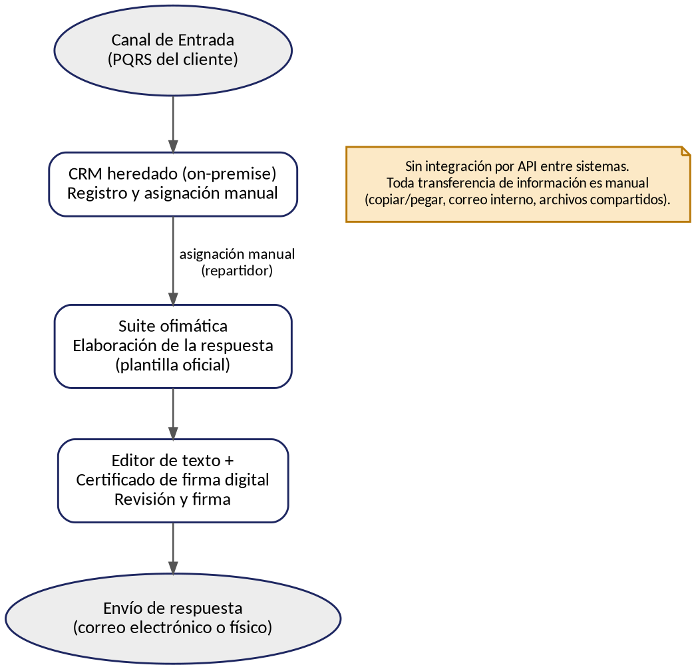
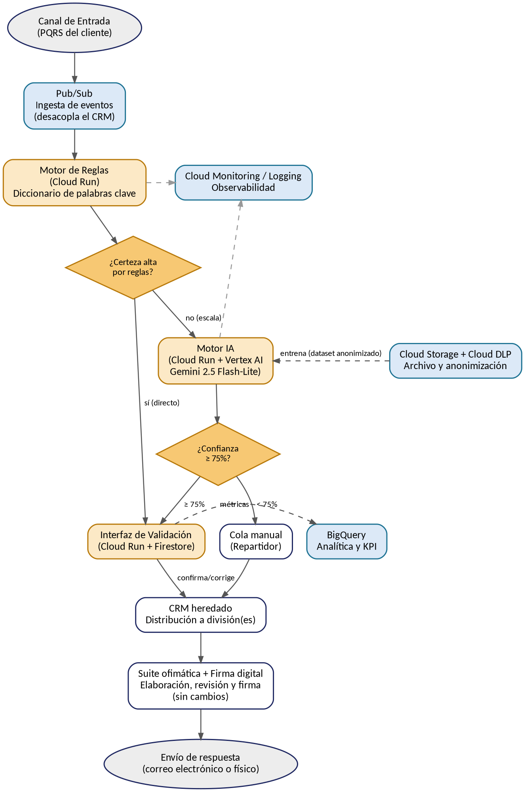

# Fase C: Arquitectura de Sistemas de Información
## Marco de trabajo TOGAF — ADM (Architecture Development Method)
### Proyecto: IA-PQRS Smart Routing
**Enrutamiento inteligente de Peticiones, Quejas, Reclamos y Sugerencias (PQRS)**
**Empresa de referencia:** TelcoLatam

*Documento elaborado como continuación de la Fase B: Arquitectura de Negocio, e informado directamente por el concepto de solución técnica desarrollado en la Fase A: Visión de la Arquitectura (sección 12).*

> **Nota de versión.** Esta es una revisión de la Fase C que incorpora la arquitectura real en GCP y la clasificación en 3 niveles (reglas → IA → manual) confirmadas en la Fase A y en la actualización de la Fase B. Los cambios frente a la versión anterior de este documento están resumidos en la sección 0.

---

## 0. Registro de cambios aplicados en esta revisión

| # | Cambio | Motivo |
|---|---|---|
| 1 | Se incorporó el **Motor de Reglas** (Cloud Run, sin IA) como primer nivel de clasificación, antes del Motor IA | Confirmado en la Fase A (sección 12.1) y en la actualización de la Fase B (sección 3.1) |
| 2 | Se reemplazó la arquitectura "cloud-agnóstica" genérica por la arquitectura real en **Google Cloud Platform (GCP)**: Pub/Sub, Cloud Run, Vertex AI (Gemini 2.5 Flash-Lite), Firestore, Cloud Storage + Cloud DLP, BigQuery, Cloud Monitoring/Logging, IAM + VPC Service Controls | Especificada en la Fase A, sección 12.2 |
| 3 | Se reemplazó la estimación de costos propia (≈USD 43.500, basada en supuestos de mercado) por el **desglose oficial de la Fase A** (≈USD 11.270 de inversión incremental para el MVP) | La Fase A, sección 12.3, ya trae una memoria de cálculo validada internamente; mantener una estimación paralela habría sido incoherente |
| 4 | Se incorporaron los **Riesgos 3, 4 y 5** de la Fase A (integración con el CRM heredado, resistencia al cambio, cumplimiento de la Ley 1581 de 2012) al gobierno de esta fase | Estaban documentados en la Fase A pero no reflejados aún en la arquitectura de sistemas |
| 5 | Se especificó la jurisdicción legal — **Colombia: Ley 1581 de 2012 (Habeas Data), Decreto 1377 de 2013 y Resolución CRC 5050 de 2016** — en los requisitos de sistema y en el gobierno de datos | La versión anterior hablaba de "la Ley de Protección de Datos Personales" sin especificar país |
| 6 | Se actualizaron el catálogo de aplicaciones, el catálogo de interfaces y el diagrama de arquitectura objetivo para reflejar los componentes reales de GCP en lugar de nombres genéricos ("API Gateway", "microservicio de inferencia") | Consistencia con el concepto de solución de la Fase A |

---

## 1. Introducción y alcance de la Fase C

La Fase C del ADM de TOGAF se centra en la Arquitectura de Aplicaciones y Datos: establece cómo el software y la información habilitan las capacidades de negocio definidas en la Fase B. Su objetivo no es diseñar una única aplicación, sino construir el mapa completo del ecosistema de software que soporta el proceso de gestión de PQRS y permite la toma de decisiones estratégica.

La arquitectura de aplicaciones debe servir directamente a la Arquitectura de Negocio definida en la Fase B, y materializar el concepto de solución ya esbozado en la Fase A. Sin esta alineación, la TI se convierte en un bloqueador en lugar de un motor de transformación: por eso cada componente de este documento se conecta explícitamente con un rol, un proceso o un requisito ya aprobado en las fases anteriores.

### 1.1 Trazabilidad con las Fases A y B

| Elemento | Fuente | Contenido aprobado | Reflejo en esta Fase C |
|---|---|---|---|
| Catálogo de actores objetivo (incluye Motor de Reglas) | Fase B, sección 3.2 | Motor de Reglas, Motor de Clasificación IA, Agente de Soporte, Científico/Ingeniero de Datos, Arquitecto de TI | Motiva el catálogo de aplicaciones objetivo (sección 3) |
| Concepto de solución en GCP | Fase A, sección 12.2 | Clasificación en 3 niveles (reglas → IA → manual) sobre Pub/Sub, Cloud Run, Vertex AI, Firestore, Cloud Storage + DLP, BigQuery, Monitoring/Logging, IAM + VPC SC | Base directa de la arquitectura de aplicaciones objetivo (sección 3) y de datos (sección 4) |
| Presupuesto desglosado del MVP | Fase A, sección 12.3 | Inversión incremental ≈ USD 11.270; operación estable ≈ USD 550-570/mes | Anexo A de este documento |
| Riesgos 3, 4 y 5 | Fase A, sección 10 | Integración con el CRM heredado; resistencia al cambio; incumplimiento de la Ley 1581 de 2012 | Sección 9.3 (riesgos técnicos) |
| Jurisdicción legal | Fase A, secciones 3 y 7 | Ley 1581 de 2012, Decreto 1377 de 2013, Resolución CRC 5050 de 2016 | Sección 4.3 (gobierno de datos) y requisito RS-05 |
| Requisitos de negocio (RN-01 a RN-08) | Fase B, sección 7 | Exactitud, integración REST, umbral de confianza, protección de datos, presupuesto | Traducidos a requisitos de sistema RS-01 a RS-10 (sección 7) |
| Hoja de ruta de negocio (3 meses) | Fase B, sección 8 | Cimentación, construcción, integración y despliegue | Detallada con componentes técnicos de GCP (sección 8) |

---

## 2. Arquitectura de Aplicaciones — Línea Base

### 2.1 Descripción general

Los sistemas actuales soportan el proceso 100% manual descrito en el Procedimiento PQRSD y en la Fase B: un agente registra y asigna cada ticket en el CRM heredado, y el resto del ciclo (elaboración, revisión y firma) se apoya en herramientas ofimáticas independientes, sin ninguna integración automatizada entre ellas.

### 2.2 Catálogo de Aplicaciones — Línea Base

| Aplicación | Tipo | Función en el proceso | Usada por |
|---|---|---|---|
| CRM heredado (on-premise) | Sistema de registro | Registro y asignación manual de la PQRS | Repartidor |
| Suite ofimática | Productividad | Elaboración de la respuesta con la plantilla oficial | Proyecta la respuesta |
| Lector de PDF | Utilitario | Consulta de solicitudes y anexos | Todos los roles |
| Editor de texto + certificado de firma digital | Firma electrónica | Revisión y firma del documento final | Revisor, Jefe de División |
| Repositorio de plantillas | Almacenamiento documental | Custodia de la plantilla oficial de respuesta | Repartidor (mantiene), Proyectista (usa) |

### 2.3 Catálogo de Interfaces — Línea Base

No existen interfaces automatizadas entre los sistemas actuales; toda transferencia de información entre aplicaciones es manual.

| Origen | Destino | Mecanismo | ¿Automatizada? |
|---|---|---|---|
| CRM heredado | Suite ofimática | Copiar/pegar manual del caso asignado | No |
| Suite ofimática | Editor de texto / firma digital | Envío de archivo por correo interno | No |
| Repositorio de plantillas | Suite ofimática | Descarga manual de la plantilla en blanco | No |

### 2.4 Diagrama de Arquitectura de Aplicaciones — Línea Base

*Figura 1. Arquitectura de aplicaciones de la línea base — sin integración automatizada entre sistemas.*

### 2.5 Limitaciones observadas en la línea base

* El CRM heredado no expone capacidad nativa de integración vía API (aunque la Fase A señala que sí cuenta con APIs, la infraestructura sigue siendo on-premise, sección 5).
* No existe un repositorio de datos gobernado: el histórico de PQRS está disperso y sin etiquetar.
* No hay ningún mecanismo de clasificación automática ni de monitoreo del desempeño del proceso.
* Cada paso depende de la ejecución manual de una persona, sin trazabilidad de sistema.

---

## 3. Arquitectura de Aplicaciones — Objetivo

### 3.1 Descripción general

La clasificación de una PQRS pasa a tener **tres niveles**, tal como se definió en la Fase A (sección 12.1) y se ratificó en la actualización de la Fase B (sección 3.1):

1. **Motor de Reglas** (Cloud Run, sin IA): compara el texto contra un diccionario de palabras clave por división. Si la certeza es alta, enruta directo, sin invocar el Motor IA.
2. **Motor IA** (Cloud Run + Vertex AI, modelo Gemini 2.5 Flash-Lite): solo se invoca cuando el Motor de Reglas no puede determinar el área con certeza. Aplica el umbral de confianza del 75% ya definido en la Fase A.
3. **Cola manual** (Repartidor): recibe los casos que ni las reglas ni la IA lograron clasificar con certeza suficiente, sin cambios frente a la línea base.

Este diseño en tres niveles no es una preferencia estética: un motor de reglas no requiere dataset de entrenamiento, es inmediato de construir dentro del plazo de 3 meses del MVP, reduce la latencia y el costo de inferencia, y sus decisiones son 100% explicables — algo relevante frente a la obligación regulatoria de justificar cómo se resuelve cada PQR (Resolución CRC 5050 de 2016, art. 2.1.24.3).

Las aplicaciones de elaboración, revisión y firma de la respuesta permanecen sin cambios, en línea con el alcance aprobado en la Fase A.

### 3.2 Modelos de Arquitectura de Aplicaciones aplicados al proyecto

| Modelo | Qué evalúa | Aplicación al proyecto IA-PQRS |
|---|---|---|
| Modelo Funcional | Distribución de costos operativos y de capital; identifica aplicaciones que consumen recursos sin generar valor diferencial | El CRM heredado y la suite ofimática son de bajo valor diferencial: se conservan tal cual (costo hundido); la inversión incremental se concentra en el Motor de Reglas y el Motor IA |
| Modelo de Desarrollo | Enfoque de construcción: desarrollo interno, compra externa o integración de plataformas existentes | Vertex AI (Gemini 2.5 Flash-Lite) se **compra** como servicio administrado; el Motor de Reglas y la Interfaz de Validación se **desarrollan a medida** |
| Modelo de Integración | Nivel de rigidez o fluidez de las interfaces; capacidad de adaptación del sistema | Pub/Sub desacopla el CRM heredado de los servicios de clasificación, con reintentos automáticos ante indisponibilidad (mitiga el Riesgo 3 de la Fase A) |
| Modelo de Producto | Valor competitivo único; identifica aplicaciones que generan diferenciación | El activo diferenciador es el diccionario de reglas por división y el dataset propio con el que eventualmente se afine el modelo, no la infraestructura genérica que los rodea |

### 3.3 Estrategia de portafolio: comprar vs. desarrollar

* **Comprar (SaaS / servicio administrado):** Vertex AI con el modelo Gemini 2.5 Flash-Lite para la clasificación de segundo nivel — es una capacidad genérica de lenguaje, no diferenciadora por sí misma.
* **Desarrollar a medida:** el Motor de Reglas (diccionario de palabras clave propio de TelcoLatam) y la Interfaz de Validación embebida en el flujo del agente — aquí está el conocimiento específico del negocio.
* **Plataforma de integración (administrada):** Pub/Sub como capa de desacople entre el CRM heredado y los servicios de clasificación.

### 3.4 Catálogo de Aplicaciones — Objetivo

| Aplicación | Servicio GCP | Estado | Función en el proceso |
|---|---|---|---|
| Ingesta de eventos | Pub/Sub | Nuevo | Desacopla el CRM heredado de los servicios de clasificación, con reintentos automáticos |
| Motor de Reglas | Cloud Run | Nuevo | Servicio sin estado; ejecuta el diccionario de palabras clave por división (primer nivel) |
| Motor IA | Cloud Run + Vertex AI (Gemini 2.5 Flash-Lite) | Nuevo | Clasifica por NLP los casos que el Motor de Reglas no resolvió (segundo nivel) |
| Interfaz de Validación | Cloud Run + Firestore | Nuevo | El Agente de Soporte confirma o corrige la sugerencia; Firestore guarda el estado del caso |
| Archivo y anonimización | Cloud Storage + Cloud DLP | Nuevo | Cloud DLP redacta datos personales antes de usar el histórico para reentrenar el modelo |
| Analítica y KPI | BigQuery | Nuevo | Tablero de cobertura, exactitud y tiempo de ciclo |
| Observabilidad | Cloud Monitoring / Cloud Logging | Nuevo | Alerta si la tasa de escalamiento a IA o a cola manual se dispara |
| Identidad y seguridad | IAM + VPC Service Controls | Nuevo | Perímetro único de cumplimiento; ningún dato de PQRS sale de GCP |
| CRM heredado | (on-premise, existente) | Sin cambios (extendido) | Continúa como sistema de registro y distribución del caso |
| Suite ofimática + firma digital | (existente) | Sin cambios | Elaboración, revisión y firma de la respuesta |

### 3.5 Catálogo de Interfaces — Objetivo

| Interfaz | Origen → Destino | Mecanismo | Datos intercambiados |
|---|---|---|---|
| Evento de ingesta | CRM heredado → Pub/Sub | Mensajería asíncrona, con reintentos | Texto de la PQRS |
| Clasificación por reglas | Pub/Sub → Motor de Reglas (Cloud Run) | REST / evento | Texto de la PQRS |
| Escalamiento a IA | Motor de Reglas → Motor IA (Vertex AI) | REST / JSON | Texto de la PQRS (solo si las reglas no resuelven) |
| Resultado de clasificación | Motor IA → Interfaz de Validación | REST / JSON | Área sugerida + puntaje de confianza |
| Confirmación del agente | Interfaz de Validación (Firestore) → CRM heredado | REST / evento | Caso enrutado y división asignada |
| Entrenamiento | Cloud Storage (dataset anonimizado por DLP) → Motor IA | Batch / ETL | Dataset etiquetado y anonimizado |
| Monitoreo | Motor de Reglas y Motor IA → Cloud Monitoring/Logging | Streaming / logs | Métricas de desempeño y tasa de escalamiento |
| Analítica | Interfaz de Validación → BigQuery | Streaming / batch | Métricas de cobertura, exactitud y tiempo de ciclo |

### 3.6 Diagrama de Arquitectura de Aplicaciones — Objetivo

*Figura 2. Arquitectura de aplicaciones objetivo en GCP. En ámbar, los componentes de clasificación (reglas e IA); en azul claro, los componentes de datos, analítica y observabilidad.*

---

## 4. Arquitectura de Datos

### 4.1 Catálogo de Entidades de Datos

| Entidad | Descripción | Aplicación de origen |
|---|---|---|
| PQRS (texto original) | Solicitud recibida del cliente | Canal de entrada / CRM heredado |
| Resultado del Motor de Reglas | Área sugerida (o "sin certeza") | Motor de Reglas (Cloud Run) |
| Clasificación del Motor IA | Área sugerida + puntaje de confianza | Motor IA (Vertex AI) |
| Decisión del agente | Confirmación o corrección de la sugerencia | Interfaz de Validación (Firestore) |
| Caso enrutado | PQRS con la división ya asignada | CRM heredado |
| Respuesta oficial | Documento firmado enviado al cliente | Suite ofimática / firma digital |
| Dataset de entrenamiento (anonimizado) | Histórico de PQRS etiquetado, auditado, balanceado y anonimizado | Cloud Storage + Cloud DLP |
| Registro de auditoría y métricas | Trazabilidad y desempeño del modelo en producción | BigQuery / Cloud Monitoring |

### 4.2 Matriz Entidad de Datos — Aplicación

C = Crea · L = Lee · A = Actualiza

| Entidad de datos | Motor de Reglas | Motor IA | Interfaz Validación (Firestore) | Cloud Storage + DLP | BigQuery |
|---|---|---|---|---|---|
| PQRS (texto original) | L | L | L | L | |
| Resultado del Motor de Reglas | C | L | L | | L |
| Clasificación del Motor IA | | C | L / A | | L |
| Decisión del agente | | | C | L | |
| Dataset de entrenamiento | | L | | C / A | |
| Registro de auditoría | | C | | | C / L |

### 4.3 Principios de gobierno de datos y cumplimiento

* **Jurisdicción y marco legal:** el tratamiento del texto de las PQRS debe cumplir la **Ley 1581 de 2012** (Habeas Data) y su **Decreto reglamentario 1377 de 2013** (Colombia). El texto debe anonimizarse o seudonimizarse mediante **Cloud DLP** antes de almacenarse en Cloud Storage para entrenamiento (RS-05).
* **Validación previa por el Oficial de Protección de Datos:** conforme al mapa de partes interesadas de la Fase A (sección 2.2), el Oficial de Protección de Datos/Cumplimiento debe validar el proceso de anonimización antes de iniciar cualquier entrenamiento o reentrenamiento del modelo.
* **Principio "los datos son un activo"** (heredado de la Fase A, sección 7): gobierno formal del dataset mediante auditoría y balanceo antes de cada reentrenamiento (RN-06).
* **Comité de gobierno de datos/IA:** la Fase A (sección 5) señala que aún falta constituir este comité, encargado de aprobar el uso del histórico de PQRS para entrenamiento; se recomienda constituirlo antes del Mes 2 de la hoja de ruta (sección 8).
* **Retención y trazabilidad:** el registro de auditoría en BigQuery debe conservarse el tiempo suficiente para sustentar decisiones de reentrenamiento y eventuales requerimientos de la Superintendencia de Industria y Comercio.

---

## 5. Matriz Aplicación — Función de Negocio

| Función de negocio (Fase B) | Aplicación que la soporta |
|---|---|
| Recepción y registro de solicitudes | CRM heredado → Pub/Sub |
| Clasificación por reglas (primer nivel) | Motor de Reglas (Cloud Run) |
| Clasificación automática por IA (segundo nivel) | Motor IA (Cloud Run + Vertex AI) |
| Validación humana de la sugerencia | Interfaz de Validación (Cloud Run + Firestore) |
| Atención por área responsable | CRM heredado (distribución) |
| Elaboración y aprobación de respuestas | Suite ofimática + firma digital |
| Gobierno y KPI del proceso | BigQuery (tablero de métricas) |
| Integración e infraestructura | Pub/Sub, IAM + VPC Service Controls |

---

## 6. Análisis de Brechas (Aplicaciones y Datos)

| Brecha | Estado actual | Estado objetivo | Acción para cerrarla |
|---|---|---|---|
| Integración | Sin integración automatizada entre sistemas | Pub/Sub desacopla el CRM de los servicios de clasificación, con reintentos automáticos | Diseñar los tópicos y suscripciones de Pub/Sub (Fase D detalla el dimensionamiento) |
| Clasificación automática | No existe ningún mecanismo de clasificación | Clasificación en 3 niveles: reglas → IA (Vertex AI) → manual | Construir el diccionario de reglas y configurar el Motor IA con el umbral de confianza |
| Gobierno de datos | Dataset disperso, sin etiquetar ni anonimizar | Dataset etiquetado, auditado, balanceado y anonimizado (Cloud DLP) en Cloud Storage | Implementar el pipeline de curaduría y anonimización de datos |
| Monitoreo | Sin trazabilidad automática del desempeño | Cloud Monitoring/Logging + BigQuery con métricas de cobertura, exactitud y tiempo de ciclo | Desplegar los tableros y alertas de observabilidad |
| Cumplimiento legal | Sin comité de gobierno de datos/IA ni proceso formal de anonimización | Comité constituido y pipeline de anonimización validado por el Oficial de Protección de Datos | Constituir el comité y ejecutar la validación antes del entrenamiento (Fase A, sección 5) |

---

## 7. Especificación de Requisitos de Sistemas (RS)

| ID | Requisito de sistema | Requisito de negocio relacionado |
|---|---|---|
| RS-01 | El Motor IA (Vertex AI, Gemini 2.5 Flash-Lite) debe responder en el orden de milisegundos y soportar un volumen superior a 10.000 solicitudes/día | RN-01 |
| RS-02 | El Motor de Reglas y el Motor IA deben exponerse como servicios Cloud Run, consumidos vía Pub/Sub con reintentos automáticos | RN-02 |
| RS-03 | La Interfaz de Validación (Cloud Run + Firestore) debe mostrar el área sugerida y el puntaje de confianza, y permitir la corrección manual en un clic | RN-03 |
| RS-04 | El sistema debe enrutar automáticamente a la cola manual del Repartidor cuando ni el Motor de Reglas ni el Motor IA alcancen la certeza/confianza requerida (< 75%) | RN-04 |
| RS-05 | El pipeline de datos debe anonimizar o seudonimizar los datos personales del texto de la PQRS mediante Cloud DLP, conforme a la Ley 1581 de 2012 y el Decreto 1377 de 2013 | RN-05 |
| RS-06 | BigQuery debe registrar métricas de sesgo por segmento y alertar desviaciones significativas antes de cada reentrenamiento | RN-06 |
| RS-07 | El CRM heredado y la suite ofimática deben conservar sin modificaciones la plantilla oficial y los lineamientos vigentes | RN-07 |
| RS-08 | La arquitectura debe operar dentro de servicios cloud de pago por uso (Cloud Run, Vertex AI, Pub/Sub, BigQuery), ajustándose al presupuesto y plazo del MVP (ver Anexo A) | RN-08 |
| RS-09 | El Motor de Reglas debe resolver el caso sin invocar el Motor IA cuando la certeza sea alta, para reducir la latencia y el costo de inferencia | Fase A, sección 12.1 |
| RS-10 | La ingesta vía Pub/Sub debe incluir reintentos automáticos y una cola de contingencia hacia el Repartidor si el CRM heredado no responde a tiempo | Mitigación del Riesgo 3 (Fase A) |

---

## 8. Componentes de la Hoja de Ruta (Aplicaciones y Datos)

| Fase | Horizonte | Componentes de aplicaciones y datos (GCP) |
|---|---|---|
| Fase 1 — Cimentación | Mes 1 | Diseño de tópicos/suscripciones de Pub/Sub; construcción del diccionario de reglas por división; diseño del esquema de BigQuery y del dataset en Cloud Storage; constitución del comité de gobierno de datos/IA |
| Fase 2 — Construcción | Mes 2 | Despliegue del Motor de Reglas (Cloud Run); configuración del Motor IA (Vertex AI, Gemini 2.5 Flash-Lite) con el umbral de confianza; desarrollo de la Interfaz de Validación (Cloud Run + Firestore); pipeline de anonimización con Cloud DLP |
| Fase 3 — Integración y despliegue | Mes 3 | Integración Pub/Sub ↔ CRM heredado; despliegue piloto con clasificación en 3 niveles; configuración de Cloud Monitoring/Logging e IAM + VPC Service Controls; capacitación a agentes; medición de KPI iniciales en BigQuery |

---

## 9. Rol del Arquitecto y Gobernanza

### 9.1 Roles en la Fase C

| Rol | Responsabilidades en esta fase |
|---|---|
| Arquitecto Empresarial | Crea marcos técnicos y patrones de diseño; establece estándares de desarrollo; define arquitecturas de referencia; gestiona el portafolio de aplicaciones; protege el valor empresarial |
| Arquitecto de Aplicaciones (Arquitecto de TI, catálogo Fase B) | Sirve como puente entre dominios; alinea la estrategia con la ejecución; diseña la arquitectura de microservicios en GCP definida en la Fase A |

### 9.2 Dominios de arquitectura impactados

* **Negocio:** sin cambios adicionales frente a lo definido en la Fase B.
* **Datos:** gobierno, etiquetado, balanceo y anonimización del histórico de PQRS — detallado en la sección 4.
* **Aplicación:** Motor de Reglas, Motor IA, Interfaz de Validación e integración vía Pub/Sub — detallado en la sección 3.
* **Tecnología:** el proveedor cloud ya está definido (GCP); queda para la Fase D el dimensionamiento detallado (regiones, políticas de escalamiento, continuidad/DR, hardening de seguridad).

### 9.3 Riesgos técnicos (heredados de la Fase A, sección 10)

| Riesgo | Nivel inicial | Mitigación | Nivel residual |
|---|---|---|---|
| Integración con el CRM heredado (límites de tasa o indisponibilidad de sus APIs) | Alto | Pub/Sub como capa desacoplada, con reintentos automáticos y cola de contingencia hacia el Repartidor | Moderado |
| Resistencia al cambio / baja adopción por parte de los agentes | Alto | Comunicar que el rol del agente es de validación, no de reemplazo; capacitación temprana; involucrar a los agentes en el diseño de la Interfaz de Validación | Bajo |
| Incumplimiento de la Ley 1581 de 2012 en el tratamiento de datos de entrenamiento | Alto | Anonimización con Cloud DLP y validación previa del Oficial de Protección de Datos | Bajo |
| Mantenimiento del diccionario de reglas (queda desactualizado si cambian productos/servicios) | Moderado | Revisión periódica del diccionario; monitoreo de la tasa de escalamiento al Motor IA como señal de alerta | Bajo |

### 9.4 Gobierno de arquitectura

Esta Arquitectura de Sistemas de Información debe someterse a revisión y aprobación formal del Gerente de TI y del Director de Servicio al Cliente antes de avanzar a la Fase D (Arquitectura Tecnológica), donde se detallará el dimensionamiento de la infraestructura ya definida en GCP (regiones, políticas de escalamiento, continuidad y hardening de seguridad), siguiendo el Plan de Comunicaciones de Arquitectura Empresarial definido para el proyecto.

---

## 10. Conclusión y Aprobación para Avanzar a la Fase D

Esta Fase C documenta la arquitectura de aplicaciones línea base (sistemas manuales y desconectados descritos en el Procedimiento PQRSD) y la arquitectura de aplicaciones y datos objetivo — clasificación en 3 niveles (reglas → IA → manual) sobre servicios administrados de GCP —, junto con los catálogos, matrices, el análisis de brechas, los requisitos de sistemas y la hoja de ruta necesarios para cerrar la distancia entre ambas, en línea con la Arquitectura de Negocio de la Fase B y el concepto de solución de la Fase A.

Con esta base, el proyecto "IA-PQRS Smart Routing" queda en condiciones de avanzar hacia la Fase D: Arquitectura Tecnológica, donde se detallará el dimensionamiento de la infraestructura GCP ya seleccionada.

### Aprobación

| Rol | Nombre | Firma | Fecha |
|---|---|---|---|
| Gerente de TI | | | |
| Director de Servicio al Cliente | | | |

---

## Anexo A. Estimación de Costos del MVP

Esta sección reemplaza la estimación independiente que traía una versión anterior de este documento (≈USD 43.500, basada en supuestos genéricos de mercado). En su lugar, se usa el desglose oficial ya desarrollado en la Fase A (sección 12.3), que es más preciso porque está anclado a los servicios reales de GCP definidos en la sección 3 de este documento.

### A.1 Desglose de costos — MVP (3 meses)

| Ítem | Costo estimado (USD) | Notas |
|---|---|---|
| Científico de Datos / ML Engineer (contratista, perfil semi-senior en Colombia) | ≈ 7.400 | (supuesto, Fase A) |
| Ingeniero Cloud/Backend | ≈ 2.600 | Recurso interno ya asignado; costo de oportunidad, no desembolso nuevo |
| Revisión de cumplimiento (Ley 1581 / anonimización) | ≈ 1.500 | (supuesto, Fase A) |
| Infraestructura GCP durante el MVP | ≈ 100 | Dentro de los niveles gratuitos a este volumen |
| Capacitación a agentes | ≈ 800 | (supuesto, Fase A) |
| Contingencia (15%) | ≈ 1.470 | |
| **Total incremental (efectivo nuevo)** | **≈ 11.270** | |

**Operación en régimen estable (post-MVP, mensual):** infraestructura ≈ USD 50-80/mes (Pub/Sub, Cloud Run, Vertex AI, BigQuery, Monitoring) + ML Engineer a 20% de dedicación (supuesto) ≈ USD 490/mes → total ≈ **USD 550-570/mes** (≈ USD 6.600-6.900/año).

### A.2 Verificación de coherencia con el presupuesto

| Concepto | Monto (USD) |
|---|---|
| Total estimado del MVP (desglose oficial, Fase A) | 11.270 |
| Presupuesto aprobado en la Fase A / RN-08 | 50.000 |
| Margen restante | 38.730 (≈ 77%) |

El presupuesto real del MVP, desglosado, se ubica entre USD 11.000 y 14.000 — muy por debajo de los USD 50.000 originalmente asignados. **Esto no implica que los USD 50.000 fueran insuficientes: el problema original era la falta de desglose, no la magnitud.** Con el desglose en mano, el comité de aprobación puede optar por: (a) mantener los USD 50.000 como margen de contingencia e iteración (por ejemplo, para ajustar el umbral de confianza durante el piloto o ampliar el alcance del diccionario de reglas), o (b) reasignar el excedente a otras iniciativas del portafolio de TI.

**Nota:** el escenario de costos usa el "peor caso" (100% de los casos escalados al Motor IA); en la práctica, cuanto mejor funcione el Motor de Reglas, menor será el consumo de Vertex AI y, por tanto, el costo real. El crédito de bienvenida de USD 300 de Google Cloud no debe tratarse como ahorro recurrente, ya que aplica solo a cuentas nuevas y por tiempo limitado.
