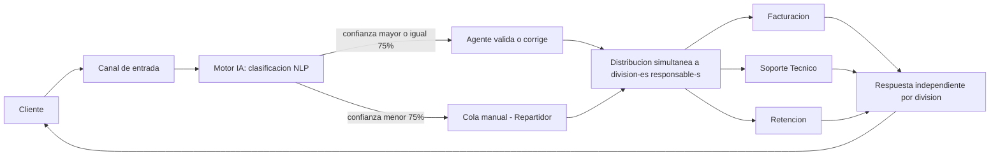
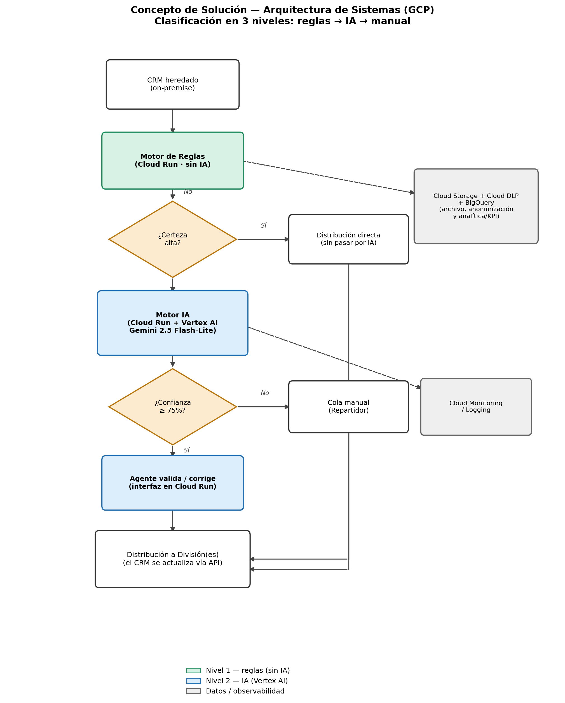
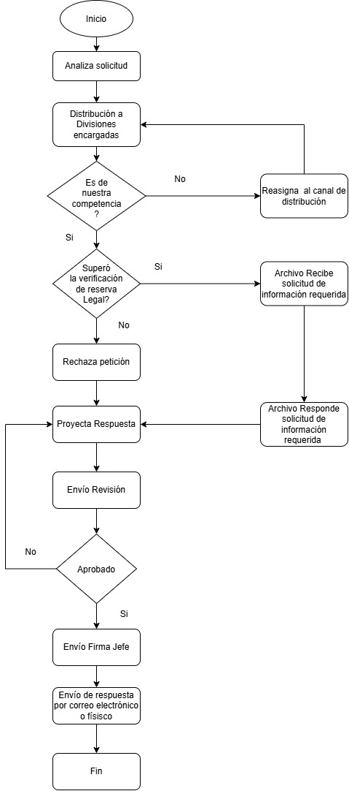
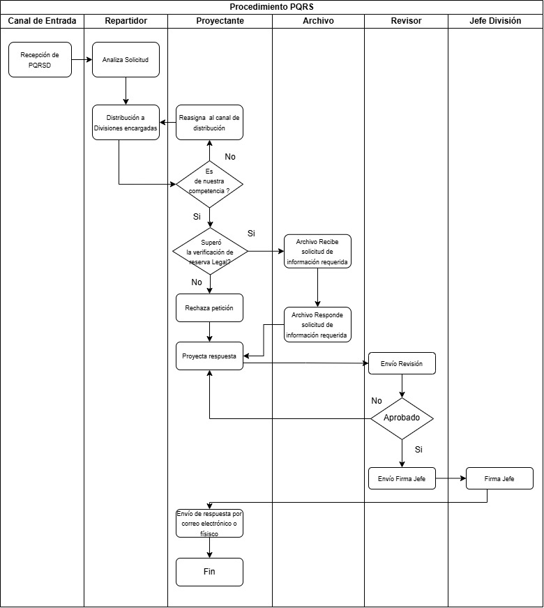
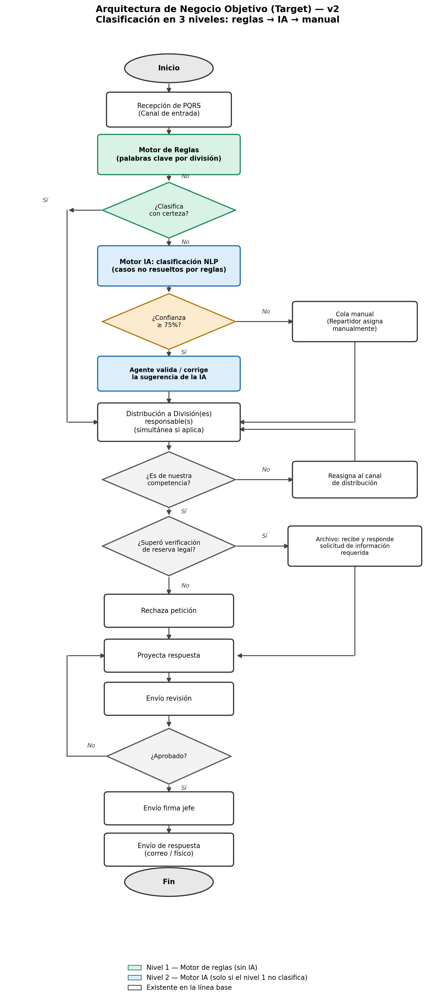
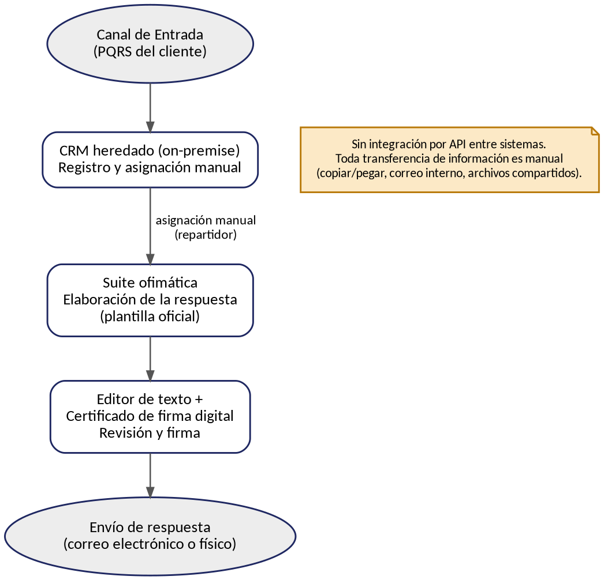
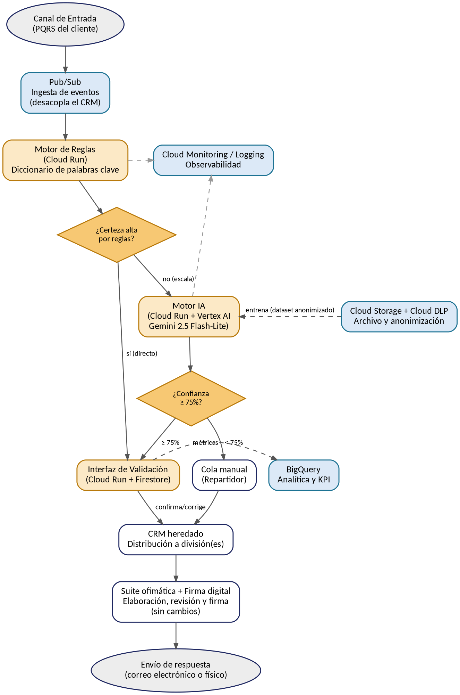

# Fase A: Visión de la Arquitectura (TOGAF)
## Proyecto: Modelo de IA para Enrutamiento Inteligente de PQRS
**Empresa de Referencia:** TelcoLatam (Empresa de Telecomunicaciones)

> **Nota de versión.** Este documento es la revisión arquitectónica de la Fase A original. Los cambios frente a la versión previa están marcados con 🔧 y resumidos en la sección 0. Los valores marcados como **(supuesto)** son cifras de ejemplo, razonables pero ilustrativas, que deben validarse con datos reales de TelcoLatam antes de la aprobación formal del documento.

---

## 0. Registro de cambios aplicados en esta revisión

| # | Cambio | Motivo |
|---|---|---|
| 1 | Se añadieron los Riesgos 3, 4 y 5 (integración con el CRM heredado, resistencia al cambio, cumplimiento de la Ley 1581 de 2012) | Estaban mencionados como preocupaciones de las partes interesadas pero no se reflejaban en el registro de riesgos |
| 2 | Se reconciliaron las métricas de cobertura (85%), exactitud (88%) y umbral de confianza (75%) | Eran tres cifras relacionadas sin una explicación de cómo se conectan entre sí |
| 3 | Se explicó la relación entre el objetivo de negocio (–40% en tiempo de primera respuesta) y el KPI de triage (–90%) | El objetivo de negocio y el KPI operativo miden cosas distintas y no estaban conectados |
| 4 | Se definió el modelo de respuesta cuando un ticket se divide entre varias divisiones: **respuestas independientes, una por división** | Decisión pendiente, confirmada por el patrocinador |
| 5 | Se especificó la jurisdicción de protección de datos: **Colombia — Ley 1581 de 2012 (Habeas Data)**, Decreto 1377 de 2013, y el marco regulatorio de tiempos de respuesta de PQR (Resolución CRC 5050 de 2016, art. 2.1.24.3) | La versión original mencionaba "la Ley de Protección de Datos Personales" sin especificar país |
| 6 | Se añadió un concepto de solución (*Solution Concept*) en diagrama | La Visión de Arquitectura solo tenía descripción narrativa |
| 7 | Se amplió la Evaluación de Preparación con factores de gobernanza, capacidad de las áreas receptoras y preparación legal/cumplimiento | Solo cubría TI y Cultura |
| 8 | Se añadieron métricas base **(supuestos ilustrativos)**: CSAT actual y tasa de reasignaciones por mala clasificación | No existía un punto de partida cuantificado para medir la mejora prometida |
| 9 | Se reescribieron los principios con la estructura completa de TOGAF (Nombre, Enunciado, Justificación, Implicaciones) y se agregaron un principio de Tecnología y uno de Privacidad | Faltaban implicaciones concretas y no había principio para el dominio Tecnología, pese a estar en el alcance |
| 10 | Se incluyó explícitamente en el Alcance la interfaz de validación/corrección para agentes | Era un requisito de un stakeholder pero no aparecía en la sección de alcance |
| 11 | Se agregó un mapa de partes interesadas (poder/interés) con roles adicionales | Faltaban el Oficial de Protección de Datos, los líderes de las divisiones receptoras y el cliente final |
| 12 | Se agregó una memoria de cálculo ilustrativa **(supuesto)** para el ROI de 8 meses | La cifra no tenía sustento numérico |
| 13 | Se agregó la sección 12 con la arquitectura de sistemas (GCP) y el presupuesto desarrollados en la propuesta técnica posterior | El presupuesto de USD 50.000 (sección 3) tampoco tenía desglose de a qué se destinaría |

---

## 1. Establecer el Proyecto de Arquitectura

La arquitectura empresarial es una capacidad de negocio, por lo que este ciclo del ADM (Architecture Development Method) se manejará como un proyecto formal utilizando el marco de gestión de proyectos de TelcoLatam.

* **Nombre del Proyecto:** IA-PQRS Smart Routing.
* **Alineación corporativa:** Este proyecto apoya el marco de gestión estratégica de Servicio al Cliente, buscando el respaldo de la gerencia corporativa y el compromiso de la gerencia de línea.
* 🔧 **Patrocinio formal:** Director de Servicio al Cliente (patrocinador de negocio) y Gerente de TI (patrocinador tecnológico), quienes firman la aprobación de esta fase (sección 11).

## 2. Identificar las Partes Interesadas, las Preocupaciones y los Requisitos del Negocio

El compromiso de las partes interesadas en esta etapa tiene tres objetivos: identificar componentes de la visión y requisitos, identificar los límites del alcance y reconocer las preocupaciones y factores culturales que darán forma a la comunicación de la arquitectura.

### 2.1 Partes interesadas principales

* **Director de Servicio al Cliente (Stakeholder principal):**
  * *Preocupación:* Tiempos de respuesta lentos y alta insatisfacción del cliente.
  * *Requisito:* Clasificación precisa de al menos el 85% de las PQRS sin intervención humana.
* **Gerente de TI (Stakeholder técnico):**
  * *Preocupación:* Integración del modelo de IA con el CRM heredado (legacy) de la empresa.
  * *Requisito:* Arquitectura basada en microservicios y APIs RESTful.
* **Agentes de Soporte (Usuarios finales):**
  * *Preocupación:* Miedo al reemplazo laboral y fatiga por reasignación manual.
  * *Requisito:* Interfaz clara donde la IA sugiera el área (Facturación, Soporte Técnico, Retención) y permita corrección manual si es necesario.

### 2.2 🔧 Mapa de partes interesadas (poder / interés)

| Parte interesada | Interés | Poder / influencia | Estrategia de involucramiento |
|---|---|---|---|
| Director de Servicio al Cliente | Alto | Alto | Gestionar de cerca — patrocinador |
| Gerente de TI | Alto | Alto | Gestionar de cerca — patrocinador |
| Agentes de Soporte | Alto | Medio | Mantener informados; involucrar en el diseño de la interfaz de validación |
| 🔧 Líderes de Facturación / Soporte Técnico / Retención (nuevo) | Medio | Medio | Mantener satisfechos — deben validar su capacidad de recibir casos ya enrutados, incluyendo respuestas independientes por división (sección 8) |
| 🔧 Oficial de Protección de Datos / Cumplimiento (nuevo) | Medio | Alto | Consultar antes de usar el histórico de PQRS para entrenar el modelo (ver Principio de Privacidad, sección 7, y Riesgo 5, sección 10) |
| 🔧 Cliente final / ciudadano (nuevo) | Alto (impactado por el resultado) | Bajo (influencia directa) | Monitorear a través del CSAT y del tiempo de respuesta |

## 3. Confirmar y Definir los Objetivos del Negocio, los Impulsores del Negocio y las Limitaciones

Es necesario identificar los objetivos comerciales y los impulsores estratégicos de la organización, asegurando que las definiciones existentes estén actualizadas.

* **Objetivo del Negocio:** Reducir el tiempo promedio de primera respuesta a las PQRS en un 40% durante el primer trimestre de implementación.
* **Impulsores del Negocio (Drivers):** Alto volumen de solicitudes diarias (más de 10.000 PQRS) y penalizaciones regulatorias por incumplimiento en tiempos de respuesta. 🔧 En Colombia, el proveedor de servicios de comunicaciones debe responder toda PQR dentro de los 15 días hábiles siguientes a su presentación (Resolución CRC 5050 de 2016, art. 2.1.24.3, prorrogable 15 días hábiles adicionales para práctica de pruebas); si no hay respuesta dentro del término aplica el Silencio Administrativo Positivo, que resuelve la PQR a favor del usuario. Esta es la penalización regulatoria concreta que motiva el proyecto.
* **Limitaciones (Constraints):** Presupuesto estricto de $50.000 USD, límite de tiempo de 3 meses para el MVP, y cumplimiento obligatorio de la **Ley 1581 de 2012 (Ley Estatutaria de Habeas Data)** y su Decreto reglamentario 1377 de 2013 en la manipulación de los textos de las quejas. 🔧 *(Jurisdicción especificada: Colombia, confirmada por el patrocinador.)*

### 3.1 🔧 Nota de trazabilidad: objetivo de negocio vs. KPI operativo

El objetivo de negocio (–40% en el tiempo total de primera respuesta) y el KPI de la sección 9 (–90% en el tiempo de *triage*) miden cosas distintas y no se puede asumir que uno implique el otro automáticamente. El razonamiento que los conecta es el siguiente:

* En la línea base, el cuello de botella declarado no es solo el tiempo de lectura del ticket (3–5 min), sino la **cola de hasta 24 horas** que se forma porque la capacidad de triage manual no alcanza a absorber el volumen (>10.000 PQRS/día).
* Si el motor de IA elimina prácticamente ese tiempo de servicio de triage, la cola generada por saturación de capacidad debería reducirse drásticamente (en términos de teoría de colas: al aumentar la tasa de servicio muy por encima de la tasa de llegada, el tiempo de espera tiende a colapsar), lo que hace plausible el 40% de reducción total.
* Sin embargo, los pasos posteriores (proyección, revisión y firma de la respuesta) **permanecen manuales** y no están cubiertos por esta automatización; si estos pasos resultan ser el nuevo cuello de botella, el 40% podría no alcanzarse solo con la mejora del triage.
* **Recomendación:** medir, además del tiempo de triage, el **tiempo de ciclo total** end-to-end como KPI complementario desde el piloto (sección 8), y tratar el 40% como una meta a validar, no como un hecho garantizado por el 90%.

## 4. Evaluar las Capacidades del Negocio

Este paso busca comprender el nivel de capacidad base y objetivo de la empresa. Es fundamental identificar las capacidades comerciales requeridas que la empresa debe poseer para actuar sobre las prioridades estratégicas.

* **Capacidad Base (Baseline):** Actualmente, la redirección de PQRS es 100% manual. Los agentes leen cada ticket y lo asignan en el CRM, tomando un promedio de 3 a 5 minutos por ticket.
* 🔧 **Métricas base adicionales (supuesto, a validar con datos reales de TelcoLatam):**
  * CSAT actual del proceso de PQRS: **61/100** *(supuesto)*.
  * Tasa de reasignaciones por clasificación inicial incorrecta ("¿Es de nuestra competencia? → No"): **≈ 18% de los tickets** *(supuesto)*.
  * Estas dos cifras deben reemplazarse por datos reales del CRM antes de fijar la línea base definitiva; se incluyen aquí solo para que el caso de negocio tenga un punto de partida cuantificable.
* **Capacidad Objetivo (Target):** Capacidad de procesamiento de lenguaje natural (NLP) integrada en el CRM que pre-clasifica y enruta el ticket en milisegundos.
* **Brechas (Gaps):** La empresa carece de talento interno especializado en IA (brecha de habilidades) y de infraestructura de procesamiento en la nube nativa.

## 5. Evaluar la Preparación para la Transformación del Negocio

Se utiliza una Evaluación de Preparación para la Transformación del Negocio para evaluar y cuantificar la preparación de la organización para someterse a un cambio.

* **Factores de preparación:**
  * *TI:* Preparación media (el CRM tiene APIs, pero la infraestructura es On-Premise).
  * *Cultura Organizacional:* Preparación baja/media. Hay resistencia al cambio por parte del nivel operativo ante la automatización.
  * 🔧 *Gobernanza y patrocinio (nuevo):* Preparación alta — existe patrocinio formal de dos directivos senior (sección 1), pero **falta constituir un comité de gobierno de datos/IA** que apruebe el uso del histórico de PQRS para entrenamiento (ver Riesgo 5).
  * 🔧 *Capacidad de las áreas receptoras — Facturación, Soporte Técnico, Retención (nuevo):* Sin evaluar formalmente. Al haberse definido que cada división responde de forma **independiente** (sección 8), el riesgo de descoordinación entre áreas se reduce, pero debe confirmarse que cada división tiene capacidad operativa para atender casos que hoy le llegan tras una cola de 24 horas y que, en el escenario objetivo, le llegarán casi en tiempo real.
  * 🔧 *Preparación legal / cumplimiento (nuevo):* Media — TelcoLatam ya opera bajo la Ley 1581 de 2012, pero no se ha evaluado si la política de tratamiento de datos vigente cubre el uso de texto histórico de PQRS para entrenar modelos de IA; probablemente se requiera anonimización o una autorización específica del titular (Decreto 1377 de 2013).
* Estos resultados se utilizan para dar forma al alcance de la arquitectura e identificar áreas de riesgo.

## 6. Definir el Alcance

Se debe definir qué está dentro y qué está fuera del alcance de los esfuerzos de la Arquitectura Base y la Arquitectura Objetivo.

* **Dentro del alcance (In-scope):**
  * Desarrollo del modelo de IA (clasificación de texto).
  * Creación del microservicio de inferencia.
  * Integración con el módulo de enrutamiento del CRM actual.
  * 🔧 **Interfaz de validación y corrección de la sugerencia de la IA para los Agentes de Soporte** (antes implícita, ahora explícita, ya que es un requisito directo del stakeholder "Agentes de Soporte" en la sección 2).
* **Fuera del alcance (Out-of-scope):**
  * La resolución automática o respuesta automatizada (Chatbot) hacia el cliente final; el alcance se limita solo al enrutamiento al área responsable.
  * 🔧 **Consolidación automática de respuestas entre divisiones.** Cuando un ticket involucre a más de una división (por ejemplo, Facturación y Soporte Técnico), **cada división elabora y envía su propia respuesta de forma independiente**, siguiendo el proceso ya vigente de proyección, revisión y firma; no se construye un mecanismo de consolidación entre áreas en esta iteración (decisión del patrocinador).
* **Dominios de arquitectura a cubrir:** Negocio, Datos (datasets de entrenamiento de PQRS), Aplicación (APIs e integración CRM) y Tecnología (Infraestructura Cloud).

## 7. Confirmar y Definir los Principios de la Arquitectura, incluyendo los Principios del Negocio

🔧 Los principios se reescriben con la estructura completa de TOGAF (Nombre, Enunciado, Justificación, Implicaciones) y se agregan un principio de Tecnología y uno de Privacidad, dado que ambos dominios están en el alcance pero no tenían principio propio.

**Principio de Negocio 1 — El cliente es el centro de la operación**
* *Enunciado:* Toda decisión de diseño debe priorizar el enrutamiento ágil de la PQRS para mejorar la experiencia del cliente.
* *Justificación:* La insatisfacción del cliente y los tiempos de respuesta lentos son la preocupación explícita del Director de Servicio al Cliente y el driver principal del proyecto.
* *Implicaciones:* Cualquier decisión técnica que agregue latencia perceptible al cliente (por ejemplo, revisiones adicionales no esenciales) debe justificarse explícitamente frente a este principio.

**Principio de Arquitectura (Datos) — Los datos son un activo**
* *Enunciado:* Los históricos de PQRS deben estar limpios, clasificados y gobernados para entrenar modelos efectivos.
* *Justificación:* La calidad del modelo de clasificación depende directamente de la calidad del dataset de entrenamiento.
* *Implicaciones:* Se requiere un proceso de curaduría, etiquetado, auditoría y balanceo del dataset antes del entrenamiento (ver Riesgo 2, sección 10).

**Principio de Arquitectura (Aplicación) — Independencia tecnológica**
* *Enunciado:* El modelo de IA debe estar desacoplado del CRM para permitir escalabilidad futura.
* *Justificación:* Acoplar el modelo directamente al CRM heredado limitaría la escalabilidad y dificultaría futuras migraciones tecnológicas.
* *Implicaciones:* El modelo se expone como microservicio con API REST; el CRM lo consume como cliente, no como componente interno.

**🔧 Principio de Arquitectura (Tecnología) — Preferencia por servicios administrados en la nube (*cloud-first*)** *(nuevo)*
* *Enunciado:* La infraestructura del microservicio de inferencia debe desplegarse preferentemente sobre servicios administrados en la nube, en lugar de ampliar la huella on-premise del CRM heredado.
* *Justificación:* La capacidad objetivo exige clasificar en milisegundos y escalar ante picos de más de 10.000 PQRS/día; la infraestructura on-premise actual no está diseñada para esa elasticidad (brecha de infraestructura, sección 4).
* *Implicaciones:* Se requiere presupuesto y habilidades de operación cloud (brecha ya identificada); la integración con el CRM debe hacerse vía API, no por acceso directo a su base de datos.

**🔧 Principio de Arquitectura (Datos / Privacidad) — Privacidad desde el diseño** *(nuevo)*
* *Enunciado:* El tratamiento del texto de las PQRS para entrenar o ejecutar el modelo de IA debe cumplir la Ley 1581 de 2012 y su Decreto 1377 de 2013 desde la etapa de diseño, no como control posterior.
* *Justificación:* Las PQRS pueden contener datos personales, y ocasionalmente datos sensibles; procesarlos sin las autorizaciones o la anonimización adecuadas expone a TelcoLatam a sanciones de la Superintendencia de Industria y Comercio y a pérdida de confianza del cliente (Riesgo 5, sección 10).
* *Implicaciones:* El dataset de entrenamiento debe anonimizarse o seudonimizarse; la finalidad del tratamiento debe documentarse en la política de datos vigente; el Oficial de Protección de Datos debe validar el proceso antes de iniciar el entrenamiento.

## 8. Desarrollar la Visión de la Arquitectura

Basándose en las preocupaciones de las partes interesadas, los requisitos, el alcance y los principios, se crea una vista de alto nivel de las arquitecturas base y objetivo.

* **Escenario de Negocio** 🔧 *(corregido para reflejar la decisión de respuestas independientes):* Un cliente envía una queja extensa sobre una caída de internet y un cobro injustificado. En la *Arquitectura Base*, el ticket espera en una cola general hasta 24 horas hasta que un agente humano lo lee y lo envía primero a Soporte Técnico y, después, de forma secuencial, a Facturación — duplicando la espera del cliente. En la *Arquitectura Objetivo*, el modelo de IA extrae la intención y las entidades del texto, identifica que el caso corresponde a dos áreas (Soporte Técnico y Facturación) y notifica a ambas **simultáneamente**; cada división recibe su propio caso y **elabora y envía su respuesta de forma independiente**, siguiendo el mismo proceso de proyección, revisión y firma ya vigente, sin necesidad de coordinación ni consolidación entre áreas.
* Estas definiciones iniciales de la arquitectura deben almacenarse en el Repositorio de Arquitectura.

### 8.1 🔧 Concepto de solución (*Solution Concept*) *(nuevo)*

```mermaid
flowchart LR
    A[Cliente] --> B[Canal de entrada]
    B --> C[Motor IA: clasificacion NLP]
    C -->|confianza mayor o igual 75%| D[Agente valida o corrige]
    C -->|confianza menor 75%| E[Cola manual - Repartidor]
    D --> F[Distribucion simultanea a division-es responsable-s]
    E --> F
    F --> G1[Facturacion]
    F --> G2[Soporte Tecnico]
    F --> G3[Retencion]
    G1 --> H[Respuesta independiente por division]
    G2 --> H
    G3 --> H
    H --> A
```

*Cada rectángulo Gx representa una división que, si recibe el caso, sigue su propio ciclo de proyección–revisión–firma ya vigente en el Procedimiento PQRSD, sin depender de las demás.*

## 9. Definir las propuestas de valor de la arquitectura objetivo y los KPI

Es fundamental desarrollar el caso de negocio, definir las propuestas de valor para los grupos de partes interesadas y establecer métricas de rendimiento.

* **Propuesta de Valor:** Transformar el centro de contacto de un cuello de botella reactivo a un despachador inteligente y automatizado, reduciendo costos operativos y mitigando el riesgo de multas regulatorias.
* **KPIs (Indicadores Clave de Rendimiento)** 🔧 *reescritos y reconciliados:*
  * **Cobertura de enrutamiento automático:** ≥ 85% de las PQRS deben quedar enrutadas sin intervención humana (requisito del Director de Servicio al Cliente), lograda cuando el modelo entrega una confianza ≥ 75% (umbral operativo del Riesgo 1).
  * **Exactitud del modelo:** > 88% de precisión en la clasificación del área responsable, medida sobre el subconjunto de PQRS que supera el umbral de confianza del 75% (es decir, sobre el tramo cubierto automáticamente).
    * 🔧 *Nota de reconciliación:* cobertura (85%) y exactitud (88%) son magnitudes independientes — no hay garantía teórica de que un único umbral del 75% las satisfaga a ambas simultáneamente. Se recomienda tratar el 75% como punto de partida y ajustarlo durante el piloto (Fase C/D) según el balance real cobertura/exactitud que arroje el modelo.
  * **Reducción de tiempo de triage:** 90% de disminución en el tiempo de clasificación inicial (de 3–5 minutos a milisegundos).
  * **Reducción de tiempo total de primera respuesta:** 40% en el primer trimestre — sujeta a la nota de trazabilidad de la sección 3.1; se recomienda monitorear también el tiempo de ciclo de los pasos manuales posteriores (proyección, revisión, firma) como KPI complementario.
  * **Retorno de Inversión (ROI):** Recuperación de la inversión en 8 meses mediante la optimización de horas-hombre.
    * 🔧 **Memoria de cálculo ilustrativa (supuesto, a validar con datos reales de TelcoLatam):**
      * Volumen: 10.000 PQRS/día; con 85% de cobertura automática ≈ 8.500 tickets/día dejan de requerir triage manual.
      * Ahorro estimado por ticket automatizado: ≈ 4 minutos (de ~4 min manual a prácticamente 0).
      * Ahorro de tiempo: 8.500 × 4 min ≈ 566 horas-agente/día.
      * Costo promedio hora-agente *(supuesto)*: USD 6/hora → ahorro ≈ USD 3.400/día ≈ USD 71.000/mes (22 días hábiles).
      * Con una inversión de USD 50.000, el punto de equilibrio aritmético se alcanzaría en menos de un mes de operación estable, lo que sugiere que el horizonte de 8 meses de la Fase A original es conservador y probablemente ya incorpora la curva de aprendizaje del modelo, el tiempo de estabilización y los costos de infraestructura/talento adicionales (brecha de la sección 4) que no estaban desglosados. Se recomienda documentar estos supuestos explícitamente en el caso de negocio formal.

## 10. Identificar los riesgos de la transformación empresarial y las actividades de mitigación

Se deben identificar los riesgos asociados con la Visión de la Arquitectura y evaluar su nivel inicial y su estrategia de mitigación. Se consideran dos niveles de riesgo: Nivel de Riesgo Inicial y Nivel de Riesgo Residual.

* **Riesgo 1 — Clasificación errónea del modelo de IA (falsos positivos):** puede retrasar aún más el ticket (Riesgo Inicial: Crítico).
  * *Mitigación:* Implementar un umbral de confianza (*confidence score*). Si la IA tiene menos del 75% de seguridad en la predicción, el ticket se envía a la cola manual. (Riesgo Residual: Marginal).
* **Riesgo 2 — Sesgo en los datos de entrenamiento históricos** que provoque mala atención a ciertas demografías (Riesgo Inicial: Marginal).
  * *Mitigación:* Auditoría y balanceo del dataset antes de la fase de entrenamiento. (Riesgo Residual: Insignificante).
* 🔧 **Riesgo 3 — Integración con el CRM heredado** *(nuevo):* Las limitaciones, límites de tasa o indisponibilidad de las APIs del CRM on-premise pueden impedir el enrutamiento en tiempo real, afectando directamente la preocupación ya declarada por el Gerente de TI (Riesgo Inicial: Alto).
  * *Mitigación:* Diseñar el microservicio de inferencia desacoplado (Principio de independencia tecnológica) con reintentos automáticos y una cola de contingencia hacia el Repartidor si el CRM no responde a tiempo. (Riesgo Residual: Moderado).
* 🔧 **Riesgo 4 — Resistencia al cambio / baja adopción por parte de los agentes** *(nuevo):* El temor al reemplazo laboral y la preparación cultural baja/media (sección 5) pueden generar baja adopción del paso de validación humana, o desconfianza sistemática hacia las sugerencias de la IA (Riesgo Inicial: Alto).
  * *Mitigación:* Comunicar explícitamente que el rol del agente es de validación y no de reemplazo; capacitación temprana; involucrar a los Agentes de Soporte en el diseño de la interfaz de validación (Fase C). (Riesgo Residual: Bajo).
* 🔧 **Riesgo 5 — Incumplimiento de la Ley 1581 de 2012 en el tratamiento de datos de entrenamiento** *(nuevo):* Usar el histórico de PQRS sin las autorizaciones o la anonimización requeridas expone a TelcoLatam a sanciones de la Superintendencia de Industria y Comercio y a daño reputacional (Riesgo Inicial: Alto).
  * *Mitigación:* Anonimización/seudonimización del dataset y validación previa con el Oficial de Protección de Datos, conforme al Principio de Privacidad desde el diseño (sección 7). (Riesgo Residual: Bajo).

## 11. Desarrollar la Declaración de Trabajo de Arquitectura y plantear su aprobación

Se evaluarán los productos de trabajo requeridos contra los requisitos de rendimiento comercial y se estimarán los recursos necesarios para desarrollar la hoja de ruta.

* **Documento de Aprobación:** Se elabora formalmente la Declaración de Trabajo de Arquitectura, que incluirá la visión general, el plan del proyecto y los roles de: científicos de datos, ingenieros de datos, arquitectos de TI, 🔧 y además un **responsable de cumplimiento/protección de datos** y un **líder de producto o gerente de proyecto**, dado el nuevo Principio de Privacidad y los Riesgos 3 a 5 identificados en esta revisión.
* **Comunicaciones:** Se desarrolla el Plan de Comunicaciones de Arquitectura Empresarial para interactuar con las partes interesadas —incluyendo ahora a los líderes de las divisiones receptoras y al Oficial de Protección de Datos (sección 2.2)— sobre el progreso del proyecto.
* **Aprobación:** Se revisan los planes con los patrocinadores (Director de Servicio al Cliente y Gerente de TI) para asegurar la aprobación formal bajo los procedimientos de gobernanza adecuados y obtener la firma (*sign-off*) para proceder a la Fase B (Arquitectura de Negocio).

## 12. Arquitectura de Sistemas y Presupuesto (actualización posterior)

### 12.1 Resumen del cambio

El presupuesto de USD 50.000 fijado en la sección 3 no tenía una memoria de cálculo que lo respaldara. Además, se decidió anteponer un filtro de clasificación sin IA (motor de reglas por palabras clave) antes de invocar el modelo de IA, para reducir la latencia y el costo, escalando a IA solo cuando el motor de reglas no puede determinar el área con certeza. Con base en esto se desarrolló, como propuesta técnica posterior a esta Fase A, la arquitectura de sistemas en GCP y el presupuesto desglosado que se resumen a continuación.

### 12.2 Arquitectura

La clasificación pasa a tener tres niveles: **(1) Motor de Reglas** (Cloud Run, sin IA, diccionario de palabras clave por división) → si no clasifica con certeza, **(2) Motor IA** (Cloud Run + Vertex AI, modelo Gemini 2.5 Flash-Lite) aplicando el umbral de confianza del 75% ya definido en la sección 10 → si tampoco alcanza el umbral, **(3) cola manual** del Repartidor, sin cambios frente a la línea base. Un motor de reglas no requiere dataset de entrenamiento, es inmediato de construir dentro del plazo de 3 meses del MVP, y sus decisiones son 100% explicables, algo relevante frente a la obligación regulatoria de justificar cómo se resuelve cada PQR (Resolución CRC 5050 de 2016, ya referenciada en la sección 3).

*Figura. Concepto de solución de la arquitectura objetivo en GCP: clasificación en 3 niveles (reglas → IA → manual), con los componentes de datos y observabilidad como soporte transversal.*

| Componente | Servicio GCP | Rol |
|---|---|---|
| Ingesta de eventos | Pub/Sub | Desacopla el CRM heredado de los servicios de clasificación, con reintentos automáticos (mitiga el Riesgo 3, sección 10) |
| Motor de reglas | Cloud Run | Servicio sin estado; ejecuta el diccionario de palabras clave por división |
| Motor de IA | Cloud Run + Vertex AI (Gemini 2.5 Flash-Lite) | Cloud Run orquesta la llamada al modelo de lenguaje alojado en Vertex AI |
| Interfaz de validación del agente | Cloud Run + Firestore | El Agente de Soporte confirma o corrige la sugerencia; Firestore guarda el estado del caso |
| Archivo y anonimización | Cloud Storage + Cloud DLP | Cloud DLP redacta datos personales antes de reentrenar el modelo (Principio de Privacidad desde el Diseño, sección 7) |
| Analítica y KPI | BigQuery | Tablero de cobertura, exactitud y tiempo de ciclo (KPI de la sección 9) |
| Observabilidad | Cloud Monitoring / Cloud Logging | Alerta si la tasa de escalamiento a IA o a cola manual se dispara |
| Identidad y seguridad | IAM + VPC Service Controls | Un solo perímetro de cumplimiento; ningún dato de PQRS sale de GCP |

### 12.3 Presupuesto

**MVP (3 meses):**

| Ítem | Costo estimado |
|---|---|
| Científico de Datos / ML Engineer (contratista, perfil semi-senior en Colombia) **(supuesto)** | ≈ USD 7.400 |
| Ingeniero Cloud/Backend (recurso interno ya asignado; no es desembolso nuevo) | ≈ USD 2.600 (costo de oportunidad, referencial) |
| Revisión de cumplimiento (Ley 1581 / anonimización) **(supuesto)** | ≈ USD 1.500 |
| Infraestructura GCP durante el MVP (dentro de los niveles gratuitos a este volumen) | ≈ USD 100 |
| Capacitación a agentes **(supuesto)** | ≈ USD 800 |
| Contingencia (15%) | ≈ USD 1.470 |
| **Total incremental (efectivo nuevo)** | **≈ USD 11.270** |

**Operación en régimen estable (post-MVP, mensual):** infraestructura ≈ USD 50–80/mes (Pub/Sub, Cloud Run, Vertex AI, BigQuery, Monitoring) + ML Engineer a 20% de dedicación **(supuesto)** ≈ USD 490/mes → **total ≈ USD 550–570/mes (≈ USD 6.600–6.900/año)**, frente a un ahorro estimado en horas-agente de ≈ USD 71.000/mes (memoria de cálculo del ROI, sección 9).

**Conclusión:** el presupuesto real del MVP, desglosado, se ubica entre USD 11.000 y 14.000 — muy por debajo de los USD 50.000 originalmente asignados. Esto no implica que $50.000 fuera insuficiente; el problema señalado era la falta de desglose, no la magnitud. Con el desglose en mano, el comité de aprobación puede optar por mantener los USD 50.000 como margen de contingencia e iteración, o reasignar el excedente a otras iniciativas.

### 12.4 Riesgos y consideraciones de esta arquitectura

* El motor de reglas requiere mantenimiento continuo del diccionario de palabras clave a medida que cambian los productos/servicios de TelcoLatam; sin este mantenimiento, aumenta la carga sobre el Motor IA (sin impacto material en el costo, sí en la latencia).
* Los precios de Vertex AI cambian con frecuencia; el presupuesto de la sección 12.3 usa el escenario de "peor caso" (100% de los casos escalados a IA) para no depender de qué tan bien funcione el motor de reglas.
* El crédito de bienvenida de USD 300 de Google Cloud aplica solo a cuentas nuevas y por tiempo limitado; no debe tratarse como ahorro recurrente.
* Los Riesgos 3, 4 y 5 (sección 10 de este documento) siguen aplicando íntegramente a esta arquitectura.

---

### Aprobación

| Rol | Nombre | Firma | Fecha |
|---|---|---|---|
| Director de Servicio al Cliente | | | |
| Gerente de TI | | | |

# Fase B: Arquitectura de Negocio
## Marco de trabajo TOGAF — ADM (Architecture Development Method)
### Proyecto: IA-PQRS Smart Routing
**Enrutamiento inteligente de Peticiones, Quejas, Reclamos y Sugerencias (PQRS)**
**Empresa de referencia:** TelcoLatam

*Documento elaborado como continuación de la Fase A: Visión de la Arquitectura.*

---

## 1. Introducción y alcance de la Fase B

El objetivo de la Fase B del ADM de TOGAF es desarrollar la Arquitectura de Negocio objetivo que describe cómo TelcoLatam necesita operar para alcanzar las metas establecidas en la Fase A (Visión de la Arquitectura), documentando tanto la arquitectura de línea base (situación actual) como la arquitectura objetivo, e identificando las brechas, los requisitos de negocio y los componentes de la hoja de ruta necesarios para cerrarlas.

Este documento toma como entrada directa la Visión de la Arquitectura aprobada en la Fase A (proyecto "IA-PQRS Smart Routing") y el procedimiento operativo vigente "Procedimiento PQRSD", que documenta el proceso manual actual de gestión y respuesta a PQRS. A partir de ambos insumos se construye la arquitectura de negocio línea base y objetivo, los catálogos y matrices formales, el análisis de brechas, la especificación de requisitos y los componentes de la hoja de ruta que exige esta fase.

### 1.1 Trazabilidad con la Fase A

| Elemento de la Fase A | Contenido aprobado | Reflejo en esta Fase B |
|---|---|---|
| Objetivo de negocio | Reducir el tiempo promedio de primera respuesta a las PQRS en 40% en el primer trimestre | Motiva el rediseño del proceso de triage/enrutamiento (secciones 3 y 6) |
| Impulsores (drivers) | Alto volumen (>10.000 PQRS/día) y penalizaciones regulatorias por incumplimiento | Justifica la automatización de la clasificación (sección 3.1) |
| Limitaciones | Presupuesto de USD 50.000, MVP en 3 meses, cumplimiento de la Ley de Protección de Datos Personales | Delimita el alcance de la hoja de ruta (sección 8) y los requisitos RN-05 (sección 7) |
| Capacidad base / objetivo | De un proceso 100% manual (3–5 min/ticket) a un motor NLP que clasifica en milisegundos | Estructura la comparación línea base vs. objetivo (secciones 2 y 3) |
| Brechas identificadas | Falta de talento en IA e infraestructura cloud nativa | Insumo directo del análisis de brechas (sección 6) |
| Alcance (in/out) | Dentro: modelo de clasificación y enrutamiento. Fuera: respuesta automatizada al cliente | Delimita qué procesos de la línea base cambian y cuáles permanecen (sección 3.1) |
| Principios de negocio y arquitectura | El cliente es el centro de la operación; los datos son un activo; independencia tecnológica | Guían las decisiones de diseño del proceso objetivo (sección 3) |
| KPI | Accuracy > 88%, reducción de 90% en tiempo de triage, ROI en 8 meses | Métricas de éxito de la arquitectura objetivo (sección 3.1) |
| Riesgos y mitigación | Clasificación errónea (umbral de confianza 75%) y sesgo en los datos (auditoría/balanceo) | Incorporados como controles del proceso objetivo (secciones 3.4 y 7) |

## 2. Arquitectura de Negocio – Línea Base (Baseline)

### 2.1 Descripción general

Actualmente la gestión de PQRS en TelcoLatam es 100% manual: un agente lee cada ticket y lo asigna dentro del CRM, tomando en promedio de 3 a 5 minutos por caso (capacidad base declarada en la Fase A). Este proceso está formalizado en el "Procedimiento PQRSD" vigente, descrito a continuación.

### 2.2 Catálogo de Actor / Rol – Línea Base

| Rol | Responsabilidad principal | Aplicaciones requeridas |
|---|---|---|
| Repartidor | Distribuye las solicitudes internamente, hace seguimiento al vencimiento de términos, elabora el informe mensual y mantiene las plantillas de respuesta. | Suite ofimática, lector de PDF |
| Proyecta la respuesta | Analiza la solicitud, consolida la información, elabora el documento de respuesta con la plantilla oficial y lo remite a revisión. | Suite ofimática, lector de PDF |
| Revisor | Verifica que el documento cumpla los lineamientos institucionales, normativos y de forma; informa inconsistencias sin modificar el documento. | Editor de texto, lector de PDF, certificado de firma PDF |
| Jefe de División | Firma el documento final, validando que el contenido sea adecuado antes del envío al interesado. | Editor de texto, lector de PDF, certificado de firma PDF |

### 2.3 Catálogo de Proceso / Evento / Control / Producto – Línea Base

| Tipo | Elemento | Descripción |
|---|---|---|
| Evento | Recepción de PQRS | Ingreso de la solicitud por el canal de entrada |
| Proceso | Análisis y distribución | El repartidor analiza y distribuye la solicitud a la división encargada |
| Control | Verificación de competencia | Determina si la solicitud corresponde al área o debe reasignarse |
| Control | Verificación de reserva legal | Determina si procede solicitar información adicional o rechazar la petición |
| Proceso | Proyección de la respuesta | Elaboración del documento de respuesta con la plantilla oficial |
| Control | Revisión de forma y fondo | Validación de lineamientos institucionales antes de la firma |
| Control | Lineamientos de elaboración | Plantilla oficial, lenguaje neutral, dirección física, fuente Nunito 10.5–12 pt |
| Producto | Respuesta oficial firmada | Documento firmado por el Jefe de División, enviado por correo o físico |

### 2.4 Diagrama de Proceso de Negocio – Línea Base

Vista simplificada del flujo de extremo a extremo, tal como está documentada en el Procedimiento PQRSD:

*Figura 1. Flujo del proceso PQRSD (línea base) — vista simplificada.*

Vista del mismo proceso organizada por carriles de actor, que respalda el catálogo de la sección 2.2:

*Figura 2. Flujo del proceso PQRSD (línea base) — vista por actor (swimlane).*

### 2.5 Limitaciones observadas en la línea base

* Proceso 100% manual: cada ticket es leído y clasificado por una persona (3–5 minutos por caso).
* Sin mecanismo de priorización ni de clasificación automática de la intención del ciudadano/cliente.
* El volumen actual (>10.000 PQRS/día declarado en la Fase A) satura la capacidad de triage manual, generando los tiempos de respuesta lentos reportados por el Director de Servicio al Cliente.
* No existe un umbral de confianza ni una segunda validación automatizada; toda la trazabilidad depende de la disponibilidad del repartidor.

## 3. Arquitectura de Negocio – Objetivo (Target)

### 3.1 Descripción general

La arquitectura objetivo incorpora un motor de Procesamiento de Lenguaje Natural (NLP) que extrae la intención y las entidades del texto de la PQRS y sugiere, en milisegundos, la o las divisiones responsables (por ejemplo, Facturación y Soporte Técnico de forma simultánea cuando el caso lo requiere, como en el escenario de negocio descrito en la Fase A). El alcance aprobado en la Fase A automatiza únicamente el paso de clasificación y enrutamiento inicial; la elaboración, revisión y firma de la respuesta permanecen sin cambios, dado que la resolución o respuesta automatizada al cliente (chatbot) está explícitamente fuera de alcance.

Para mitigar el riesgo de clasificación errónea (riesgo crítico identificado en la Fase A) se incorpora un umbral de confianza del 75%: por debajo de ese umbral, el caso se enruta a la cola manual del Repartidor, tal como ocurre hoy. Adicionalmente, y para atender la preocupación de los Agentes de Soporte (miedo al reemplazo laboral y fatiga por reasignación manual) y el nivel de preparación cultural bajo/medio reportado en la Fase A, se mantiene un punto de validación humana en el que el agente puede corregir la sugerencia de la IA.

*Esta arquitectura objetivo persigue directamente los KPI definidos en la Fase A: exactitud de clasificación superior al 88%, reducción del 90% en el tiempo de triage y retorno de la inversión en 8 meses.*

🔧 **Actualización (propuesta de arquitectura de sistemas):** antes de invocar el Motor IA, un Motor de Reglas determinístico (palabras clave por división) intenta clasificar el caso. Solo cuando este primer nivel no puede determinar el área con certeza, el caso se escala al Motor IA. Esto reduce la latencia y el costo de inferencia sin cambiar el umbral de confianza del 75% ni el punto de validación humana ya descritos.

### 3.2 Catálogo de Actor / Rol – Objetivo

| Rol / Actor | Responsabilidad en la arquitectura objetivo | Aplicaciones / servicios |
|---|---|---|
|  Motor de Reglas | Servicio determinístico (sin IA) que compara el texto contra un diccionario de palabras clave por división; si la certeza es alta, enruta directo, sin invocar el Motor IA. | Microservicio de reglas (Cloud Run) |
|  Motor de Clasificación IA | Servicio automatizado que analiza el texto, extrae intención y entidades, y sugiere el área responsable con un puntaje de confianza, solo para los casos que el Motor de Reglas no resolvió. | Microservicio de inferencia NLP (API REST) |
|  Agente de Soporte | Revisa la sugerencia de la IA en los casos con confianza ≥ 75% y puede corregirla antes de la distribución. | Interfaz de validación integrada al CRM |
|  Repartidor | Atiende únicamente los casos con confianza < 75% (cola manual); conserva sus funciones de seguimiento e informes. | Suite ofimática, lector de PDF |
| Proyecta la respuesta / Revisor / Jefe de División | Sin cambios frente a la línea base: elaboran, revisan y firman la respuesta una vez recibido el caso ya enrutado. | Suite ofimática, editor de texto, certificado de firma PDF |
| Director de Servicio al Cliente | Patrocinador y stakeholder principal; valida que se cumpla el requisito de 85% de clasificación sin intervención humana. | Tablero de KPI |
| Gerente de TI | Stakeholder técnico; garantiza la integración por microservicios y APIs REST con el CRM heredado. | Plataforma de integración / APIs |
|  Científico de Datos / Ingeniero de Datos | Curan, etiquetan, auditan y balancean el dataset histórico de PQRS; entrenan y validan el modelo NLP. | Plataforma de datos / entrenamiento de modelos |
|  Arquitecto de TI | Diseña la arquitectura de microservicios desacoplada del CRM y su despliegue en la nube. | Repositorio de arquitectura |

### 3.3 Catálogo de Función y Servicio de Negocio

| Función de negocio | Servicio de negocio | Descripción |
|---|---|---|
| Gestión de PQRS | Recepción y registro de solicitudes | Ingreso del caso por el canal de entrada (sin cambios) |
| Clasificación y enrutamiento |  Clasificación por reglas (sin IA) | Servicio nuevo: primer nivel, determinístico, por palabras clave |
| Clasificación y enrutamiento |  Clasificación automática por IA | Servicio nuevo: segundo nivel, solo para lo que las reglas no resuelven |
| Clasificación y enrutamiento |  Validación humana de la sugerencia | Servicio nuevo: el agente confirma o corrige la sugerencia de la IA |
| Atención al cliente | Atención por Facturación / Soporte Técnico / Retención | Áreas receptoras del caso ya enrutado (sin cambios) |
| Elaboración y aprobación de respuestas | Proyección, revisión y firma de la respuesta | Sin cambios frente a la línea base |

### 3.4 Catálogo de Proceso / Evento / Control / Producto – Objetivo

| Tipo | Elemento | Descripción |
|---|---|---|
| Evento | Recepción de PQRS | Ingreso de la solicitud por el canal de entrada (sin cambios) |
|  Proceso | Clasificación por reglas | El motor de reglas compara el texto contra un diccionario de palabras clave por división |
|  Control | Certeza de la clasificación por reglas | Determina si el caso se enruta directo o se escala al Motor IA |
|  Proceso | Clasificación NLP | El motor de IA extrae intención y entidades y sugiere el área responsable (solo casos escalados) |
|  Control | Umbral de confianza (75%) | Determina si el caso se enruta automáticamente o pasa a cola manual |
|  Proceso | Validación del agente | El agente confirma o corrige la sugerencia antes de la distribución |
| Proceso | Distribución simultánea | Notificación a una o varias divisiones responsables en paralelo |
| Control | Verificación de competencia / reserva legal | Sin cambios frente a la línea base |
| Proceso | Proyección, revisión y firma de la respuesta | Sin cambios frente a la línea base |
| Producto | Respuesta oficial firmada | Sin cambios frente a la línea base |

### 3.5 Diagrama de Proceso de Negocio – Objetivo

*Figura 3. Flujo del proceso PQRS con clasificación en 3 niveles (arquitectura objetivo). Verde: reglas sin IA; azul: IA.*

## 4. Matriz de interacción Actor – Proceso

Participación de cada actor en los procesos de la arquitectura objetivo (X = participa):

| Actor / Rol | Recepción | Clasif. reglas | Clasif. IA | Valida agente | Distribución | Competencia/ reserva legal | Proyecta resp. | Revisión | Firma |
|---|---|---|---|---|---|---|---|---|---|
| Motor de Reglas | | X | | | | | | | |
| Motor de Clasificación IA | | | X | | | | | | |
| Agente de Soporte | | | | X | | | | | |
| Repartidor | X | | | | X | | | | |
| División responsable | | | | | X | X | | | |
| Proyecta la respuesta | | | | | | | X | | |
| Revisor | | | | | | | | X | |
| Jefe de División | | | | | | | | | X |

## 5. Matriz Función de Negocio – Organización

| Función de negocio | Área / unidad organizacional responsable |
|---|---|
| Recepción y registro de solicitudes | Canal de entrada / Atención al Cliente |
| Clasificación automática por IA | TI — Ciencia de Datos (operación del microservicio) |
| Validación humana de la sugerencia | Atención al Cliente (Agentes de Soporte) |
| Atención por área responsable | Facturación / Soporte Técnico / Retención |
| Elaboración y aprobación de respuestas | División responsable / Jefatura de División |
| Gobierno y KPI del proceso | Dirección de Servicio al Cliente |
| Integración e infraestructura | Gerencia de TI |

## 6. Análisis de brechas (Gap Analysis)

| Brecha | Estado actual (línea base) | Estado objetivo | Acción para cerrarla |
|---|---|---|---|
| Talento en IA | No existe equipo interno de ciencia/ingeniería de datos | Modelo NLP en producción, monitoreado y reentrenado | Incorporar científico(s) e ingeniero(s) de datos al proyecto (según Declaración de Trabajo de la Fase A) |
| Infraestructura | CRM on-premise, sin infraestructura cloud nativa | Microservicio de inferencia desacoplado, desplegable en la nube | Diseñar la arquitectura de microservicios con el Arquitecto de TI (Fase C/D) |
| Datos | Histórico de PQRS sin limpiar, clasificar ni gobernar | Dataset etiquetado, auditado y balanceado, gobernado como activo | Ejecutar el principio de arquitectura "los datos son un activo" antes del entrenamiento |
| Proceso | Clasificación 100% manual, sin umbral de confianza ni trazabilidad automática | Clasificación automática con umbral de confianza y validación humana | Implementar el flujo objetivo descrito en la sección 3 |
| Adopción / cultura | Preparación cultural baja/media; resistencia al cambio y temor al reemplazo laboral | Agentes con rol de validación y corrección, no de reemplazo | Mantener el punto de validación humana y capacitar a los agentes (hoja de ruta, sección 8) |

## 7. Especificación de requisitos de arquitectura (Business Requirements)

Requisitos de negocio derivados de las partes interesadas y restricciones definidas en la Fase A, y de los lineamientos vigentes del Procedimiento PQRSD:

| ID | Requisito | Fuente |
|---|---|---|
| RN-01 | El motor de clasificación debe alcanzar al menos 85% de exactitud en la asignación del área responsable sin intervención humana. | Director de Servicio al Cliente |
| RN-02 | El motor de clasificación debe exponerse como microservicio con APIs RESTful, integrado al CRM heredado. | Gerente de TI |
| RN-03 | La interfaz debe mostrar al agente el área sugerida por la IA y permitir su corrección manual. | Agentes de Soporte |
| RN-04 | Cuando la confianza del modelo sea inferior al 75%, el caso debe enrutarse a la cola manual del Repartidor. | Mitigación del Riesgo 1 (Fase A) |
| RN-05 | El tratamiento del texto de las PQRS debe cumplir la Ley de Protección de Datos Personales. | Restricciones del proyecto (Fase A) |
| RN-06 | El dataset de entrenamiento debe auditarse y balancearse para mitigar sesgos hacia ciertas demografías. | Mitigación del Riesgo 2 (Fase A) |
| RN-07 | Debe mantenerse el uso de la plantilla oficial, el lenguaje neutral y los demás lineamientos de elaboración de respuestas ya vigentes. | Procedimiento PQRSD |
| RN-08 | El desarrollo del MVP debe ejecutarse dentro de un presupuesto de USD 50.000 y un plazo de 3 meses. | Limitaciones del proyecto (Fase A) |

## 8. Componentes de la hoja de ruta de Arquitectura de Negocio

Hoja de ruta de alto nivel para el MVP, acorde con el plazo de 3 meses y el presupuesto de USD 50.000 definidos en la Fase A:

| Fase | Horizonte | Componentes principales |
|---|---|---|
| Fase 1 — Cimentación | Mes 1 | Recolección, limpieza, etiquetado, auditoría y balanceo del dataset histórico de PQRS; definición de la arquitectura del microservicio. |
| Fase 2 — Construcción | Mes 2 | Entrenamiento y validación del modelo NLP; desarrollo de la API de inferencia; diseño de la interfaz de validación para agentes. |
| Fase 3 — Integración y despliegue | Mes 3 | Integración con el CRM heredado; pruebas piloto con umbral de confianza del 75%; capacitación a agentes; despliegue del MVP y medición de KPI iniciales. |

## 9. Impacto en el panorama arquitectónico y gobernanza

### 9.1 Dominios de arquitectura impactados

* Negocio: rediseño del proceso de triage y enrutamiento de PQRS (este documento).
* Datos: gobierno, etiquetado y balanceo del histórico de PQRS (a detallar en la Fase C).
* Aplicación: microservicio de inferencia, interfaz de validación e integración con el CRM (a detallar en la Fase C).
* Tecnología: infraestructura cloud para el despliegue del microservicio (a detallar en la Fase D).

### 9.2 Riesgos heredados de la Fase A

| Riesgo | Nivel inicial | Mitigación | Nivel residual |
|---|---|---|---|
| Clasificación errónea del modelo de IA | Crítico | Umbral de confianza del 75%; por debajo, enrutamiento manual | Marginal |
| Sesgo en los datos de entrenamiento | Marginal | Auditoría y balanceo del dataset antes del entrenamiento | Insignificante |

### 9.3 Gobierno de arquitectura

Conforme a la Declaración de Trabajo de Arquitectura aprobada en la Fase A, esta Arquitectura de Negocio debe someterse a revisión y aprobación formal del Director de Servicio al Cliente y del Gerente de TI antes de dar paso a la Fase C (Arquitectura de Sistemas de Información), siguiendo el Plan de Comunicaciones de Arquitectura Empresarial definido para el proyecto.

## 10. Conclusión y aprobación para avanzar a la Fase C

Esta Fase B documenta la arquitectura de negocio línea base (proceso manual descrito en el Procedimiento PQRSD) y la arquitectura de negocio objetivo (enrutamiento asistido por IA en 3 niveles: reglas → IA → manual), junto con los catálogos, matrices, el análisis de brechas, los requisitos de negocio y la hoja de ruta necesarios para cerrar la distancia entre ambas, en línea con los objetivos, principios y KPI aprobados en la Fase A. Con esta base, el proyecto "IA-PQRS Smart Routing" queda en condiciones de avanzar hacia la Fase C: Arquitectura de Sistemas de Información.

### Aprobación

| Rol | Nombre | Firma | Fecha |
|---|---|---|---|
| Director de Servicio al Cliente | | | |
| Gerente de TI | | | |

# Fase C: Arquitectura de Sistemas de Información
## Marco de trabajo TOGAF — ADM (Architecture Development Method)
### Proyecto: IA-PQRS Smart Routing
**Enrutamiento inteligente de Peticiones, Quejas, Reclamos y Sugerencias (PQRS)**
**Empresa de referencia:** TelcoLatam

*Documento elaborado como continuación de la Fase B: Arquitectura de Negocio, e informado directamente por el concepto de solución técnica desarrollado en la Fase A: Visión de la Arquitectura (sección 12).*

> **Nota de versión.** Esta es una revisión de la Fase C que incorpora la arquitectura real en GCP y la clasificación en 3 niveles (reglas → IA → manual) confirmadas en la Fase A y en la actualización de la Fase B. Los cambios frente a la versión anterior de este documento están resumidos en la sección 0.

---

## 0. Registro de cambios aplicados en esta revisión

| # | Cambio | Motivo |
|---|---|---|
| 1 | Se incorporó el **Motor de Reglas** (Cloud Run, sin IA) como primer nivel de clasificación, antes del Motor IA | Confirmado en la Fase A (sección 12.1) y en la actualización de la Fase B (sección 3.1) |
| 2 | Se reemplazó la arquitectura "cloud-agnóstica" genérica por la arquitectura real en **Google Cloud Platform (GCP)**: Pub/Sub, Cloud Run, Vertex AI (Gemini 2.5 Flash-Lite), Firestore, Cloud Storage + Cloud DLP, BigQuery, Cloud Monitoring/Logging, IAM + VPC Service Controls | Especificada en la Fase A, sección 12.2 |
| 3 | Se reemplazó la estimación de costos propia (≈USD 43.500, basada en supuestos de mercado) por el **desglose oficial de la Fase A** (≈USD 11.270 de inversión incremental para el MVP) | La Fase A, sección 12.3, ya trae una memoria de cálculo validada internamente; mantener una estimación paralela habría sido incoherente |
| 4 | Se incorporaron los **Riesgos 3, 4 y 5** de la Fase A (integración con el CRM heredado, resistencia al cambio, cumplimiento de la Ley 1581 de 2012) al gobierno de esta fase | Estaban documentados en la Fase A pero no reflejados aún en la arquitectura de sistemas |
| 5 | Se especificó la jurisdicción legal — **Colombia: Ley 1581 de 2012 (Habeas Data), Decreto 1377 de 2013 y Resolución CRC 5050 de 2016** — en los requisitos de sistema y en el gobierno de datos | La versión anterior hablaba de "la Ley de Protección de Datos Personales" sin especificar país |
| 6 | Se actualizaron el catálogo de aplicaciones, el catálogo de interfaces y el diagrama de arquitectura objetivo para reflejar los componentes reales de GCP en lugar de nombres genéricos ("API Gateway", "microservicio de inferencia") | Consistencia con el concepto de solución de la Fase A |

---

## 1. Introducción y alcance de la Fase C

La Fase C del ADM de TOGAF se centra en la Arquitectura de Aplicaciones y Datos: establece cómo el software y la información habilitan las capacidades de negocio definidas en la Fase B. Su objetivo no es diseñar una única aplicación, sino construir el mapa completo del ecosistema de software que soporta el proceso de gestión de PQRS y permite la toma de decisiones estratégica.

La arquitectura de aplicaciones debe servir directamente a la Arquitectura de Negocio definida en la Fase B, y materializar el concepto de solución ya esbozado en la Fase A. Sin esta alineación, la TI se convierte en un bloqueador en lugar de un motor de transformación: por eso cada componente de este documento se conecta explícitamente con un rol, un proceso o un requisito ya aprobado en las fases anteriores.

### 1.1 Trazabilidad con las Fases A y B

| Elemento | Fuente | Contenido aprobado | Reflejo en esta Fase C |
|---|---|---|---|
| Catálogo de actores objetivo (incluye Motor de Reglas) | Fase B, sección 3.2 | Motor de Reglas, Motor de Clasificación IA, Agente de Soporte, Científico/Ingeniero de Datos, Arquitecto de TI | Motiva el catálogo de aplicaciones objetivo (sección 3) |
| Concepto de solución en GCP | Fase A, sección 12.2 | Clasificación en 3 niveles (reglas → IA → manual) sobre Pub/Sub, Cloud Run, Vertex AI, Firestore, Cloud Storage + DLP, BigQuery, Monitoring/Logging, IAM + VPC SC | Base directa de la arquitectura de aplicaciones objetivo (sección 3) y de datos (sección 4) |
| Presupuesto desglosado del MVP | Fase A, sección 12.3 | Inversión incremental ≈ USD 11.270; operación estable ≈ USD 550-570/mes | Anexo A de este documento |
| Riesgos 3, 4 y 5 | Fase A, sección 10 | Integración con el CRM heredado; resistencia al cambio; incumplimiento de la Ley 1581 de 2012 | Sección 9.3 (riesgos técnicos) |
| Jurisdicción legal | Fase A, secciones 3 y 7 | Ley 1581 de 2012, Decreto 1377 de 2013, Resolución CRC 5050 de 2016 | Sección 4.3 (gobierno de datos) y requisito RS-05 |
| Requisitos de negocio (RN-01 a RN-08) | Fase B, sección 7 | Exactitud, integración REST, umbral de confianza, protección de datos, presupuesto | Traducidos a requisitos de sistema RS-01 a RS-10 (sección 7) |
| Hoja de ruta de negocio (3 meses) | Fase B, sección 8 | Cimentación, construcción, integración y despliegue | Detallada con componentes técnicos de GCP (sección 8) |

---

## 2. Arquitectura de Aplicaciones — Línea Base

### 2.1 Descripción general

Los sistemas actuales soportan el proceso 100% manual descrito en el Procedimiento PQRSD y en la Fase B: un agente registra y asigna cada ticket en el CRM heredado, y el resto del ciclo (elaboración, revisión y firma) se apoya en herramientas ofimáticas independientes, sin ninguna integración automatizada entre ellas.

### 2.2 Catálogo de Aplicaciones — Línea Base

| Aplicación | Tipo | Función en el proceso | Usada por |
|---|---|---|---|
| CRM heredado (on-premise) | Sistema de registro | Registro y asignación manual de la PQRS | Repartidor |
| Suite ofimática | Productividad | Elaboración de la respuesta con la plantilla oficial | Proyecta la respuesta |
| Lector de PDF | Utilitario | Consulta de solicitudes y anexos | Todos los roles |
| Editor de texto + certificado de firma digital | Firma electrónica | Revisión y firma del documento final | Revisor, Jefe de División |
| Repositorio de plantillas | Almacenamiento documental | Custodia de la plantilla oficial de respuesta | Repartidor (mantiene), Proyectista (usa) |

### 2.3 Catálogo de Interfaces — Línea Base

No existen interfaces automatizadas entre los sistemas actuales; toda transferencia de información entre aplicaciones es manual.

| Origen | Destino | Mecanismo | ¿Automatizada? |
|---|---|---|---|
| CRM heredado | Suite ofimática | Copiar/pegar manual del caso asignado | No |
| Suite ofimática | Editor de texto / firma digital | Envío de archivo por correo interno | No |
| Repositorio de plantillas | Suite ofimática | Descarga manual de la plantilla en blanco | No |

### 2.4 Diagrama de Arquitectura de Aplicaciones — Línea Base

*Figura 1. Arquitectura de aplicaciones de la línea base — sin integración automatizada entre sistemas.*

### 2.5 Limitaciones observadas en la línea base

* El CRM heredado no expone capacidad nativa de integración vía API (aunque la Fase A señala que sí cuenta con APIs, la infraestructura sigue siendo on-premise, sección 5).
* No existe un repositorio de datos gobernado: el histórico de PQRS está disperso y sin etiquetar.
* No hay ningún mecanismo de clasificación automática ni de monitoreo del desempeño del proceso.
* Cada paso depende de la ejecución manual de una persona, sin trazabilidad de sistema.

---

## 3. Arquitectura de Aplicaciones — Objetivo

### 3.1 Descripción general

La clasificación de una PQRS pasa a tener **tres niveles**, tal como se definió en la Fase A (sección 12.1) y se ratificó en la actualización de la Fase B (sección 3.1):

1. **Motor de Reglas** (Cloud Run, sin IA): compara el texto contra un diccionario de palabras clave por división. Si la certeza es alta, enruta directo, sin invocar el Motor IA.
2. **Motor IA** (Cloud Run + Vertex AI, modelo Gemini 2.5 Flash-Lite): solo se invoca cuando el Motor de Reglas no puede determinar el área con certeza. Aplica el umbral de confianza del 75% ya definido en la Fase A.
3. **Cola manual** (Repartidor): recibe los casos que ni las reglas ni la IA lograron clasificar con certeza suficiente, sin cambios frente a la línea base.

Este diseño en tres niveles no es una preferencia estética: un motor de reglas no requiere dataset de entrenamiento, es inmediato de construir dentro del plazo de 3 meses del MVP, reduce la latencia y el costo de inferencia, y sus decisiones son 100% explicables — algo relevante frente a la obligación regulatoria de justificar cómo se resuelve cada PQR (Resolución CRC 5050 de 2016, art. 2.1.24.3).

Las aplicaciones de elaboración, revisión y firma de la respuesta permanecen sin cambios, en línea con el alcance aprobado en la Fase A.

### 3.2 Modelos de Arquitectura de Aplicaciones aplicados al proyecto

| Modelo | Qué evalúa | Aplicación al proyecto IA-PQRS |
|---|---|---|
| Modelo Funcional | Distribución de costos operativos y de capital; identifica aplicaciones que consumen recursos sin generar valor diferencial | El CRM heredado y la suite ofimática son de bajo valor diferencial: se conservan tal cual (costo hundido); la inversión incremental se concentra en el Motor de Reglas y el Motor IA |
| Modelo de Desarrollo | Enfoque de construcción: desarrollo interno, compra externa o integración de plataformas existentes | Vertex AI (Gemini 2.5 Flash-Lite) se **compra** como servicio administrado; el Motor de Reglas y la Interfaz de Validación se **desarrollan a medida** |
| Modelo de Integración | Nivel de rigidez o fluidez de las interfaces; capacidad de adaptación del sistema | Pub/Sub desacopla el CRM heredado de los servicios de clasificación, con reintentos automáticos ante indisponibilidad (mitiga el Riesgo 3 de la Fase A) |
| Modelo de Producto | Valor competitivo único; identifica aplicaciones que generan diferenciación | El activo diferenciador es el diccionario de reglas por división y el dataset propio con el que eventualmente se afine el modelo, no la infraestructura genérica que los rodea |

### 3.3 Estrategia de portafolio: comprar vs. desarrollar

* **Comprar (SaaS / servicio administrado):** Vertex AI con el modelo Gemini 2.5 Flash-Lite para la clasificación de segundo nivel — es una capacidad genérica de lenguaje, no diferenciadora por sí misma.
* **Desarrollar a medida:** el Motor de Reglas (diccionario de palabras clave propio de TelcoLatam) y la Interfaz de Validación embebida en el flujo del agente — aquí está el conocimiento específico del negocio.
* **Plataforma de integración (administrada):** Pub/Sub como capa de desacople entre el CRM heredado y los servicios de clasificación.

### 3.4 Catálogo de Aplicaciones — Objetivo

| Aplicación | Servicio GCP | Estado | Función en el proceso |
|---|---|---|---|
| Ingesta de eventos | Pub/Sub | Nuevo | Desacopla el CRM heredado de los servicios de clasificación, con reintentos automáticos |
| Motor de Reglas | Cloud Run | Nuevo | Servicio sin estado; ejecuta el diccionario de palabras clave por división (primer nivel) |
| Motor IA | Cloud Run + Vertex AI (Gemini 2.5 Flash-Lite) | Nuevo | Clasifica por NLP los casos que el Motor de Reglas no resolvió (segundo nivel) |
| Interfaz de Validación | Cloud Run + Firestore | Nuevo | El Agente de Soporte confirma o corrige la sugerencia; Firestore guarda el estado del caso |
| Archivo y anonimización | Cloud Storage + Cloud DLP | Nuevo | Cloud DLP redacta datos personales antes de usar el histórico para reentrenar el modelo |
| Analítica y KPI | BigQuery | Nuevo | Tablero de cobertura, exactitud y tiempo de ciclo |
| Observabilidad | Cloud Monitoring / Cloud Logging | Nuevo | Alerta si la tasa de escalamiento a IA o a cola manual se dispara |
| Identidad y seguridad | IAM + VPC Service Controls | Nuevo | Perímetro único de cumplimiento; ningún dato de PQRS sale de GCP |
| CRM heredado | (on-premise, existente) | Sin cambios (extendido) | Continúa como sistema de registro y distribución del caso |
| Suite ofimática + firma digital | (existente) | Sin cambios | Elaboración, revisión y firma de la respuesta |

### 3.5 Catálogo de Interfaces — Objetivo

| Interfaz | Origen → Destino | Mecanismo | Datos intercambiados |
|---|---|---|---|
| Evento de ingesta | CRM heredado → Pub/Sub | Mensajería asíncrona, con reintentos | Texto de la PQRS |
| Clasificación por reglas | Pub/Sub → Motor de Reglas (Cloud Run) | REST / evento | Texto de la PQRS |
| Escalamiento a IA | Motor de Reglas → Motor IA (Vertex AI) | REST / JSON | Texto de la PQRS (solo si las reglas no resuelven) |
| Resultado de clasificación | Motor IA → Interfaz de Validación | REST / JSON | Área sugerida + puntaje de confianza |
| Confirmación del agente | Interfaz de Validación (Firestore) → CRM heredado | REST / evento | Caso enrutado y división asignada |
| Entrenamiento | Cloud Storage (dataset anonimizado por DLP) → Motor IA | Batch / ETL | Dataset etiquetado y anonimizado |
| Monitoreo | Motor de Reglas y Motor IA → Cloud Monitoring/Logging | Streaming / logs | Métricas de desempeño y tasa de escalamiento |
| Analítica | Interfaz de Validación → BigQuery | Streaming / batch | Métricas de cobertura, exactitud y tiempo de ciclo |

### 3.6 Diagrama de Arquitectura de Aplicaciones — Objetivo

*Figura 2. Arquitectura de aplicaciones objetivo en GCP. En ámbar, los componentes de clasificación (reglas e IA); en azul claro, los componentes de datos, analítica y observabilidad.*

---

## 4. Arquitectura de Datos

### 4.1 Catálogo de Entidades de Datos

| Entidad | Descripción | Aplicación de origen |
|---|---|---|
| PQRS (texto original) | Solicitud recibida del cliente | Canal de entrada / CRM heredado |
| Resultado del Motor de Reglas | Área sugerida (o "sin certeza") | Motor de Reglas (Cloud Run) |
| Clasificación del Motor IA | Área sugerida + puntaje de confianza | Motor IA (Vertex AI) |
| Decisión del agente | Confirmación o corrección de la sugerencia | Interfaz de Validación (Firestore) |
| Caso enrutado | PQRS con la división ya asignada | CRM heredado |
| Respuesta oficial | Documento firmado enviado al cliente | Suite ofimática / firma digital |
| Dataset de entrenamiento (anonimizado) | Histórico de PQRS etiquetado, auditado, balanceado y anonimizado | Cloud Storage + Cloud DLP |
| Registro de auditoría y métricas | Trazabilidad y desempeño del modelo en producción | BigQuery / Cloud Monitoring |

### 4.2 Matriz Entidad de Datos — Aplicación

C = Crea · L = Lee · A = Actualiza

| Entidad de datos | Motor de Reglas | Motor IA | Interfaz Validación (Firestore) | Cloud Storage + DLP | BigQuery |
|---|---|---|---|---|---|
| PQRS (texto original) | L | L | L | L | |
| Resultado del Motor de Reglas | C | L | L | | L |
| Clasificación del Motor IA | | C | L / A | | L |
| Decisión del agente | | | C | L | |
| Dataset de entrenamiento | | L | | C / A | |
| Registro de auditoría | | C | | | C / L |

### 4.3 Principios de gobierno de datos y cumplimiento

* **Jurisdicción y marco legal:** el tratamiento del texto de las PQRS debe cumplir la **Ley 1581 de 2012** (Habeas Data) y su **Decreto reglamentario 1377 de 2013** (Colombia). El texto debe anonimizarse o seudonimizarse mediante **Cloud DLP** antes de almacenarse en Cloud Storage para entrenamiento (RS-05).
* **Validación previa por el Oficial de Protección de Datos:** conforme al mapa de partes interesadas de la Fase A (sección 2.2), el Oficial de Protección de Datos/Cumplimiento debe validar el proceso de anonimización antes de iniciar cualquier entrenamiento o reentrenamiento del modelo.
* **Principio "los datos son un activo"** (heredado de la Fase A, sección 7): gobierno formal del dataset mediante auditoría y balanceo antes de cada reentrenamiento (RN-06).
* **Comité de gobierno de datos/IA:** la Fase A (sección 5) señala que aún falta constituir este comité, encargado de aprobar el uso del histórico de PQRS para entrenamiento; se recomienda constituirlo antes del Mes 2 de la hoja de ruta (sección 8).
* **Retención y trazabilidad:** el registro de auditoría en BigQuery debe conservarse el tiempo suficiente para sustentar decisiones de reentrenamiento y eventuales requerimientos de la Superintendencia de Industria y Comercio.

---

## 5. Matriz Aplicación — Función de Negocio

| Función de negocio (Fase B) | Aplicación que la soporta |
|---|---|
| Recepción y registro de solicitudes | CRM heredado → Pub/Sub |
| Clasificación por reglas (primer nivel) | Motor de Reglas (Cloud Run) |
| Clasificación automática por IA (segundo nivel) | Motor IA (Cloud Run + Vertex AI) |
| Validación humana de la sugerencia | Interfaz de Validación (Cloud Run + Firestore) |
| Atención por área responsable | CRM heredado (distribución) |
| Elaboración y aprobación de respuestas | Suite ofimática + firma digital |
| Gobierno y KPI del proceso | BigQuery (tablero de métricas) |
| Integración e infraestructura | Pub/Sub, IAM + VPC Service Controls |

---

## 6. Análisis de Brechas (Aplicaciones y Datos)

| Brecha | Estado actual | Estado objetivo | Acción para cerrarla |
|---|---|---|---|
| Integración | Sin integración automatizada entre sistemas | Pub/Sub desacopla el CRM de los servicios de clasificación, con reintentos automáticos | Diseñar los tópicos y suscripciones de Pub/Sub (Fase D detalla el dimensionamiento) |
| Clasificación automática | No existe ningún mecanismo de clasificación | Clasificación en 3 niveles: reglas → IA (Vertex AI) → manual | Construir el diccionario de reglas y configurar el Motor IA con el umbral de confianza |
| Gobierno de datos | Dataset disperso, sin etiquetar ni anonimizar | Dataset etiquetado, auditado, balanceado y anonimizado (Cloud DLP) en Cloud Storage | Implementar el pipeline de curaduría y anonimización de datos |
| Monitoreo | Sin trazabilidad automática del desempeño | Cloud Monitoring/Logging + BigQuery con métricas de cobertura, exactitud y tiempo de ciclo | Desplegar los tableros y alertas de observabilidad |
| Cumplimiento legal | Sin comité de gobierno de datos/IA ni proceso formal de anonimización | Comité constituido y pipeline de anonimización validado por el Oficial de Protección de Datos | Constituir el comité y ejecutar la validación antes del entrenamiento (Fase A, sección 5) |

---

## 7. Especificación de Requisitos de Sistemas (RS)

| ID | Requisito de sistema | Requisito de negocio relacionado |
|---|---|---|
| RS-01 | El Motor IA (Vertex AI, Gemini 2.5 Flash-Lite) debe responder en el orden de milisegundos y soportar un volumen superior a 10.000 solicitudes/día | RN-01 |
| RS-02 | El Motor de Reglas y el Motor IA deben exponerse como servicios Cloud Run, consumidos vía Pub/Sub con reintentos automáticos | RN-02 |
| RS-03 | La Interfaz de Validación (Cloud Run + Firestore) debe mostrar el área sugerida y el puntaje de confianza, y permitir la corrección manual en un clic | RN-03 |
| RS-04 | El sistema debe enrutar automáticamente a la cola manual del Repartidor cuando ni el Motor de Reglas ni el Motor IA alcancen la certeza/confianza requerida (< 75%) | RN-04 |
| RS-05 | El pipeline de datos debe anonimizar o seudonimizar los datos personales del texto de la PQRS mediante Cloud DLP, conforme a la Ley 1581 de 2012 y el Decreto 1377 de 2013 | RN-05 |
| RS-06 | BigQuery debe registrar métricas de sesgo por segmento y alertar desviaciones significativas antes de cada reentrenamiento | RN-06 |
| RS-07 | El CRM heredado y la suite ofimática deben conservar sin modificaciones la plantilla oficial y los lineamientos vigentes | RN-07 |
| RS-08 | La arquitectura debe operar dentro de servicios cloud de pago por uso (Cloud Run, Vertex AI, Pub/Sub, BigQuery), ajustándose al presupuesto y plazo del MVP (ver Anexo A) | RN-08 |
| RS-09 | El Motor de Reglas debe resolver el caso sin invocar el Motor IA cuando la certeza sea alta, para reducir la latencia y el costo de inferencia | Fase A, sección 12.1 |
| RS-10 | La ingesta vía Pub/Sub debe incluir reintentos automáticos y una cola de contingencia hacia el Repartidor si el CRM heredado no responde a tiempo | Mitigación del Riesgo 3 (Fase A) |

---

## 8. Componentes de la Hoja de Ruta (Aplicaciones y Datos)

| Fase | Horizonte | Componentes de aplicaciones y datos (GCP) |
|---|---|---|
| Fase 1 — Cimentación | Mes 1 | Diseño de tópicos/suscripciones de Pub/Sub; construcción del diccionario de reglas por división; diseño del esquema de BigQuery y del dataset en Cloud Storage; constitución del comité de gobierno de datos/IA |
| Fase 2 — Construcción | Mes 2 | Despliegue del Motor de Reglas (Cloud Run); configuración del Motor IA (Vertex AI, Gemini 2.5 Flash-Lite) con el umbral de confianza; desarrollo de la Interfaz de Validación (Cloud Run + Firestore); pipeline de anonimización con Cloud DLP |
| Fase 3 — Integración y despliegue | Mes 3 | Integración Pub/Sub ↔ CRM heredado; despliegue piloto con clasificación en 3 niveles; configuración de Cloud Monitoring/Logging e IAM + VPC Service Controls; capacitación a agentes; medición de KPI iniciales en BigQuery |

---

## 9. Rol del Arquitecto y Gobernanza

### 9.1 Roles en la Fase C

| Rol | Responsabilidades en esta fase |
|---|---|
| Arquitecto Empresarial | Crea marcos técnicos y patrones de diseño; establece estándares de desarrollo; define arquitecturas de referencia; gestiona el portafolio de aplicaciones; protege el valor empresarial |
| Arquitecto de Aplicaciones (Arquitecto de TI, catálogo Fase B) | Sirve como puente entre dominios; alinea la estrategia con la ejecución; diseña la arquitectura de microservicios en GCP definida en la Fase A |

### 9.2 Dominios de arquitectura impactados

* **Negocio:** sin cambios adicionales frente a lo definido en la Fase B.
* **Datos:** gobierno, etiquetado, balanceo y anonimización del histórico de PQRS — detallado en la sección 4.
* **Aplicación:** Motor de Reglas, Motor IA, Interfaz de Validación e integración vía Pub/Sub — detallado en la sección 3.
* **Tecnología:** el proveedor cloud ya está definido (GCP); queda para la Fase D el dimensionamiento detallado (regiones, políticas de escalamiento, continuidad/DR, hardening de seguridad).

### 9.3 Riesgos técnicos (heredados de la Fase A, sección 10)

| Riesgo | Nivel inicial | Mitigación | Nivel residual |
|---|---|---|---|
| Integración con el CRM heredado (límites de tasa o indisponibilidad de sus APIs) | Alto | Pub/Sub como capa desacoplada, con reintentos automáticos y cola de contingencia hacia el Repartidor | Moderado |
| Resistencia al cambio / baja adopción por parte de los agentes | Alto | Comunicar que el rol del agente es de validación, no de reemplazo; capacitación temprana; involucrar a los agentes en el diseño de la Interfaz de Validación | Bajo |
| Incumplimiento de la Ley 1581 de 2012 en el tratamiento de datos de entrenamiento | Alto | Anonimización con Cloud DLP y validación previa del Oficial de Protección de Datos | Bajo |
| Mantenimiento del diccionario de reglas (queda desactualizado si cambian productos/servicios) | Moderado | Revisión periódica del diccionario; monitoreo de la tasa de escalamiento al Motor IA como señal de alerta | Bajo |

### 9.4 Gobierno de arquitectura

Esta Arquitectura de Sistemas de Información debe someterse a revisión y aprobación formal del Gerente de TI y del Director de Servicio al Cliente antes de avanzar a la Fase D (Arquitectura Tecnológica), donde se detallará el dimensionamiento de la infraestructura ya definida en GCP (regiones, políticas de escalamiento, continuidad y hardening de seguridad), siguiendo el Plan de Comunicaciones de Arquitectura Empresarial definido para el proyecto.

---

## 10. Conclusión y Aprobación para Avanzar a la Fase D

Esta Fase C documenta la arquitectura de aplicaciones línea base (sistemas manuales y desconectados descritos en el Procedimiento PQRSD) y la arquitectura de aplicaciones y datos objetivo — clasificación en 3 niveles (reglas → IA → manual) sobre servicios administrados de GCP —, junto con los catálogos, matrices, el análisis de brechas, los requisitos de sistemas y la hoja de ruta necesarios para cerrar la distancia entre ambas, en línea con la Arquitectura de Negocio de la Fase B y el concepto de solución de la Fase A.

Con esta base, el proyecto "IA-PQRS Smart Routing" queda en condiciones de avanzar hacia la Fase D: Arquitectura Tecnológica, donde se detallará el dimensionamiento de la infraestructura GCP ya seleccionada.

### Aprobación

| Rol | Nombre | Firma | Fecha |
|---|---|---|---|
| Gerente de TI | | | |
| Director de Servicio al Cliente | | | |

---

## Anexo A. Estimación de Costos del MVP

Esta sección reemplaza la estimación independiente que traía una versión anterior de este documento (≈USD 43.500, basada en supuestos genéricos de mercado). En su lugar, se usa el desglose oficial ya desarrollado en la Fase A (sección 12.3), que es más preciso porque está anclado a los servicios reales de GCP definidos en la sección 3 de este documento.

### A.1 Desglose de costos — MVP (3 meses)

| Ítem | Costo estimado (USD) | Notas |
|---|---|---|
| Científico de Datos / ML Engineer (contratista, perfil semi-senior en Colombia) | ≈ 7.400 | (supuesto, Fase A) |
| Ingeniero Cloud/Backend | ≈ 2.600 | Recurso interno ya asignado; costo de oportunidad, no desembolso nuevo |
| Revisión de cumplimiento (Ley 1581 / anonimización) | ≈ 1.500 | (supuesto, Fase A) |
| Infraestructura GCP durante el MVP | ≈ 100 | Dentro de los niveles gratuitos a este volumen |
| Capacitación a agentes | ≈ 800 | (supuesto, Fase A) |
| Contingencia (15%) | ≈ 1.470 | |
| **Total incremental (efectivo nuevo)** | **≈ 11.270** | |

**Operación en régimen estable (post-MVP, mensual):** infraestructura ≈ USD 50-80/mes (Pub/Sub, Cloud Run, Vertex AI, BigQuery, Monitoring) + ML Engineer a 20% de dedicación (supuesto) ≈ USD 490/mes → total ≈ **USD 550-570/mes** (≈ USD 6.600-6.900/año).

### A.2 Verificación de coherencia con el presupuesto

| Concepto | Monto (USD) |
|---|---|
| Total estimado del MVP (desglose oficial, Fase A) | 11.270 |
| Presupuesto aprobado en la Fase A / RN-08 | 50.000 |
| Margen restante | 38.730 (≈ 77%) |

El presupuesto real del MVP, desglosado, se ubica entre USD 11.000 y 14.000 — muy por debajo de los USD 50.000 originalmente asignados. **Esto no implica que los USD 50.000 fueran insuficientes: el problema original era la falta de desglose, no la magnitud.** Con el desglose en mano, el comité de aprobación puede optar por: (a) mantener los USD 50.000 como margen de contingencia e iteración (por ejemplo, para ajustar el umbral de confianza durante el piloto o ampliar el alcance del diccionario de reglas), o (b) reasignar el excedente a otras iniciativas del portafolio de TI.

**Nota:** el escenario de costos usa el "peor caso" (100% de los casos escalados al Motor IA); en la práctica, cuanto mejor funcione el Motor de Reglas, menor será el consumo de Vertex AI y, por tanto, el costo real. El crédito de bienvenida de USD 300 de Google Cloud no debe tratarse como ahorro recurrente, ya que aplica solo a cuentas nuevas y por tiempo limitado.
