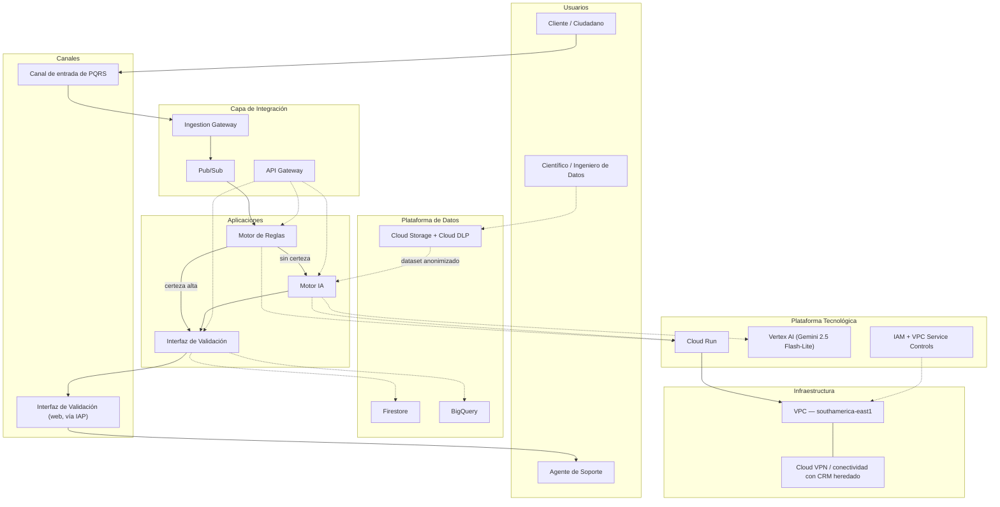
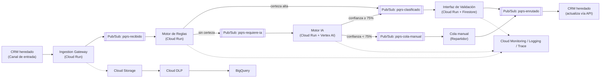
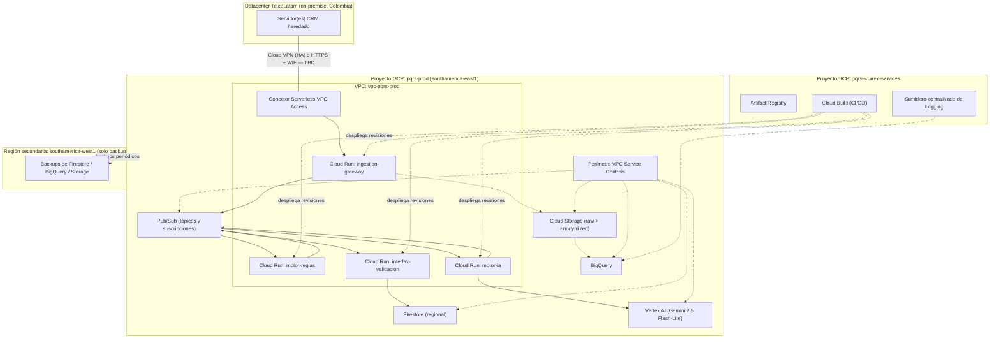
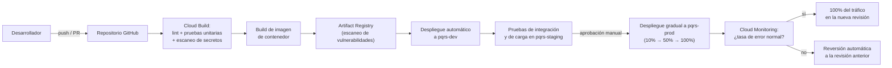
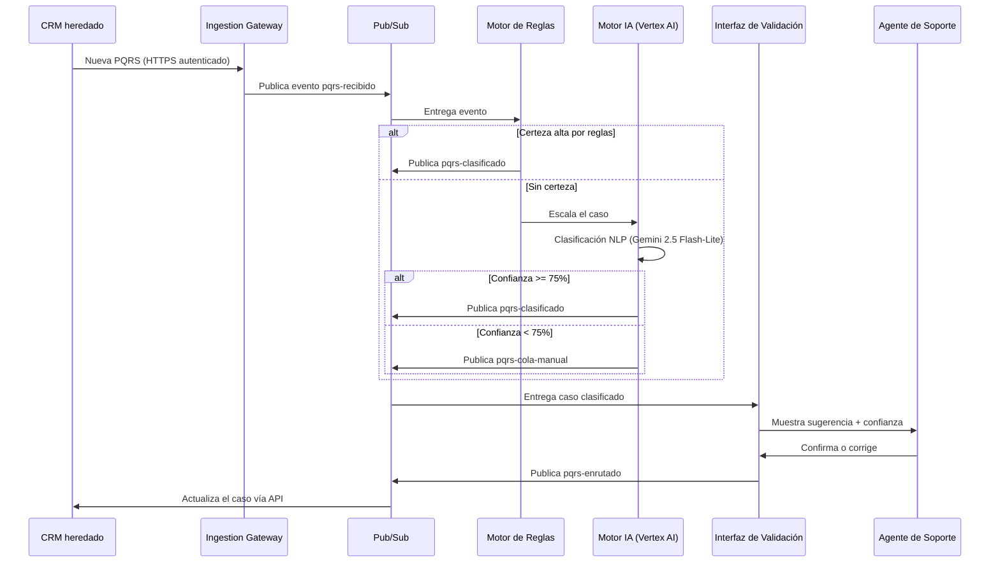
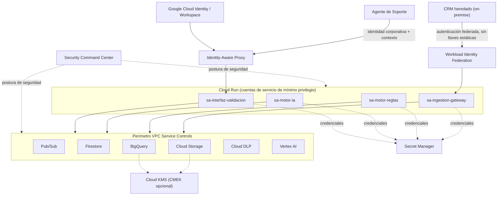

# Fase D — Arquitectura Tecnológica

## 1. Información del documento

| Campo | Valor |
|---|---|
| Proyecto | IA-PQRS Smart Routing |
| Empresa de referencia | TelcoLatam |
| Fase ADM | Fase D — Arquitectura Tecnológica |
| Fases de entrada | Fase A (Visión de la Arquitectura), Fase B (Arquitectura de Negocio), Fase C (Arquitectura de Sistemas de Información) |
| Proveedor cloud | Google Cloud Platform (GCP) — decisión ya tomada en la Fase A, sección 12 |
| Estado | Borrador para revisión del Gerente de TI y el Director de Servicio al Cliente |
| Fecha | 2026-09-29 |
| Autor | Arquitectura Empresarial — continuación documental de las Fases A, B y C |

## 2. Objetivo

Definir la arquitectura tecnológica objetivo (infraestructura, plataformas, redes, seguridad, integración y operación) que soporta la clasificación de PQRS en 3 niveles (reglas → IA → manual) establecida en la Fase A (sección 12) y detallada como arquitectura de aplicaciones y datos en la Fase C. Esta fase traduce el concepto de solución en GCP ya aprobado en un diseño técnico dimensionado: selección de región, patrones de cómputo y almacenamiento, conectividad con el CRM heredado on-premise, controles de seguridad e identidad, observabilidad, CI/CD y continuidad operativa — de modo que el proyecto quede listo para pasar de la arquitectura a la implementación (Fase E).

## 3. Alcance

**Dentro del alcance de esta fase:**
* Dimensionamiento técnico de los componentes GCP ya catalogados en la Fase C (Pub/Sub, Cloud Run, Vertex AI, Firestore, Cloud Storage + Cloud DLP, BigQuery, Cloud Monitoring/Logging, IAM + VPC Service Controls).
* Diseño de la conectividad entre el CRM heredado on-premise y GCP.
* Arquitectura de seguridad, identidad y gestión de secretos.
* Estrategia de CI/CD, Infraestructura como Código (IaC) y gobierno de configuración.
* Estrategia de resiliencia, alta disponibilidad, continuidad y recuperación ante desastres (DR).
* Catálogo de estándares y principios tecnológicos, análisis de brechas técnicas y hoja de ruta de implementación.

**Fuera del alcance de esta fase:**
* Rediseño del CRM heredado o de las herramientas ofimáticas usadas por Proyectista/Revisor/Jefe de División (sin cambios, Fase C sección 3.1).
* Migración del CRM a la nube (permanece on-premise; solo se diseña su conectividad).
* Selección o entrenamiento detallado del modelo de IA (cubierto en la Fase C, aquí solo se dimensiona la plataforma que lo aloja: Vertex AI).
* Fase E (Oportunidades y Soluciones) y Fase F (Planificación de la Migración), que consumirán esta arquitectura como insumo.

## 4. Contexto arquitectónico

### 4.1 Arquitectura Baseline

La línea base tecnológica es la ya descrita en las Fases A (sección 5) y C (sección 2): un CRM heredado on-premise con capacidad de exponer APIs pero sin infraestructura cloud nativa, sin integración automatizada entre sistemas, sin gobierno de datos, sin observabilidad ni CI/CD formal. El detalle de hardware, topología de red y versiones de software de este entorno **no está disponible** en la documentación de fases anteriores (`TBD` — ver sección 21).

### 4.2 Arquitectura Target

La arquitectura objetivo despliega los servicios administrados de GCP ya seleccionados en la Fase A/C sobre una región primaria de Sudamérica, con conectividad privada hacia el CRM heredado, un perímetro de seguridad único (VPC Service Controls), IAM de mínimo privilegio, observabilidad extremo a extremo y una estrategia de resiliencia que se apoya explícitamente en el proceso manual ya existente como mecanismo de degradación segura ante fallas (sección 7.14). El detalle completo se desarrolla en la sección 7.

### 4.3 Dependencias con las fases anteriores

| Fase | Insumo que consume esta Fase D |
|---|---|
| Fase A, sección 12 | Selección de proveedor (GCP), concepto de solución en 3 niveles, presupuesto desglosado (≈USD 11.270 MVP / ≈USD 550-570 mes operación), Riesgos 3-5, jurisdicción legal (Ley 1581 de 2012, Decreto 1377 de 2013) |
| Fase B, secciones 3 y 7 | Catálogo de actores objetivo (Motor de Reglas, Motor IA, Agente de Soporte), requisitos de negocio RN-01 a RN-08 |
| Fase C, secciones 3, 4 y 7 | Catálogo de aplicaciones y de interfaces objetivo, catálogo de entidades de datos, requisitos de sistema RS-01 a RS-10, riesgos técnicos preliminares (sección 9.3), y el señalamiento explícito de que "queda para la Fase D el dimensionamiento detallado (regiones, políticas de escalamiento, continuidad/DR, hardening de seguridad)" (Fase C, sección 9.2) |

### 4.4 Principios arquitectónicos aplicables

Se heredan de la Fase A (sección 7) los principios de **Privacidad desde el Diseño**, **Independencia tecnológica** y **Preferencia por servicios administrados en la nube (*cloud-first*)**, y de la Fase C el criterio de **comprar vs. desarrollar** (sección 3.3). Esta fase añade los principios tecnológicos específicos detallados en la sección 11.

### 4.5 Restricciones

* Presupuesto: ≈USD 11.270 de inversión incremental para el MVP y ≈USD 550-570/mes en operación estable (Fase A, sección 12.3; Fase C, Anexo A) — toda decisión de esta fase debe caber dentro de ese marco o justificar explícitamente una excepción.
* Plazo: MVP en 3 meses (Fase A, sección 3; RN-08).
* Jurisdicción legal: Colombia — Ley 1581 de 2012, Decreto 1377 de 2013, y Resolución CRC 5050 de 2016 para tiempos de respuesta (Fase A/C).
* GCP no tiene una región en Colombia; debe seleccionarse una región sudamericana disponible (sección 7.3).
* El CRM heredado permanece on-premise; no se migra en este proyecto.

### 4.6 Supuestos

* **Supuesto:** el CRM heredado puede realizar llamadas salientes HTTPS (egress a internet) o, alternativamente, la red de TelcoLatam puede establecer un túnel VPN hacia GCP. No se confirma cuál de las dos condiciones aplica — ver ADR-02 (sección 15) y TBD (sección 21).
* **Supuesto:** TelcoLatam no cuenta hoy con un proveedor de identidad (IdP) corporativo federable a Google Cloud Identity; se asume Google Workspace/Cloud Identity como directorio para el acceso de agentes, sujeto a confirmación.
* **Supuesto:** el volumen de >10.000 PQRS/día (Fase A) se distribuye de forma no uniforme durante el horario laboral, sin picos que excedan varias veces ese promedio; no se dispone de un perfil de tráfico horario real.
* **Supuesto:** no existen hoy requisitos regulatorios de residencia de datos que exijan que el texto de las PQRS permanezca físicamente en territorio colombiano (la Ley 1581 regula el tratamiento, no exige residencia física); se recomienda validar este punto con el Oficial de Protección de Datos antes de la implementación.

## 5. Requisitos tecnológicos

### 5.1 Requisitos funcionales tecnológicos

| ID | Requisito | Origen |
|---|---|---|
| RT-01 | La plataforma debe recibir el texto de la PQRS desde el CRM heredado y publicarlo como evento en Pub/Sub, sin pérdida de mensajes | RS-02, RS-10 |
| RT-02 | La plataforma debe exponer un mecanismo de ingesta (`ingestion-gateway`) que traduzca la llamada del CRM heredado (que no habla nativamente el protocolo de Pub/Sub) en una publicación autenticada al tópico correspondiente | Nuevo — deriva de RS-02 |
| RT-03 | La plataforma debe permitir al Agente de Soporte confirmar o corregir la sugerencia de clasificación desde una interfaz web con autenticación corporativa | RS-03 |

### 5.2 Requisitos no funcionales

| ID | Requisito | Origen |
|---|---|---|
| RT-04 | Todo dato en tránsito debe cifrarse con TLS 1.2 o superior; todo dato en reposo debe cifrarse con las llaves administradas por Google (o CMEK si el Oficial de Protección de Datos lo exige) | RS-05, principio de Privacidad desde el Diseño (Fase A) |
| RT-05 | Todos los servicios deben desplegarse mediante Infraestructura como Código (Terraform), sin cambios manuales directos en la consola de GCP en producción | Principio tecnológico PT-04 (sección 11) |

### 5.3 Requisitos de disponibilidad

| ID | Requisito | Métrica objetivo | Origen |
|---|---|---|---|
| RT-06 | Los servicios Cloud Run que forman la ruta crítica de clasificación deben tener una disponibilidad mensual objetivo | ≥ 99.5% (heredada del SLA de Cloud Run regional) | RS-01 |
| RT-07 | Ante la indisponibilidad de cualquier componente de clasificación (reglas, IA o validación), el caso debe degradar de forma segura a la cola manual del Repartidor, sin bloquear la recepción de nuevas PQRS | RS-10, Riesgo 3 (Fase A) |

### 5.4 Requisitos de rendimiento

| ID | Requisito | Métrica objetivo | Origen |
|---|---|---|---|
| RT-08 | El Motor de Reglas debe responder en tiempo sub-segundo | p95 ≤ 300 ms | RS-01, RS-09 |
| RT-09 | El Motor IA (llamada a Vertex AI) debe responder dentro de un tiempo razonable para un flujo asíncrono, aunque no sea literalmente de "milisegundos" como sugiere RS-01 — se ajusta la expectativa a la naturaleza de un modelo de lenguaje | p95 ≤ 3 s | Refinamiento arquitectónico de RS-01 (ver ADR-09) |
| RT-10 | El tiempo de ciclo completo de clasificación automática (ingesta → reglas/IA → validación disponible para el agente) no debe exceder | p95 ≤ 8 s | KPI de la Fase A (reducción del 90% en tiempo de triage) |

### 5.5 Requisitos de escalabilidad

| ID | Requisito | Métrica objetivo | Origen |
|---|---|---|---|
| RT-11 | La plataforma debe soportar el volumen actual (>10.000 PQRS/día) con margen de crecimiento sin cambios arquitectónicos | ≥ 3x el volumen actual (≈30.000/día) | RS-01 |
| RT-12 | El escalamiento debe ser automático (sin aprovisionamiento manual de capacidad) para todos los componentes de la ruta de clasificación | Cloud Run y Pub/Sub escalan de forma nativa; Vertex AI gestionado | Principio *cloud-first* (Fase A) |

### 5.6 Requisitos de seguridad

| ID | Requisito | Origen |
|---|---|---|
| RT-13 | El acceso de los Agentes de Soporte a la Interfaz de Validación debe controlarse por identidad (Zero Trust), no por ubicación de red | Principio tecnológico PT-02 |
| RT-14 | Ningún dato de PQRS debe salir del perímetro de seguridad definido (VPC Service Controls) | RS-05, Fase A sección 12.2 |
| RT-15 | Las credenciales de servicio (API keys, tokens) deben gestionarse en Secret Manager con rotación; se evitan llaves estáticas de larga duración donde sea técnicamente posible | Principio tecnológico PT-06 |

### 5.7 Requisitos de continuidad

| ID | Requisito | Métrica objetivo | Origen |
|---|---|---|---|
| RT-16 | Los datos en Firestore, Cloud Storage y BigQuery deben respaldarse de forma que permitan una recuperación ante desastres | RPO ≤ 24 h | Sección 7.14 |
| RT-17 | El tiempo máximo aceptable para restablecer el servicio de clasificación automática tras un desastre regional | RTO ≤ 4 h (con degradación a cola manual mientras tanto) | Sección 7.14, ADR-06 |

### 5.8 Requisitos de interoperabilidad

| ID | Requisito | Origen |
|---|---|---|
| RT-18 | Todas las interfaces internas deben exponerse como REST/JSON documentado con OpenAPI 3.0 | Estándar TE-01 (sección 10) |
| RT-19 | El Motor IA debe poder sustituirse por otro proveedor de modelos de lenguaje sin rediseñar el resto de la arquitectura (principio de independencia tecnológica, Fase A) | Principio tecnológico PT-07 |

### 5.9 Requisitos de observabilidad y operación

| ID | Requisito | Origen |
|---|---|---|
| RT-20 | Cada componente de la ruta de clasificación debe emitir métricas, logs estructurados y trazas distribuidas correlacionables por un identificador único de caso | RS-06, sección 7.11 |
| RT-21 | Deben existir alertas automáticas ante: aumento anómalo de la tasa de escalamiento a IA, agotamiento de presupuesto mensual, y profundidad creciente de la cola de mensajes fallidos (*dead-letter*) | Sección 7.11 |

## 6. Arquitectura Tecnológica Baseline

### 6.1 Vista general

La línea base es deliberadamente simple: un sistema monolítico on-premise (el CRM) rodeado de herramientas ofimáticas de escritorio, sin capa de integración, sin nube y sin automatización. No existe una arquitectura tecnológica formalmente documentada previa a este proyecto.

### 6.2 Infraestructura

`Información no disponible.` Las Fases A-C no documentan servidores, hipervisores ni centros de datos específicos del CRM heredado. Se asume (Supuesto) que corresponde a infraestructura física o virtualizada dentro de un centro de datos propio o contratado de TelcoLatam.

### 6.3 Computación

`Información no disponible` en detalle (modelos de servidor, capacidad). Funcionalmente, el CRM ejecuta los módulos de registro y asignación de PQRS descritos en la Fase C (sección 2.2).

### 6.4 Almacenamiento

`Información no disponible` en detalle técnico. Funcionalmente, el histórico de PQRS está "disperso y sin etiquetar" (Fase C, sección 2.5), sin un repositorio de datos gobernado.

### 6.5 Redes y comunicaciones

`Información no disponible.` La Fase A (sección 5) indica que el CRM "tiene APIs, pero la infraestructura es On-Premise"; no se documenta topología, segmentación ni si existe salida a internet.

### 6.6 Seguridad

`Información no disponible` en el nivel de controles técnicos (firewalls, IAM interno, cifrado). No hay evidencia de un perímetro de seguridad formal ni de gestión de secretos.

### 6.7 Plataformas

CRM heredado (plataforma no especificada por nombre en la documentación de fases anteriores) + suite ofimática de escritorio + editor de texto con certificado de firma digital PDF (Fase C, sección 2.2).

### 6.8 Middleware

No existe middleware de integración; toda transferencia de datos entre aplicaciones es manual (copiar/pegar, envío de archivos por correo interno — Fase C, sección 2.3).

### 6.9 Integración

Ninguna interfaz automatizada (Fase C, sección 2.3): 0 integraciones documentadas entre el CRM, la suite ofimática y el repositorio de plantillas.

### 6.10 Operación y monitoreo

No existe observabilidad de sistema ni monitoreo formal del proceso; el seguimiento depende enteramente de la disponibilidad del Repartidor (Fase B, sección 2.5).

## 7. Arquitectura Tecnológica Target

### 7.1 Principios de diseño

Serverless-first, seguridad por diseño (Zero Trust + privacidad desde el diseño), automatización total de la infraestructura (IaC), observabilidad por defecto, resiliencia mediante degradación segura hacia el proceso manual existente, y costo variable (pago por uso) alineado al presupuesto ya aprobado. El detalle de cada principio está en la sección 11.

### 7.2 Vista general de la arquitectura

La arquitectura target despliega los componentes ya catalogados en la Fase C sobre un único proyecto GCP de producción (más proyectos de *staging*/desarrollo, sección 7.8), en la región **southamerica-east1 (São Paulo)** como región primaria (ADR-01, sección 15), con conectividad privada hacia el CRM heredado, un perímetro VPC Service Controls que envuelve todos los servicios de datos, e IAM de mínimo privilegio con una cuenta de servicio dedicada por componente. La vista conceptual completa está en la sección 8.1.

### 7.3 Arquitectura de infraestructura

| Decisión | Valor | Justificación |
|---|---|---|
| Región primaria | `southamerica-east1` (São Paulo, Brasil) | Región GCP más cercana a Colombia con el catálogo de servicios más maduro en Sudamérica; GCP no tiene región propia en Colombia (ver ADR-01) |
| Región secundaria (DR) | `southamerica-west1` (Santiago, Chile) — a confirmar | Alternativa sudamericana para redundancia de datos; no se activa cómputo aquí en el MVP (ver sección 7.14) |
| Disponibilidad de Vertex AI (Gemini) en la región primaria | **A validar (TBD)** | Los modelos generativos de Vertex AI no siempre están disponibles en todas las regiones; si el modelo no está disponible en `southamerica-east1`, el Motor IA deberá invocar el endpoint global/`us-central1` de Vertex AI, añadiendo latencia cross-region (ver Riesgo TR-03, sección 16) |
| Organización de proyectos GCP | `pqrs-prod`, `pqrs-staging`, `pqrs-shared-services` (CI/CD, logging centralizado) | Aísla producción de pruebas; sigue las prácticas recomendadas de Google Cloud (jerarquía de recursos) |

### 7.4 Arquitectura de computación

| Servicio Cloud Run | Función | Concurrencia | CPU siempre asignada | Instancias mín./máx. |
|---|---|---|---|---|
| `ingestion-gateway` | Recibe la llamada del CRM heredado y publica en Pub/Sub | 80 | Sí (reduce *cold start* para el CRM) | 1 / 10 |
| `motor-reglas` | Clasificación por diccionario de palabras clave (Fase C, sección 3.1) | 80 | No (escala a cero) | 0 / 10 |
| `motor-ia` | Orquesta la llamada a Vertex AI (Gemini 2.5 Flash-Lite) | 40 | No | 0 / 10 |
| `interfaz-validacion` | Aplicación web para el Agente de Soporte, respaldada por Firestore | 80 | No | 0 / 5 |

No se utiliza Google Kubernetes Engine (GKE): dado el volumen (>10.000 PQRS/día, tráfico bajo y no sostenido) y la ausencia de necesidades de orquestación multi-contenedor compleja, Cloud Run cubre el requisito de escalabilidad (RT-11, RT-12) con menor sobrecarga operativa y menor costo — decisión coherente con el principio *cloud-first* de la Fase A y con el presupuesto (ver ADR-04, sección 15).

### 7.5 Arquitectura de almacenamiento

| Componente | Servicio | Configuración objetivo |
|---|---|---|
| Estado de casos en validación | Firestore (modo Nativo, regional en `southamerica-east1`) | Recuperación a un punto en el tiempo (PITR) habilitada; reglas de seguridad restringidas a las cuentas de servicio de los Cloud Run autorizados |
| Texto crudo de la PQRS (pre-anonimización) | Cloud Storage — bucket `pqrs-raw` | Retención corta (ver política de retención, sección 7.7); cifrado con llaves administradas por Google (CMEK opcional, ADR-09) |
| Dataset anonimizado de entrenamiento | Cloud Storage — bucket `pqrs-training-anonymized` (poblado vía Cloud DLP) | Versionado habilitado; ciclo de vida: transición a *Coldline* tras 90 días |
| Analítica y KPI | BigQuery — dataset `pqrs_analytics` | Particionado por fecha de ingesta; *time travel* de 7 días + exportaciones periódicas a Cloud Storage para retención extendida |
| Auditoría | BigQuery — dataset `pqrs_audit` | Acceso restringido a nivel de columna para campos que pudieran contener texto no anonimizado; retención alineada a los requerimientos de trazabilidad de la Superintendencia de Industria y Comercio (Fase C, sección 4.3) |

### 7.6 Arquitectura de red y comunicaciones

* **VPC** dedicada por proyecto (`vpc-pqrs-prod`), con un conector de Acceso a VPC sin servidores (Serverless VPC Access) para que los servicios Cloud Run alcancen recursos privados.
* **Conectividad con el CRM heredado:** dos alternativas evaluadas (ADR-02, sección 15):
  1. **Cloud VPN de alta disponibilidad (HA VPN)** entre la red on-premise de TelcoLatam y la VPC de GCP — recomendado si el CRM no tiene salida a internet o si la política de seguridad de TelcoLatam exige conectividad privada.
  2. **Llamada saliente HTTPS autenticada con Workload Identity Federation** desde el CRM hacia el `ingestion-gateway` (expuesto con ingreso restringido) — recomendado si el CRM sí puede salir a internet, por ser más simple y económico.
  * **Decisión:** se documenta como condicional (TBD) hasta confirmar con el Gerente de TI la postura de red real del CRM (sección 21).
* **Cloud NAT** para that any Cloud Run/recurso privado que requiera salida a internet (por ejemplo, para acceder a Vertex AI si su endpoint no es accesible vía Private Service Connect en la región elegida).
* **Cloud Armor** (WAF) solo si `ingestion-gateway` requiere ingreso público (alternativa 2 anterior); no aplica si se opta por Cloud VPN puro.
* **API Gateway** como capa única de gestión de las APIs REST internas (autenticación por API key/OIDC, cuotas, versión `v1`), evitando el costo de una plataforma de gestión de APIs de nivel empresarial (Apigee) no justificada por el volumen ni el presupuesto del proyecto.

### 7.7 Arquitectura de seguridad

* **Perímetro VPC Service Controls** (ya definido en la Fase A/C) que envuelve Pub/Sub, Cloud Storage, BigQuery, Firestore, Cloud DLP y Vertex AI: ningún dato de PQRS puede exfiltrarse fuera del perímetro, incluso con credenciales válidas pero mal configuradas.
* **IAM de mínimo privilegio:** una cuenta de servicio por componente (`sa-ingestion-gateway`, `sa-motor-reglas`, `sa-motor-ia`, `sa-interfaz-validacion`, `sa-etl-dlp`), cada una con únicamente los roles necesarios (p. ej. `sa-motor-ia` solo tiene `roles/aiplatform.user` y el permiso de publicar en su tópico de salida, no acceso a BigQuery ni a Cloud Storage).
* **Zero Trust para agentes humanos:** la Interfaz de Validación se expone mediante **Identity-Aware Proxy (IAP)**, controlando el acceso por identidad corporativa (Google Workspace/Cloud Identity) y contexto (dispositivo, ubicación), en lugar de depender de que el agente esté conectado a la red corporativa o VPN — cumple RT-13.
* **Gestión de secretos:** todas las credenciales (API keys de contingencia, tokens) se almacenan en **Secret Manager**, con rotación programada; se prioriza **Workload Identity Federation** para evitar llaves de cuenta de servicio estáticas donde el CRM lo permita (ADR-07).
* **Cifrado:** TLS 1.2+ en tránsito (impuesto por defecto en los servicios GCP usados); en reposo, llaves administradas por Google por defecto, con **Cloud KMS (CMEK)** como mejora opcional para el bucket de datos anonimizados si el Oficial de Protección de Datos lo exige (ADR-09, no incluido en el presupuesto del MVP).
* **Gestión de certificados:** certificados TLS administrados automáticamente por Google (Certificate Manager) para cualquier dominio personalizado expuesto a través de API Gateway o un Load Balancer.
* **Gestión de vulnerabilidades:** análisis de imágenes de contenedor habilitado en Artifact Registry (Container Analysis) antes de cada despliegue; **Security Command Center** (nivel estándar/gratuito) habilitado para postura de seguridad continua sobre el perímetro.

### 7.8 Arquitectura de plataformas

Separación por proyecto GCP: `pqrs-dev` (desarrollo), `pqrs-staging` (pruebas de integración y de carga), `pqrs-prod` (producción), y `pqrs-shared-services` (Artifact Registry, Cloud Build, sumideros de logging centralizados). Esta separación es un requisito de gobierno de configuración (sección 12) que la línea base no tenía en absoluto.

### 7.9 Middleware

Pub/Sub actúa como el middleware de mensajería asíncrona entre el CRM heredado y los servicios de clasificación (ya definido en la Fase C); no se introduce un bus de mensajería adicional (se descartaron explícitamente RabbitMQ y Kafka en la Fase A por sobredimensionamiento frente al volumen del proyecto).

### 7.10 Integración tecnológica

Todas las integraciones internas son REST/JSON sobre HTTPS, documentadas con OpenAPI 3.0 (TE-01) y expuestas a través de API Gateway. La integración con Vertex AI usa el SDK/API REST nativo de Google. El detalle punto a punto ya está en el catálogo de interfaces de la Fase C (sección 3.5); esta fase añade el mecanismo de transporte (Pub/Sub, Cloud VPN/WIF) y los controles de autenticación.

### 7.11 Observabilidad

* **Métricas y paneles:** Cloud Monitoring, con paneles para tasa de escalamiento reglas→IA, tasa de escalamiento IA→manual, latencia p95 por componente (RT-08/RT-09/RT-10), tasa de error, y consumo de presupuesto de Vertex AI.
* **Logs:** Cloud Logging con logs estructurados (JSON) correlacionados por un identificador único de caso (*trace ID*) presente en todos los componentes (RT-20); sumidero (*sink*) hacia BigQuery (`pqrs_audit`) para retención extendida.
* **Trazas distribuidas:** Cloud Trace habilitado en la cadena `ingestion-gateway → motor-reglas → motor-ia → interfaz-validacion`, permitiendo diagnosticar en qué salto se concentra la latencia.
* **Reporte de errores:** Error Reporting integrado nativamente con Cloud Run.
* **Alertas (RT-21):** notificaciones (correo, y opcionalmente Slack/PagerDuty si se contratan) ante: aumento anómalo de la tasa de escalamiento a IA, profundidad creciente de la cola de mensajes fallidos (*dead-letter topic* de Pub/Sub), y alertas de presupuesto de facturación (Cloud Billing Budgets) dado el historial de falta de control presupuestal señalado en la Fase A original.

### 7.12 DevSecOps / CI-CD

* **Control de versiones:** el repositorio del proyecto ya existente en GitHub (`Modelo-de-IA-para-Enrutamiento-Inteligente-de-PQRS`), con una carpeta `infra/` para el código Terraform.
* **Integración continua:** Cloud Build (o GitHub Actions equivalente) ejecuta pruebas unitarias, análisis estático de código, escaneo de secretos (p. ej. *trufflehog*/*git-secrets*) y construcción de la imagen de contenedor en cada *pull request*.
* **Despliegue continuo:** Cloud Build publica la imagen en Artifact Registry (con escaneo de vulnerabilidades habilitado) y despliega a Cloud Run con **despliegue gradual (traffic splitting)**: 10% → 50% → 100% del tráfico a la nueva revisión, con reversión automática si las métricas de error superan un umbral.
* **Infraestructura como Código:** Terraform gestiona Pub/Sub, Cloud Run, IAM, VPC, Firestore, BigQuery y VPC Service Controls; ningún cambio manual en la consola de GCP en `pqrs-prod` (RT-05).
* **DevSecOps:** las puertas de calidad (*quality gates*) del pipeline incluyen el análisis estático, el escaneo de secretos y el escaneo de vulnerabilidades de contenedor como bloqueantes, no opcionales.

### 7.13 Resiliencia y alta disponibilidad

Cloud Run es multi-zona dentro de la región de forma nativa (sin configuración adicional); Pub/Sub replica los mensajes dentro de la región del tópico; Firestore y BigQuery ofrecen alta disponibilidad regional gestionada por Google. No se requiere diseño adicional de HA a nivel de infraestructura porque los servicios son completamente administrados — el foco de esta arquitectura está en la **resiliencia del proceso de negocio** (sección 7.14), no en la redundancia de servidores.

### 7.14 Continuidad y recuperación ante desastres

* **Principio de degradación segura (ADR-06):** si cualquier componente de clasificación automática (reglas o IA) falla o se degrada, el diseño ya contempla (RS-10, RT-07) el enrutamiento automático a la cola manual del Repartidor. Esto significa que, ante una falla total de la plataforma en GCP, TelcoLatam **no pierde la capacidad de atender PQRS**: simplemente vuelve al proceso 100% manual que ya opera hoy como línea base. Esta es la estrategia de continuidad de negocio principal del proyecto, y reduce sustancialmente la necesidad de una arquitectura de DR costosa.
* **Backup de datos:**
  * Firestore: exportaciones administradas diarias a Cloud Storage (además del PITR nativo).
  * BigQuery: *time travel* de 7 días + exportación mensual a Cloud Storage (*Coldline*) para retención de auditoría de largo plazo.
  * Cloud Storage: versionado de objetos habilitado en los buckets de datos anonimizados.
* **Objetivos de recuperación:** RPO ≤ 24 h (RT-16) y RTO ≤ 4 h (RT-17) para el restablecimiento de la clasificación automática; durante ese lapso, el sistema opera en modo degradado (100% cola manual) sin interrupción del servicio al cliente.
* **Región secundaria:** `southamerica-west1` queda documentada como región de redundancia de datos (replicación de backups), sin cómputo activo en el MVP — activarla implicaría una inversión adicional no incluida en el presupuesto actual (Anexo A, Fase C).

### 7.15 Estimación de costos, ubicación de los datos y especificación detallada por componente

> **Nota de fuentes y alcance.** El presupuesto operativo agregado (≈ US$550-570/mes) ya fue aprobado en la Fase A (sección 12.3) y desglosado por bloques en la *Propuesta de Arquitectura GCP y Presupuesto* (sección 7). Esta tabla lo desagrega componente por componente, incorporando los elementos de infraestructura, seguridad y CI/CD que esta Fase D añade y que aquellos documentos no costeaban individualmente (Firestore, Secret Manager, API Gateway, Artifact Registry, Cloud Build, Cloud VPN condicional). Los precios unitarios se tomaron de las páginas oficiales de precios de Google Cloud consultadas en septiembre de 2026 y deben reverificarse en la calculadora oficial de Google Cloud antes de la aprobación final; los rangos reflejan el volumen de referencia de la Fase A (**(supuesto)** >10.000 PQRS/día ≈ 300.000/mes) y no un perfil de tráfico horario confirmado (sección 4.6).

| ID | Componente | Servicio / modo específico de GCP usado | Ubicación (región y centro de datos) | Costo estimado (mensual) | Notas |
|---|---|---|---|---|---|
| COMP-01 | CRM heredado | N/A (on-premise, sin cambios funcionales) | Centro de datos de TelcoLatam en Colombia (dirección/proveedor exactos: `Información no disponible`) | US$0 (no es gasto de GCP) | Sección 21, punto 3 |
| COMP-02 | Ingestion Gateway | Cloud Run, 2ª generación, 1 vCPU / 512 MiB, CPU siempre asignada, mín. 1 / máx. 10 instancias | `southamerica-east1` (São Paulo, Brasil) | ≈ US$0-10 | Instancia mínima=1 sale del nivel gratuito de "escala a cero"; impacto marginal a este volumen |
| COMP-03 | Pub/Sub | 5 tópicos (`pqrs-recibido`, `pqrs-requiere-ia`, `pqrs-clasificado`, `pqrs-cola-manual`, `pqrs-enrutado`) + suscripciones push | `southamerica-east1` (política de almacenamiento de mensajes fijada a la región) | ≈ US$0-5 | Primeros 10 GiB de throughput/mes gratis; a 300.000 mensajes/mes de texto corto, prácticamente sin costo |
| COMP-04 | Motor de Reglas | Cloud Run, 2ª generación, 1 vCPU / 512 MiB, escala a 0, máx. 10 instancias | `southamerica-east1` | ≈ US$0-5 | Dentro del nivel gratuito (2M solicitudes + 360.000 GiB-s/mes) a este volumen |
| COMP-05 | Motor IA (orquestador) | Cloud Run, 2ª generación, 1 vCPU / 1 GiB (memoria adicional para el cliente SDK de Vertex AI), escala a 0 | `southamerica-east1` | ≈ US$0-10 | Cómputo de orquestación únicamente; el costo del modelo se factura aparte (fila COMP-06) |
| COMP-06 | Vertex AI — motor de inferencia | Vertex AI Generative AI API, modelo **Gemini 2.5 Flash-Lite** (modelo base de Google, sin *fine-tuning*), invocado por `generateContent` | `southamerica-east1` **si el modelo está disponible ahí (TBD, GAP-10)**; en caso contrario, endpoint de `us-central1` (EE. UU.) | ≈ US$15-20 (peor caso: 100% de los casos escalados a IA) | Cifra heredada de la *Propuesta de Arquitectura GCP*, sección 7; si aplica el endpoint de EE. UU., los datos de PQRS cruzan de región durante la inferencia — implicación de residencia de datos a validar (sección 21, punto 6) |
| COMP-07 | Interfaz de Validación | Cloud Run, 2ª generación, 1 vCPU / 512 MiB, escala a 0, máx. 5 instancias | `southamerica-east1` | ≈ US$0-5 | Tráfico bajo (solo Agentes de Soporte) |
| COMP-08 | Firestore | Modo Nativo, base de datos **regional** (single-region), con recuperación a un punto en el tiempo (PITR) | `southamerica-east1` | ≈ US$0-10 | Nivel gratuito diario: 1 GiB almacenado + 50.000 lecturas + 20.000 escrituras + 20.000 eliminaciones; a >10.000 casos/día con ~2 lecturas y ~2 escrituras por caso, el uso ronda el límite gratuito de escrituras — posible pequeño excedente |
| COMP-09 | Cloud Storage | 2 buckets Standard, regionales: `pqrs-raw` (retención corta) y `pqrs-training-anonymized` (versionado, ciclo de vida a *Coldline* a los 90 días) | `southamerica-east1` | ≈ US$5-10 | El nivel "Always Free" de 5 GiB de Cloud Storage solo aplica a buckets en `us-west1`/`us-central1`/`us-east1`; al ser un bucket regional en Sudamérica, no aplica ese nivel gratuito |
| COMP-10 | Cloud DLP | Trabajos de anonimización por lotes (no continuos) sobre el texto crudo antes de poblar el bucket de entrenamiento | `southamerica-east1` (o API global de DLP) | ≈ US$5-10 | Depende del volumen real de texto a inspeccionar/mes; estimación conservadora, validar con un piloto |
| COMP-11 | BigQuery | 2 *datasets*: `pqrs_analytics` (particionado por fecha) y `pqrs_audit` (acceso restringido por columna) | `southamerica-east1` (almacenamiento regional) | ≈ US$5-10 | Primer 1 TiB de consultas/mes gratis; a este volumen de datos, difícilmente se excede |
| COMP-12 | Cloud Monitoring / Logging / Trace | Métricas, logs estructurados y trazas de los 4 servicios Cloud Run | Global (con datos de origen procesados desde `southamerica-east1`) | ≈ US$0-5 | Niveles gratuitos mensuales: ~150 MiB de métricas, 50 GiB de logs, 2,5M *spans* de traza — suficiente a este volumen |
| COMP-13 | IAM | Cuentas de servicio de mínimo privilegio (una por componente) | Global (sin datos de PQRS) | US$0 | Sin costo directo |
| COMP-14 | VPC Service Controls | Perímetro de seguridad sobre Pub/Sub, Firestore, Cloud Storage, BigQuery, Cloud DLP y Vertex AI | `southamerica-east1` (recursos protegidos) | US$0 | Sin costo directo; es un control de gobierno, no un servicio facturado por uso |
| COMP-15 | Secret Manager | ≈5-8 secretos activos (uno por cuenta de servicio/credencial) | Global, con política de réplica fijada a `southamerica-east1` | ≈ US$0-2 | Nivel gratuito: 6 versiones activas + 10.000 operaciones de acceso/mes; a este número de secretos y de invocaciones, se mantiene cerca del nivel gratuito |
| COMP-16 | Cloud VPN (HA VPN) | 2 túneles (mínimo para 99,99% de disponibilidad) | `southamerica-east1` (extremo GCP); extremo on-premise en el datacenter de TelcoLatam | **Condicional (ADR-02):** ≈ US$72-90/mes si se adopta esta alternativa; **US$0 adicionales** si se adopta la alternativa de HTTPS + Workload Identity Federation (fila COMP-24) | US$0,05/túnel/hora × 2 túneles × 720 h ≈ US$72/mes, más tráfico IPsec — impacto de presupuesto real que depende de GAP-06 |
| COMP-17 | Serverless VPC Access | Conector para que Cloud Run alcance recursos privados (solo necesario si se adopta Cloud VPN) | `southamerica-east1` | ≈ US$5-15 (condicional, solo si aplica COMP-16) | Estimación conservadora por instancias mínimas del conector; validar en la calculadora oficial |
| COMP-18 | API Gateway | Gestión de las APIs REST internas (autenticación, cuotas, versión `v1`) | Global (con *backends* en `southamerica-east1`) | US$0 | Primeras 2.000.000 de llamadas/mes gratis; a ≈300.000 PQRS/mes con 3-4 llamadas internas cada una (≈900.000-1.200.000 llamadas/mes), se mantiene dentro del nivel gratuito |
| COMP-19 | Identity-Aware Proxy (IAP) | Control de acceso Zero Trust a la Interfaz de Validación | `southamerica-east1` (recurso protegido) | US$0 de GCP | El costo real no es de GCP sino de la licencia de Google Workspace/Cloud Identity por agente (fila COMP-23) — **pendiente, TBD sección 21 punto 4** |
| COMP-20 | Artifact Registry | Repositorio de imágenes de contenedor de los 4 servicios Cloud Run (con escaneo de vulnerabilidades) | `southamerica-east1` (o multi-región, a definir en Terraform) | ≈ US$1-5 | Nivel gratuito: 0,5 GiB/mes; con 4 servicios y varias versiones retenidas, el excedente es pequeño (pocos GiB) |
| COMP-21 | Cloud Build | Pipeline de CI/CD (lint, pruebas, escaneo de secretos, build de imagen) | Región del *pool* de ejecución (a definir, recomendado `southamerica-east1` o el más cercano disponible) | ≈ US$0-10 | Nivel gratuito: 2.500 minutos de build/mes; con el volumen de despliegues esperado en un equipo pequeño, se mantiene mayormente dentro del nivel gratuito |
| COMP-22 | Terraform (IaC) | Código de infraestructura, sin servicio alojado por GCP | N/A (repositorio Git) | US$0 de GCP | Costo ya cubierto como parte del tiempo del Ingeniero Cloud/Backend (Fase A, sección 12.3) |
| COMP-23 | Google Cloud Identity / Workspace | Directorio corporativo para habilitar IAP | Google gestiona la ubicación; TelcoLatam administra el dominio | **Pendiente (TBD):** rango de mercado orientativo ≈ US$7-12/usuario/mes si se adquiere, según el plan — no es una cifra confirmada | Depende del número de Agentes de Soporte con acceso y de si TelcoLatam ya tiene una suscripción activa (sección 21, punto 4) |
| COMP-24 | Workload Identity Federation | Autenticación del CRM sin llaves estáticas (alternativa a COMP-16) | Global | US$0 | Sin costo directo; es la alternativa económica en el ADR-02 |
| COMP-25 | Cloud KMS | 1-2 llaves de cifrado (CMEK opcional) | `southamerica-east1` | **Opcional, no incluido en el MVP:** ≈ US$1-5/mes si se activa | Solo se activa si el Oficial de Protección de Datos lo exige (ADR-09); la Ley 1581 no lo exige por sí sola |
| COMP-26 | Security Command Center | Postura de seguridad continua, nivel estándar | Global | US$0 | El nivel estándar es gratuito; el nivel Premium (no contemplado en este MVP) tiene costo adicional |
| COMP-27 | Cloud Billing Budgets & Alerts | Alertas de consumo frente al presupuesto aprobado | Global | US$0 | Sin costo directo |

**Resumen de costo operativo mensual refinado**

| Escenario | Costo estimado/mes |
|---|---|
| Infraestructura GCP — suma de las filas anteriores, escenario base (conectividad CRM vía HTTPS + Workload Identity Federation, sin Cloud VPN, sin CMEK) | ≈ US$40-100 |
| + Licencia de Google Workspace/Cloud Identity (IAP) | Pendiente — depende del número de agentes y de si TelcoLatam ya tiene la suscripción (TBD, sección 21, punto 4); no se suma al total hasta confirmarse |
| + Científico de Datos/ML Engineer (monitoreo y reentrenamiento, 20% dedicación — ya presupuestado en la *Propuesta de Arquitectura GCP*, sección 7) | ≈ US$490 |
| **Total operativo refinado — escenario base** | **≈ US$530-590/mes** — consistente con el rango ya aprobado en la Fase A, sección 12.3 (≈ US$550-570/mes) |
| **Escenario alterno:** si el ADR-02 se resuelve hacia Cloud VPN (HA VPN) en lugar de HTTPS + WIF (filas COMP-16 y COMP-17) | + ≈ US$77-105/mes adicionales → **≈ US$610-695/mes** |
| **Adición opcional:** Cloud KMS/CMEK si el Oficial de Protección de Datos lo exige (COMP-25) | + ≈ US$1-5/mes |

**Implicación para la toma de decisiones:** la resolución del ADR-02 (conectividad con el CRM heredado, GAP-06) no es solo una decisión de red — tiene un impacto directo de hasta ≈ US$80-105/mes sobre el presupuesto operativo (aprox. 15% del total). Se recomienda que esta confirmación del Gerente de TI ocurra antes de cerrar el presupuesto operativo definitivo, no después.

## 8. Vistas y diagramas arquitectónicos

### 8.1 Vista conceptual

### 8.2 Vista lógica

### 8.3 Vista física

### 8.4 Vista de despliegue

### 8.5 Vista de integración

### 8.6 Vista de seguridad

## 9. Catálogo de componentes tecnológicos

| ID | Componente | Categoría | Baseline | Target | Propósito | Dependencias |
|---|---|---|---|---|---|---|
| COMP-01 | CRM heredado | Aplicación / plataforma | Sí (sin cambios funcionales) | Sí (extendido con conectividad) | Registro y distribución del caso | COMP-16 o COMP-24 |
| COMP-02 | Ingestion Gateway | Cómputo (Cloud Run) | No | Sí | Traduce la llamada del CRM a un evento Pub/Sub autenticado | COMP-03, COMP-16/24 |
| COMP-03 | Pub/Sub | Integración / mensajería | No | Sí | Desacopla el CRM de los servicios de clasificación, con reintentos | COMP-02, COMP-04, COMP-05, COMP-06 |
| COMP-04 | Motor de Reglas | Cómputo (Cloud Run) | No | Sí | Clasificación determinística de primer nivel | COMP-03 |
| COMP-05 | Motor IA | Cómputo (Cloud Run) + IA | No | Sí | Clasificación NLP de segundo nivel | COMP-03, COMP-06 |
| COMP-06 | Vertex AI (Gemini 2.5 Flash-Lite) | Plataforma de IA | No | Sí | Modelo de lenguaje para clasificación | COMP-05 |
| COMP-07 | Interfaz de Validación | Cómputo (Cloud Run) | No | Sí | Confirmación/corrección humana de la sugerencia | COMP-03, COMP-08, COMP-19 |
| COMP-08 | Firestore | Almacenamiento (datos operacionales) | No | Sí | Estado de los casos en validación | COMP-07 |
| COMP-09 | Cloud Storage | Almacenamiento (objetos) | No | Sí | Archivo del texto crudo y del dataset anonimizado | COMP-10 |
| COMP-10 | Cloud DLP | Datos / cumplimiento | No | Sí | Anonimización antes de reentrenar el modelo | COMP-09 |
| COMP-11 | BigQuery | Almacenamiento analítico | No | Sí | KPI, analítica y auditoría | COMP-09 |
| COMP-12 | Cloud Monitoring / Logging / Trace | Observabilidad | No | Sí | Métricas, logs y trazas de toda la ruta | Todos los COMP-0x de cómputo |
| COMP-13 | IAM | Seguridad / identidad | No | Sí | Cuentas de servicio de mínimo privilegio | Todos |
| COMP-14 | VPC Service Controls | Seguridad / perímetro | No | Sí | Evita exfiltración de datos de PQRS | COMP-03, 06, 08, 09, 10, 11 |
| COMP-15 | Secret Manager | Seguridad / secretos | No | Sí | Gestión y rotación de credenciales | Todos los COMP-0x de cómputo |
| COMP-16 | Cloud VPN (HA VPN) | Red | No | Condicional (ADR-02) | Conectividad privada con el CRM heredado | COMP-01, COMP-02 |
| COMP-17 | Serverless VPC Access | Red | No | Sí | Permite a Cloud Run alcanzar recursos privados | COMP-16 |
| COMP-18 | API Gateway | Integración / API management | No | Sí | Punto único de gestión de las APIs REST | COMP-02, 04, 05, 07 |
| COMP-19 | Identity-Aware Proxy (IAP) | Seguridad / Zero Trust | No | Sí | Acceso de agentes por identidad, no por red | COMP-07, COMP-23 |
| COMP-20 | Artifact Registry | CI/CD | No | Sí | Almacena y escanea imágenes de contenedor | COMP-21 |
| COMP-21 | Cloud Build | CI/CD | No | Sí | Integración y despliegue continuo | COMP-20 |
| COMP-22 | Terraform (IaC) | Gestión de configuración | No | Sí | Despliegue reproducible de toda la infraestructura | — |
| COMP-23 | Google Cloud Identity / Workspace | Identidad | No | Sí (supuesto, sección 4.6) | Directorio corporativo para IAP | COMP-19 |
| COMP-24 | Workload Identity Federation | Seguridad / identidad | No | Condicional (ADR-02) | Autenticación del CRM sin llaves estáticas | COMP-02 |
| COMP-25 | Cloud KMS | Seguridad / cifrado | No | Opcional (ADR-09) | CMEK para datos anonimizados | COMP-09, COMP-11 |
| COMP-26 | Security Command Center | Seguridad / postura | No | Sí (nivel estándar) | Gestión continua de vulnerabilidades y postura | COMP-14 |
| COMP-27 | Cloud Billing Budgets & Alerts | Gobernanza / FinOps | No | Sí | Alertas de consumo frente al presupuesto aprobado | — |

## 10. Estándares tecnológicos

| ID | Dominio | Estándar | Justificación | Obligatorio |
|---|---|---|---|---|
| TE-01 | APIs | REST + JSON, documentado con OpenAPI 3.0 | Interoperabilidad (RT-18) y consistencia con RS-02 | Sí |
| TE-02 | Autenticación de servicios | OAuth 2.0 / OIDC vía cuentas de servicio de GCP; Workload Identity Federation donde sea posible | Evita llaves estáticas (RT-15) | Sí |
| TE-03 | Cifrado en tránsito | TLS 1.2 o superior en todas las comunicaciones | RT-04 | Sí |
| TE-04 | Infraestructura como Código | Terraform (HCL) | RT-05, reproducibilidad y auditabilidad | Sí |
| TE-05 | Control de versiones y commits | Git con *Conventional Commits*, ramas protegidas en `main` | Trazabilidad de cambios en producción | Sí |
| TE-06 | Logging estructurado | JSON, con campo de identificador de caso (*trace ID*) obligatorio | RT-20 | Sí |
| TE-07 | Contenedores | Imágenes base mínimas (*distroless* o equivalente) | Reduce superficie de ataque (gestión de vulnerabilidades) | Recomendado |
| TE-08 | Cumplimiento normativo | Ley 1581 de 2012, Decreto 1377 de 2013, Resolución CRC 5050 de 2016 | Marco legal aplicable (Fase A/C) | Sí |
| TE-09 | Marco de arquitectura cloud | Google Cloud Architecture Framework (pilares de seguridad, confiabilidad, costo, rendimiento) | Alineación con las buenas prácticas del proveedor ya seleccionado | Recomendado |
| TE-10 | Versionado de APIs | Semántico, con prefijo de versión en la ruta (`/v1/...`) | RT-19, independencia tecnológica | Sí |

## 11. Principios tecnológicos

| ID | Principio | Descripción | Justificación | Implicaciones |
|---|---|---|---|---|
| PT-01 | Serverless-first | Preferir servicios completamente administrados (Cloud Run, Pub/Sub, Firestore, Vertex AI) sobre infraestructura auto-gestionada (VMs, Kubernetes) | Menor costo operativo y de mantenimiento, alineado al presupuesto y al principio *cloud-first* de la Fase A | No se despliega GKE ni VMs para los componentes de esta arquitectura (sección 7.4) |
| PT-02 | Zero Trust para acceso humano | El acceso de personas se controla por identidad y contexto, no por pertenecer a una red específica | Reduce el riesgo de accesos indebidos y elimina la dependencia de VPN para los agentes | La Interfaz de Validación se expone vía IAP, no vía IP interna abierta (sección 7.7) |
| PT-03 | Privacidad desde el diseño | Heredado de la Fase A: anonimización antes de cualquier uso secundario del dato | Cumplimiento de la Ley 1581 de 2012 | Cloud DLP es un paso obligatorio antes de que cualquier dato llegue al bucket de entrenamiento |
| PT-04 | Infraestructura reproducible (IaC) | Toda la infraestructura se declara en Terraform; no hay cambios manuales en producción | Auditabilidad, consistencia entre entornos, recuperación más rápida ante desastres | Cualquier cambio de infraestructura pasa por el pipeline de CI/CD (sección 7.12) |
| PT-05 | Observabilidad por defecto | Todo componente nuevo debe nacer con métricas, logs y trazas, no añadirse después | Detección temprana de degradación (p. ej. aumento de escalamiento a IA) | Se exige instrumentación de Cloud Trace desde el primer despliegue (RT-20) |
| PT-06 | Gestión centralizada de secretos | Ninguna credencial se almacena en código fuente o variables de entorno sin cifrar | Reduce superficie de fuga de credenciales | Secret Manager es la única fuente de credenciales en tiempo de ejecución |
| PT-07 | Independencia tecnológica del modelo de IA | El Motor IA debe poder cambiar de proveedor de modelo sin rediseñar el resto del sistema | Heredado de la Fase A; evita bloqueo (*vendor lock-in*) en el componente más propenso a cambiar de precio/rendimiento | La interfaz entre Motor de Reglas/Motor IA e Interfaz de Validación se mantiene estable aunque cambie el modelo subyacente |
| PT-08 | Degradación segura ante fallas | Ante cualquier falla del sistema automatizado, el proceso cae de vuelta al flujo manual ya existente, nunca se detiene la atención al cliente | Continuidad de negocio de bajo costo, aprovechando que el proceso manual ya es la línea base | Fundamenta la estrategia de DR de la sección 7.14 (ADR-06) |

## 12. Gap Analysis

| ID | Situación Baseline | Situación Target | Gap | Impacto | Prioridad | Acción |
|---|---|---|---|---|---|---|
| GAP-01 | Sin infraestructura como código; cambios manuales (si los hubiera) | Terraform gestiona toda la infraestructura | Ausencia total de IaC | Alto — riesgo de configuración inconsistente entre entornos | Alta | Construir los módulos Terraform desde la Fase 1 de la hoja de ruta (sección 18) |
| GAP-02 | Sin integración automatizada entre sistemas | Pub/Sub + Ingestion Gateway + API Gateway | Falta de capa de integración | Alto — es la base de todo el proyecto | Alta | Ya cubierto por el diseño de esta fase; ejecutar en el Mes 1-2 |
| GAP-03 | Sin observabilidad de sistema | Cloud Monitoring/Logging/Trace + alertas | Ausencia de visibilidad operativa | Alto — sin esto no se puede detectar degradación del modelo ni fallas | Alta | Instrumentar cada servicio desde su primer despliegue (PT-05) |
| GAP-04 | Sin gestión de secretos formal | Secret Manager + Workload Identity Federation | Riesgo de credenciales expuestas | Alto | Alta | Definir la política de secretos antes de escribir el primer servicio |
| GAP-05 | Sin perímetro de seguridad definido | VPC Service Controls | Datos de PQRS sin contención formal | Alto — riesgo de incumplimiento de la Ley 1581 | Alta | Definir el perímetro antes de mover cualquier dato real (Mes 1) |
| GAP-06 | Conectividad CRM–nube no diseñada | Cloud VPN o WIF (condicional, ADR-02) | Postura de red del CRM no confirmada | Medio — bloquea el diseño final de red | Alta | Confirmar con el Gerente de TI antes de finalizar el Mes 1 |
| GAP-07 | Sin estrategia de backup/DR | RPO ≤ 24h / RTO ≤ 4h + degradación segura a manual | Falta de objetivos de recuperación formales | Medio — mitigado por el propio diseño de degradación segura (PT-08) | Media | Configurar exportaciones automáticas desde el primer entorno productivo |
| GAP-08 | Sin gestión de vulnerabilidades | Artifact Registry (escaneo) + Security Command Center | Superficie de ataque no monitoreada | Medio | Media | Habilitar el escaneo antes del primer despliegue a `pqrs-prod` |
| GAP-09 | Sin catálogo de APIs ni gestión de cuotas | API Gateway | Falta de control de consumo y versión | Bajo-Medio | Media | Configurar junto con el despliegue del Ingestion Gateway |
| GAP-10 | Disponibilidad regional de Vertex AI (Gemini) no confirmada en `southamerica-east1` | Requiere validación técnica temprana | Riesgo de latencia cross-region no presupuestada | Medio | Alta | Validar en un *spike* técnico durante la primera semana del Mes 1 (sección 21) |

## 13. Dependencias arquitectónicas

* La arquitectura tecnológica depende de que la Fase C (aplicaciones y datos) no cambie sustancialmente el diseño de tres niveles (reglas → IA → manual); cualquier cambio ahí obliga a revisar el dimensionamiento de Cloud Run y Vertex AI de esta fase.
* Depende de la confirmación del Gerente de TI sobre la postura de red del CRM heredado (GAP-06) para cerrar el diseño final de conectividad (ADR-02).
* Depende de la constitución del comité de gobierno de datos/IA (ya señalada como pendiente en la Fase A, sección 5, y reiterada en la Fase C, sección 4.3) para aprobar formalmente el pipeline de anonimización antes de cualquier entrenamiento real.
* Depende de la disponibilidad confirmada de modelos Vertex AI en la región elegida (GAP-10); de no estar disponibles, esta fase debería revisarse para adoptar `us-central1` como región del componente de IA (con el resto de la plataforma permaneciendo en `southamerica-east1`), lo que introduciría latencia adicional a evaluar contra RT-09.
* Depende de que TelcoLatam mantenga (o adquiera) una suscripción a Google Workspace/Cloud Identity para habilitar IAP (sección 4.6); si no la tiene, el mecanismo de Zero Trust deberá sustituirse por una alternativa (p. ej., Cloud Identity Free tier o federación con un IdP externo vía SAML).

## 14. Matriz de trazabilidad

| Requisito | Capacidad | Componente tecnológico | Decisión arquitectónica | Evidencia |
|---|---|---|---|---|
| RN-01 / RS-01 | Clasificación automática ≥ 85% sin intervención humana | Motor de Reglas + Motor IA (Vertex AI) | ADR-03, ADR-09 | Sección 7.4, 5.4 |
| RN-02 / RS-02 | Integración por microservicios y APIs REST | Cloud Run + API Gateway + Pub/Sub | ADR-04, ADR-08 | Sección 7.4, 7.6 |
| RN-03 / RS-03 | Interfaz de validación con corrección manual | Interfaz de Validación (Cloud Run + Firestore) + IAP | ADR-03 | Sección 7.5, 7.7 |
| RN-04 / RS-04 | Enrutamiento a cola manual bajo el umbral de confianza | Pub/Sub (`pqrs-cola-manual`) | PT-08, ADR-06 | Sección 8.2, 8.5 |
| RN-05 / RS-05 | Cumplimiento de la Ley 1581 de 2012 | Cloud DLP + VPC Service Controls | ADR-09 (CMEK opcional) | Sección 7.7, 7.5 |
| RN-06 / RS-06 | Auditoría y balanceo del dataset | BigQuery (`pqrs_audit`) + Cloud Monitoring | — | Sección 7.5, 7.11 |
| RN-07 / RS-07 | Plantilla oficial y lineamientos sin cambios | CRM heredado + suite ofimática (sin cambios) | — | Sección 6, 4.1 |
| RN-08 / RS-08 | Presupuesto y plazo del MVP | Serverless-first (PT-01), niveles gratuitos de GCP | ADR-01, ADR-04, ADR-08 | Sección 7.4, Fase A §12.3 |
| RS-09 | El Motor de Reglas resuelve sin invocar IA cuando hay certeza | Motor de Reglas (Cloud Run) | — | Sección 7.4, 8.2 |
| RS-10 / Riesgo 3 (Fase A) | Reintentos y cola de contingencia ante indisponibilidad del CRM | Pub/Sub + Ingestion Gateway | ADR-02, ADR-06 | Sección 7.6, 7.14 |

## 15. Decisiones arquitectónicas

**ADR-01 — Selección de región GCP primaria**
- **Contexto:** GCP no tiene una región dentro de Colombia; hay dos regiones sudamericanas disponibles: `southamerica-east1` (São Paulo) y `southamerica-west1` (Santiago).
- **Alternativas consideradas:** (a) `southamerica-east1`, (b) `southamerica-west1`, (c) una región de Norteamérica (`us-central1`) con mayor disponibilidad de servicios pero mayor latencia y posible fricción regulatoria.
- **Decisión adoptada:** `southamerica-east1` como región primaria; `southamerica-west1` como destino de backups.
- **Justificación:** es la región sudamericana con el catálogo de servicios GCP históricamente más completo y madura en soporte, minimizando el riesgo de encontrar servicios no disponibles (aunque persiste el riesgo puntual de Vertex AI, ver GAP-10).
- **Consecuencias:** latencia moderada desde Colombia (a validar); mantiene el dato dentro de Sudamérica.
- **Riesgos:** disponibilidad de Vertex AI (Gemini) no confirmada en esta región (ver ADR-09 y sección 21).

**ADR-02 — Conectividad entre el CRM heredado y GCP**
- **Contexto:** no se sabe si el CRM on-premise tiene salida a internet o si la política de seguridad de TelcoLatam exige conectividad privada.
- **Alternativas consideradas:** (a) Cloud VPN (HA VPN) — privada, mayor costo y complejidad de configuración; (b) llamada HTTPS saliente con Workload Identity Federation — simple y económica, requiere que el CRM tenga egress a internet.
- **Decisión adoptada:** condicional — se recomienda (b) por simplicidad y costo si el CRM tiene egress a internet; de lo contrario, (a).
- **Justificación:** (b) es más económica y rápida de implementar dentro del plazo de 3 meses; (a) es más segura si la política de red de TelcoLatam lo exige.
- **Consecuencias:** el diseño final de red no puede cerrarse hasta confirmar con el Gerente de TI (GAP-06).
- **Riesgos:** un cambio de (b) a (a) durante la implementación añadiría tiempo y costo no presupuestado.

**ADR-03 — Acceso de agentes a la Interfaz de Validación mediante IAP (Zero Trust)**
- **Contexto:** los Agentes de Soporte necesitan acceder a la Interfaz de Validación de forma segura, potencialmente desde distintas ubicaciones.
- **Alternativas consideradas:** (a) acceso solo desde la red corporativa/VPN; (b) Identity-Aware Proxy (IAP) con identidad corporativa.
- **Decisión adoptada:** (b) IAP.
- **Justificación:** evita depender de la topología de red (más flexible para trabajo remoto) y es coherente con el principio Zero Trust (PT-02).
- **Consecuencias:** requiere que TelcoLatam tenga o adquiera Google Workspace/Cloud Identity (sección 4.6).
- **Riesgos:** si TelcoLatam no puede adoptar Cloud Identity a tiempo, se debe caer a la alternativa (a) como plan de contingencia.

**ADR-04 — Cloud Run en lugar de Kubernetes (GKE) para los servicios de clasificación**
- **Contexto:** se necesita una plataforma de cómputo para el Motor de Reglas, el Motor IA y la Interfaz de Validación.
- **Alternativas consideradas:** (a) Google Kubernetes Engine (GKE); (b) Cloud Run (serverless).
- **Decisión adoptada:** (b) Cloud Run.
- **Justificación:** el volumen (>10.000 PQRS/día, tráfico moderado) no justifica la complejidad operativa ni el costo base de un clúster GKE; Cloud Run escala a cero y cubre RT-11/RT-12 con menor esfuerzo.
- **Consecuencias:** menor control de bajo nivel sobre el entorno de ejecución, aceptable dado el perfil de carga.
- **Riesgos:** si el volumen creciera órdenes de magnitud por encima de lo proyectado, podría requerirse revisar esta decisión.

**ADR-05 — Terraform como herramienta de Infraestructura como Código**
- **Contexto:** se requiere una forma reproducible y auditable de desplegar la infraestructura GCP.
- **Alternativas consideradas:** (a) Terraform; (b) Google Cloud Deployment Manager (nativo, pero en desuso); (c) Pulumi.
- **Decisión adoptada:** (a) Terraform.
- **Justificación:** es el estándar de facto para IaC multi-nube, con amplio soporte de la comunidad y del propio proveedor GCP, y facilita una eventual migración parcial si se revisara el principio de independencia tecnológica.
- **Consecuencias:** requiere que el equipo (Arquitecto de TI / Ingeniero Cloud, ya presupuestado en la Fase A) tenga o adquiera competencia en Terraform.
- **Riesgos:** ninguno significativo dado el tamaño del proyecto.

**ADR-06 — Estrategia de continuidad basada en degradación segura hacia el proceso manual**
- **Contexto:** se necesita una estrategia de continuidad de negocio y recuperación ante desastres proporcional al presupuesto del proyecto.
- **Alternativas consideradas:** (a) arquitectura multi-región activa-activa de alto costo; (b) degradación segura hacia el proceso manual ya existente, con backups de datos y recuperación en una sola región.
- **Decisión adoptada:** (b).
- **Justificación:** el proceso manual (línea base) sigue siendo un canal de contingencia válido y ya operativo; invertir en una arquitectura multi-región activa-activa no es proporcional al riesgo ni al presupuesto (~USD 11.270 de inversión incremental).
- **Consecuencias:** RTO/RPO más laxos (sección 7.14) que en un diseño de alta disponibilidad multi-región, pero con cero riesgo de interrupción del servicio al cliente.
- **Riesgos:** si el volumen de PQRS creciera tanto que el proceso manual ya no pudiera absorber una caída prolongada del sistema automatizado, esta decisión debería revisarse.

**ADR-07 — Workload Identity Federation y Secret Manager para gestión de credenciales**
- **Contexto:** se requiere autenticar al CRM heredado y a los servicios internos sin exponer credenciales estáticas.
- **Alternativas consideradas:** (a) llaves de cuenta de servicio JSON estáticas; (b) Workload Identity Federation (sin llaves) + Secret Manager para lo que no pueda federarse.
- **Decisión adoptada:** (b), con (a) como respaldo solo si el CRM no soporta federación.
- **Justificación:** reduce drásticamente el riesgo de fuga de credenciales de larga duración (RT-15).
- **Consecuencias:** mayor complejidad de configuración inicial.
- **Riesgos:** si el CRM heredado no soporta ningún mecanismo de federación moderno, se debe usar (a) con rotación estricta vía Secret Manager.

**ADR-08 — API Gateway en lugar de Apigee para gestión de APIs**
- **Contexto:** se necesita un punto único de gestión de las APIs REST internas (cuotas, autenticación, versión).
- **Alternativas consideradas:** (a) Apigee (gestión de APIs de nivel empresarial); (b) API Gateway (GCP, más simple y económico).
- **Decisión adoptada:** (b).
- **Justificación:** el volumen y la complejidad del proyecto no justifican el costo ni las capacidades avanzadas de Apigee; API Gateway cubre TE-01 y RT-18 suficientemente.
- **Consecuencias:** menos funcionalidades de monetización/analítica de API avanzada, irrelevantes para este proyecto.
- **Riesgos:** ninguno significativo.

**ADR-09 — Ajuste de la expectativa de latencia del Motor IA y evaluación de CMEK**
- **Contexto:** RS-01 (Fase C) describe una respuesta "en el orden de milisegundos", una expectativa realista para el Motor de Reglas pero no necesariamente para una llamada a un modelo de lenguaje.
- **Alternativas consideradas:** (a) mantener la expectativa literal de milisegundos para todo el pipeline; (b) diferenciar la expectativa por componente (reglas vs. IA) con métricas realistas.
- **Decisión adoptada:** (b), formalizada en RT-08/RT-09/RT-10.
- **Justificación:** evita comprometer un SLA técnicamente inalcanzable para la llamada a Vertex AI, sin renunciar al objetivo de negocio de reducir el tiempo de triage en 90% (que se mide contra los 3-5 minutos de la línea base, no contra milisegundos absolutos).
- **Consecuencias:** ninguna sobre el KPI de negocio, que sigue siendo alcanzable.
- **Riesgos:** ninguno; es una aclaración, no un incumplimiento.
- **Nota adicional:** esta misma decisión evalúa Cloud KMS (CMEK) como mejora de cifrado opcional para los buckets de datos anonimizados y BigQuery — no se incluye en el MVP por no ser exigido explícitamente por el marco legal identificado (Ley 1581 no exige CMEK), pero queda documentado como mejora disponible si el Oficial de Protección de Datos lo requiere.

## 16. Riesgos tecnológicos

| ID | Riesgo | Probabilidad | Impacto | Mitigación | Responsable |
|---|---|---|---|---|---|
| TR-01 | El CRM heredado no permite ninguna de las dos opciones de conectividad diseñadas (ni egress a internet ni VPN) | Baja | Alto | Escalar a un adaptador intermedio (agente local que sí pueda alcanzar GCP) como plan C; validar con el Gerente de TI antes del Mes 1 | Gerente de TI / Arquitecto de TI |
| TR-02 | Vertex AI (Gemini 2.5 Flash-Lite) no está disponible en `southamerica-east1` | Media | Medio | Usar el endpoint global/`us-central1` para el Motor IA únicamente, aceptando latencia adicional (ver RT-09) | Arquitecto de TI |
| TR-03 | El diccionario de reglas se desactualiza y aumenta la carga (y el costo) sobre el Motor IA | Media | Bajo-Medio | Monitorear la tasa de escalamiento reglas→IA como señal de alerta (RT-21); revisión periódica del diccionario (heredado de la Fase C) | Científico de Datos |
| TR-04 | Configuración incorrecta de IAM o del perímetro VPC Service Controls expone datos de PQRS | Baja | Alto | Revisión de IAM en cada *pull request* de Terraform; Security Command Center activo | Arquitecto de TI |
| TR-05 | Escalamiento inesperado de costos de Vertex AI por un aumento no previsto en la tasa de casos ambiguos | Media | Medio | Alertas de presupuesto (Cloud Billing Budgets, RT-21); límites de cuota configurados en Vertex AI | Gerente de TI |
| TR-06 | Vulnerabilidades en imágenes de contenedor no detectadas antes de producción | Baja | Medio | Escaneo obligatorio en Artifact Registry como *quality gate* bloqueante | Ingeniero Cloud/Backend |
| TR-07 | Dependencia de un único proveedor cloud (vendor lock-in) | Media | Bajo | Uso de Terraform (portable) y de estándares abiertos (REST/OpenAPI) donde sea posible; el principio de independencia tecnológica (PT-07) ya limita el acoplamiento al modelo de IA específico | Arquitecto Empresarial |
| TR-08 | TelcoLatam no dispone de Google Workspace/Cloud Identity para habilitar IAP | Media | Bajo-Medio | Plan de contingencia: acceso vía VPN + red interna mientras se resuelve (ver ADR-03) | Gerente de TI |
| TR-09 | Retraso en la constitución del comité de gobierno de datos/IA (pendiente desde la Fase A) bloquea la validación del pipeline de anonimización | Media | Medio | Escalar la constitución del comité como hito explícito del Mes 1 de la hoja de ruta (sección 18) | Director de Servicio al Cliente |

## 17. Consideraciones de implementación

* **Orden de construcción recomendado:** (1) proyectos GCP y jerarquía de IAM base → (2) VPC, conectividad con el CRM (una vez resuelto GAP-06) y VPC Service Controls → (3) Pub/Sub y Ingestion Gateway → (4) Motor de Reglas → (5) pipeline de datos (Cloud Storage + Cloud DLP) y Motor IA → (6) Interfaz de Validación (Cloud Run + Firestore + IAP) → (7) observabilidad y alertas → (8) BigQuery y tableros de KPI.
* **Entornos:** `pqrs-dev` para desarrollo individual, `pqrs-staging` para pruebas de integración y de carga (incluida una prueba de carga que valide RT-11 antes del despliegue a producción), `pqrs-prod` para producción.
* **Pruebas de carga:** dado que no existe un perfil de tráfico horario real (sección 4.6), se recomienda instrumentar `pqrs-staging` con tráfico sintético antes del piloto, para validar RT-08/RT-09/RT-10 con datos reales de latencia de Vertex AI en la región elegida.
* **Bootstrap de secretos:** las primeras credenciales (p. ej., la clave inicial de Workload Identity Federation) deben crearse manualmente una sola vez por un administrador, y todo lo posterior debe fluir por el pipeline de CI/CD.
* **Capacitación:** el Ingeniero Cloud/Backend y el Científico de Datos ya presupuestados (Fase A, sección 12.3) deben adquirir o confirmar competencia en Terraform, Cloud Run y Vertex AI antes del inicio del Mes 2.

## 18. Impacto sobre la hoja de ruta

La hoja de ruta de 3 meses ya definida en la Fase B (sección 8) y detallada con componentes de aplicaciones/datos en la Fase C (sección 8) se mantiene sin cambios en su duración total; esta fase añade el detalle tecnológico por mes:

| Fase | Horizonte | Componentes tecnológicos añadidos por la Fase D |
|---|---|---|
| Fase 1 — Cimentación | Mes 1 | Confirmación de la postura de red del CRM (GAP-06); creación de proyectos GCP y jerarquía de IAM; diseño de la VPC y del perímetro VPC Service Controls; validación de disponibilidad regional de Vertex AI (GAP-10); constitución del comité de gobierno de datos/IA |
| Fase 2 — Construcción | Mes 2 | Módulos Terraform para Pub/Sub, Cloud Run e IAM; pipeline de CI/CD (Cloud Build + Artifact Registry); configuración de Secret Manager y Workload Identity Federation; instrumentación de observabilidad desde el primer despliegue |
| Fase 3 — Integración y despliegue | Mes 3 | Conectividad final CRM↔GCP (Cloud VPN o WIF); configuración de IAP para la Interfaz de Validación; pruebas de carga en `pqrs-staging`; despliegue gradual a `pqrs-prod`; alertas de presupuesto y de degradación activas antes del piloto |

## 19. Recomendaciones

1. Confirmar con el Gerente de TI, antes de iniciar la Fase 1, si el CRM heredado tiene salida a internet — esta única respuesta determina si se construye Cloud VPN o la ruta más simple de Workload Identity Federation (ADR-02, GAP-06).
2. Ejecutar un *spike* técnico de una semana para confirmar la disponibilidad de Vertex AI (Gemini 2.5 Flash-Lite) en `southamerica-east1` antes de comprometer el dimensionamiento final (GAP-10).
3. Adoptar Terraform desde el primer commit de infraestructura, no como una regularización posterior — evita deuda técnica de configuración manual.
4. Priorizar la constitución del comité de gobierno de datos/IA (pendiente desde la Fase A) en paralelo a la construcción técnica, no después de ella, para no bloquear el pipeline de anonimización en el Mes 2.
5. Tratar la estrategia de continuidad (degradación segura al proceso manual, ADR-06) como una ventaja competitiva a comunicar a los stakeholders, no como una limitación: reduce el costo de DR sin sacrificar la continuidad del servicio al cliente.

## 20. Conclusiones

Esta Fase D dimensiona técnicamente la arquitectura en GCP ya seleccionada en la Fase A y detallada como arquitectura de aplicaciones y datos en la Fase C: selecciona una región primaria sudamericana, diseña la conectividad con el CRM heredado bajo dos alternativas condicionadas a una confirmación pendiente, establece un perímetro de seguridad de mínimo privilegio con acceso Zero Trust para los agentes, define una estrategia de CI/CD e Infraestructura como Código, y adopta una estrategia de continuidad de bajo costo apoyada en el propio proceso manual existente como mecanismo de degradación segura. Con esta arquitectura tecnológica documentada, el proyecto "IA-PQRS Smart Routing" queda listo para avanzar hacia la Fase E (Oportunidades y Soluciones) y la Fase F (Planificación de la Migración), sujeto a resolver los puntos pendientes listados en la sección 21.

## 21. Información pendiente / TBD

| # | Punto pendiente | Por qué es necesario | Responsable sugerido |
|---|---|---|---|
| 1 | Postura de red del CRM heredado (¿tiene egress a internet? ¿su política de seguridad exige conectividad privada?) | Determina la decisión final del ADR-02 (Cloud VPN vs. Workload Identity Federation); tiene un impacto directo de ≈ US$80-105/mes sobre el presupuesto operativo (sección 7.15) | Gerente de TI |
| 2 | Disponibilidad de Vertex AI (Gemini 2.5 Flash-Lite) en `southamerica-east1` | Determina si el Motor IA opera en la misma región o requiere una llamada cross-region (impacta RT-09) | Arquitecto de TI |
| 3 | Especificaciones técnicas del hardware/infraestructura actual del CRM heredado | No documentadas en las Fases A-C; necesarias para completar la sección 6.2-6.6 con precisión | Gerente de TI |
| 4 | Disponibilidad de Google Workspace/Cloud Identity en TelcoLatam | Determina si IAP puede implementarse tal como se diseñó (ADR-03) o si se requiere una alternativa | Gerente de TI |
| 5 | Perfil real de tráfico horario de las PQRS (picos, estacionalidad) | Necesario para calibrar los límites de instancias de Cloud Run (sección 7.4) con precisión, más allá del supuesto de la sección 4.6 | Director de Servicio al Cliente |
| 6 | Requisitos de residencia de datos más allá de la Ley 1581 (p. ej., políticas internas de TelcoLatam) | Podría cambiar la decisión de región (ADR-01) o exigir CMEK (ADR-09) | Oficial de Protección de Datos |
| 7 | Fecha de constitución del comité de gobierno de datos/IA | Pendiente desde la Fase A (sección 5); bloquea la validación formal del pipeline de anonimización | Director de Servicio al Cliente |
| 8 | Tolerancia real de negocio a RTO/RPO (¿4 horas y 24 horas son aceptables para el Director de Servicio al Cliente?) | Los valores de la sección 5.7 son una propuesta técnica razonable, no una cifra confirmada por el negocio | Director de Servicio al Cliente |
